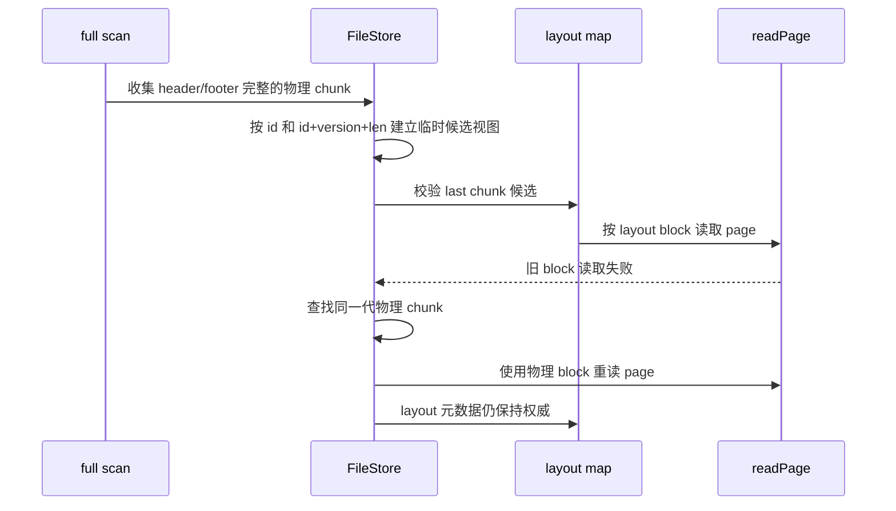

# H2 MVStore 文件损坏修复实现说明

## 背景

本文件记录提交 `97dc50977` 中已经落地的 `.mv.db` 文件损坏恢复增强方案，便于后续继续审查、排错和补测试。该修复对应的现象是：

- `JdbcSQLNonTransientConnectionException: File corrupted while reading record`
- `MVStoreException: File is corrupted - unable to recover a valid set of chunks`
- layout 仍指向旧 block，但同 id chunk 的完整物理副本已经存在于新 block。
- `discoverChunk()` 被普通页面内容或空洞误识别出的伪 header 干扰，导致完整物理 chunk 候选被清空。

详细排查证据见 [h2db-corruption-investigation-plan.md](h2db-corruption-investigation-plan.md)，方案 RFC 见 [h2db-corruption-fix-rfc.md](h2db-corruption-fix-rfc.md)。

## 目标

- 在不修改 `.mv.db` 磁盘格式的前提下增强只读 recovery。
- 让 full scan 能保留 header/footer 完整的物理 chunk 候选。
- 在 layout 指向旧 block 时，允许恢复期用同一代物理 chunk 读取 page。
- 保持 layout 中的 live/dead、occupancy、livePages 等动态元数据权威性。
- 修复 `MVStoreTool.repair` 对坏文件样本触发 NPE 或越界读取的问题。

## 非目标

- 不支持多 JVM embedded 同写、`FILE_LOCK=NO`、`nolock:` 等 unsupported 场景。
- 不在生产库原文件上做破坏性 repair。
- 不改变 compact 写入顺序或磁盘格式。
- 不保证所有任意损坏文件都能恢复，只增强已确认的 compact/layout 错位恢复路径。

## 修改点总览

| 文件 | 修改点 | 目的 |
| --- | --- | --- |
| `h2/src/main/org/h2/mvstore/FileStore.java` | 增加恢复期物理 chunk 临时视图。 | full scan 后候选校验期间，用物理位置读取 layout/page。 |
| `h2/src/main/org/h2/mvstore/FileStore.java` | 增强 `discoverChunk()` 的伪 header 过滤。 | 避免 `len=0`、无效 block 等伪 chunk 清空完整候选。 |
| `h2/src/main/org/h2/mvstore/FileStore.java` | 按 `id + version + len` 匹配物理候选。 | 防止同 id 不同世代 chunk 被误当成当前 layout 条目的副本。 |
| `h2/src/main/org/h2/mvstore/FileStore.java` | `readPage()` 和 `getChunk()` 增加恢复期 fallback。 | layout 旧 block 读失败时，用同一代物理副本重新读取。 |
| `h2/src/main/org/h2/mvstore/MVStoreTool.java` | `rollback()` 跳过无效、过长、不完整 chunk。 | repair 遇到错位样本、无可用 chunk 和短文件时不再 NPE。 |
| `h2/src/test/org/h2/test/store/TestMVStoreRecoveryCorruption.java` | 增加专项恢复回归矩阵。 | 固化复现样本、修复验收和 marker 校验。 |

## 核心流程



## 关键约束

- 恢复期物理视图只在 `findLastChunkWithCompleteValidChunkSet()` 的 full scan 候选校验期间启用，离开该作用域后必须恢复旧值。
- 物理候选只能提供 `block` 位置，不能覆盖 layout 中的动态元数据。
- 对已知 layout chunk，物理候选必须满足 `id + version + len` 一致。
- 同 id 存在多个 generation 时，禁用只按 id 的兜底匹配。
- `discoverChunk()` 不能让明显无效的伪 header 清空当前完整候选。
- repair 工具遇到不完整 chunk 必须跳过或报告，不能继续越界读。

## 前后行为对比

| 场景 | 修复前 | 修复后 |
| --- | --- | --- |
| 完整 chunk 候选中间出现 `chunk:0,len:0` 伪 header | 候选被清空，full scan 找不到可重定向副本。 | 伪 header 被过滤，完整候选保留。 |
| layout 指向旧 block，同 id chunk 已在新 block | layout page 读取失败，候选 last chunk 被拒绝。 | 恢复期使用同一代物理副本读取 page，继续校验。 |
| 同 id 多世代物理 chunk | 可能按 id 误兜底到错误世代。 | 必须匹配 `id + version + len`；多世代时禁用 id 兜底。 |
| repair 遇到无可用 chunk 或不完整 chunk | 可能 NPE 或读取越界。 | 输出诊断并返回无可用版本。 |

## 测试覆盖

专项入口：

```powershell
.\gradlew.bat runMvStoreRecoveryCheck
.\gradlew.bat "-Dh2.test.mvStoreRecoveryCorruption.characterize=true" runMvStoreRecoveryCheck
```

关键测试：

| 测试编号 | 覆盖内容 |
| --- | --- |
| `T-DISCOVER-FALSE-HEADER-01` | 伪 header 不清空完整 chunk 候选。 |
| `T-RECOVERY-LAYOUT-CYCLE-01` | layout leaf 位于被搬迁 chunk 内时能打破读取循环依赖。 |
| `T-RECOVERY-PHYSICAL-VIEW-01` | 物理视图不覆盖 layout 动态元数据。 |
| `T-RECOVERY-GENERATION-MATCH-01` | 同 id 不同 version/len 的 chunk 不被误用。 |
| `T-REPAIR-ROBUST-01` | repair 对错位样本、短文件、不完整 chunk 不 NPE。 |
| `T-DATA-MARKER-REGRESSION-01` | 修复后不静默丢失已确认 marker。 |

## 后续审查重点

- 物理读取 fallback 是否仍只在 recovery 候选校验作用域内启用。
- `isPlausibleDiscoveredChunk()` 是否过严，特别是合法 chunk id 回绕场景。
- `getRecoveryPhysicalChunk(C expected)` 是否始终按 generation 匹配。
- repair 工具是否需要进一步支持离线自动导出或重建；当前只完成健壮性修复。
- 未来空间回收优化不得复用该恢复视图作为正常读写路径，也不得通过普通 Query/SQL 后置 hook 自动触发空间回收。
