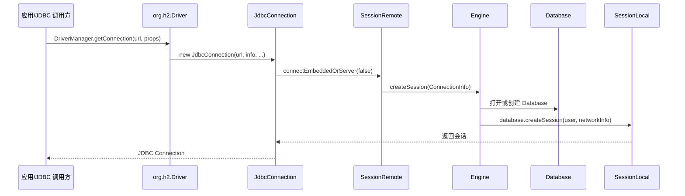
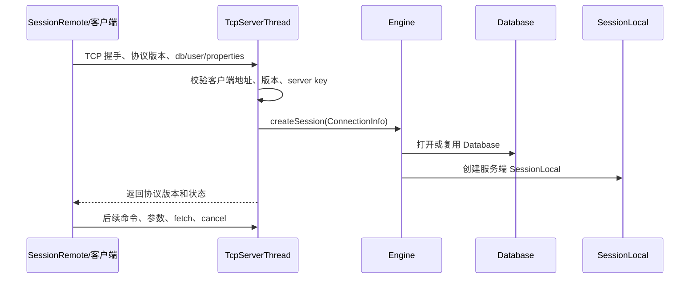
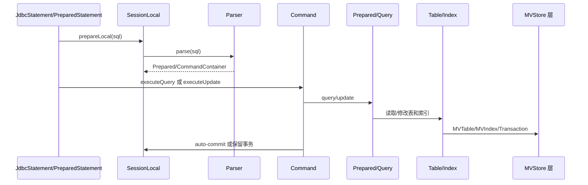

# H2DB 代码现状设计文档

## 背景

本文档基于当前 `D:\work\java\h2db` 工作区代码扫描生成，用于后续修改、排错和代码审查时快速定位关键链路。它描述的是现状架构，不提出业务功能变更。

当前仓库的实际工程根目录是 `h2/`，生产代码主要位于 `h2/src/main/org/h2`，测试代码主要位于 `h2/src/test/org/h2/test`。主线代码以 Java 8 为兼容基线，Gradle 配置见 `h2/gradle.properties` 的 `jdkVersion=1.8`。

## 目标

- 建立 H2DB 主要模块、调用链路、存储和事务边界的导航图。
- 记录修改前应优先查看的类、包和测试入口。
- 帮助排查连接、SQL 执行、事务锁、MVStore 存储、服务端协议、资源释放等问题。
- 明确当前仓库的验证方式和已知构建限制。

## 非目标

- 不替代 H2 官方用户文档或 SQL 语法文档。
- 不描述每个 SQL 语句、函数、数据类型的完整语义。
- 不改变现有源码、测试、构建脚本或发布流程。
- 不承诺本文覆盖所有历史兼容模式；具体行为仍以代码和测试为准。

## 仓库结构

| 路径 | 作用 | 修改/排错提示 |
| --- | --- | --- |
| `h2/build.gradle` | Gradle 构建配置、依赖、发布配置 | 当前脚本会禁用名称包含 `test` 的任务，验证时不要误判 |
| `h2/MAVEN.md` | Maven wrapper 的实验性构建和测试说明 | Maven 产物与官方构建不完全等价 |
| `h2/src/main/org/h2` | 主生产代码 | 引擎、SQL、JDBC、服务端、存储层都在这里 |
| `h2/src/test/org/h2/test` | 测试代码 | 混合 `TestAll`、`TestBase` 子类和 `main` 入口 |
| `h2/src/java9`、`h2/src/java10` | 版本相关源码 | 修改时确认 Java 8 主线兼容和多版本行为 |
| `h2/src/docsrc` | 官网/用户文档源码 | SQL 行为、工具行为变化时检查是否要同步 |
| `h2/src/main/org/h2/res` | help、资源文件 | Console/help 可见行为变化时检查 |

## 模块地图

| 包 | 核心职责 | 关键类 |
| --- | --- | --- |
| `org.h2` | JDBC Driver 入口 | `Driver` |
| `org.h2.jdbc`、`org.h2.jdbcx` | JDBC API、连接、语句、连接池、XA/DataSource | `JdbcConnection`、`JdbcStatement`、`JdbcPreparedStatement`、`JdbcConnectionPool` |
| `org.h2.engine` | 数据库生命周期、会话、用户权限、设置、事务入口 | `Engine`、`Database`、`SessionLocal`、`ConnectionInfo`、`User` |
| `org.h2.command` | SQL 解析和命令执行抽象 | `Parser`、`Command`、`CommandContainer` |
| `org.h2.command.ddl/dml/query` | DDL、DML、查询命令实现 | `Prepared` 子类、`Query` |
| `org.h2.expression` | 表达式、函数、参数、条件 | `Expression`、`Parameter` |
| `org.h2.table`、`org.h2.index` | 表、列、索引、游标 | `Table`、`Column`、`Index`、`Cursor` |
| `org.h2.mvstore` | MVStore 文件存储、页面、map、chunk、压缩/持久化 | `MVStore`、`MVMap`、`Page`、`FileStore` |
| `org.h2.mvstore.db` | SQL 层到 MVStore 的适配 | `Store`、`MVTable`、`MVPrimaryIndex`、`MVSecondaryIndex` |
| `org.h2.mvstore.tx` | MVCC 事务、undo log、事务可见性 | `TransactionStore`、`Transaction` |
| `org.h2.result`、`org.h2.value` | 结果集、行、值类型和类型转换 | `ResultInterface`、`LocalResult`、`Value` 子类 |
| `org.h2.server` | TCP/Web/PG 服务端 | `TcpServer`、`TcpServerThread`、`WebServer` |
| `org.h2.store`、`org.h2.store.fs` | 文件锁、文件系统抽象、LOB 辅助 | `FileLock`、`FileUtils`、`FilePath` |
| `org.h2.tools` | Shell、Server、Recover、Backup 等工具 | `Shell`、`Server`、`Recover`、`Backup` |
| `org.h2.message` | 异常、错误码、trace 日志 | `DbException`、`TraceSystem`、`Trace` |
| `org.h2.mode` | 方言/兼容模式 | `Mode` 相关类 |

## 现状/已有流程

### 嵌入式连接流程

关键代码入口：

- `h2/src/main/org/h2/Driver.java`
- `h2/src/main/org/h2/jdbc/JdbcConnection.java`
- `h2/src/main/org/h2/engine/Engine.java`
- `h2/src/main/org/h2/engine/Database.java`
- `h2/src/main/org/h2/engine/SessionLocal.java`

### 远程 TCP 连接流程

关键代码入口：

- `h2/src/main/org/h2/server/TcpServer.java`
- `h2/src/main/org/h2/server/TcpServerThread.java`
- `h2/src/main/org/h2/engine/SessionRemote.java`
- `h2/src/main/org/h2/value/Transfer.java`

排错重点：

- 协议版本由 `Constants.TCP_PROTOCOL_VERSION_*` 控制。
- 老客户端会触发兼容设置，例如 `OLD_INFORMATION_SCHEMA` 和 `NON_KEYWORDS=VALUE`。
- 每个 TCP 客户端连接对应一个 `TcpServerThread`，执行时要注意 socket 关闭、LOB 流缓存、cancel 命令和服务端连接注册清理。

### SQL 执行流程

关键代码入口：

- `h2/src/main/org/h2/command/Parser.java`
- `h2/src/main/org/h2/command/Command.java`
- `h2/src/main/org/h2/command/CommandContainer.java`
- `h2/src/main/org/h2/command/query/Query.java`
- `h2/src/main/org/h2/table/Table.java`
- `h2/src/main/org/h2/index/Index.java`

排错重点：

- SQL 语法和关键字通常牵涉 `Parser`、`Tokenizer`、`Token`、`ParserUtil` 和兼容模式。
- 查询执行结果会经过 `ResultInterface`、`LocalResult`、`Value` 类型体系。
- `Command.stop()` 中处理非事务命令提交、auto-commit 提交和慢查询 trace。
- 改 SQL 行为时同步检查参数化语句、prepared cache、错误码、兼容模式和测试脚本。

## 核心约束

| 约束 | 当前事实 | 修改要求 |
| --- | --- | --- |
| Java 版本 | `jdkVersion=1.8` | 主线代码保持 Java 8 语法/API 兼容 |
| SQL 兼容 | 支持多种 mode 和旧客户端行为 | 改 parser/语义前搜索 mode、错误码、测试脚本和文档 |
| JDBC 兼容 | `java.sql` 对外行为被用户直接依赖 | 异常类型、SQLState、错误码、metadata 返回值需谨慎 |
| 磁盘兼容 | MVStore 文件、LOB、备份/恢复可被旧数据触发 | 改持久化结构必须说明旧数据读写和回滚路径 |
| 并发事务 | `SessionLocal`、`Database`、`TransactionStore` 承担锁和事务边界 | 不要在锁内引入长 IO、远程调用或不可控回调 |
| 构建验证 | Gradle test task 当前被禁用 | 至少运行编译；测试结果要说明入口和限制 |

## 接口设计（现状边界）

| 边界 | 入口 | 输入 | 输出/副作用 | 关注点 |
| --- | --- | --- | --- | --- |
| JDBC Driver | `Driver.connect()` | JDBC URL、Properties | `JdbcConnection` 或 `null` | URL 判定、默认连接、SQLException 转换 |
| 会话创建 | `Engine.createSession()` | `ConnectionInfo` | `SessionLocal` | 数据库打开、认证、JMX、INIT、错误延迟 |
| SQL 准备 | `SessionLocal.prepareLocal()` 相关方法 | SQL 字符串 | `CommandInterface` | Parser 状态、参数、schema、兼容模式 |
| 命令执行 | `Command.executeQuery/update()` | 参数、maxRows、generatedKeys | `ResultInterface` 或 update count | auto-commit、取消、慢查询、异常转换 |
| 存储适配 | `mvstore.db.Store` | `Database`、加密 key、settings | `MVStore`、`TransactionStore` | 文件名、压缩、加密、后台异常 |
| TCP 协议 | `TcpServerThread.run()` | socket、协议版本、序列化命令 | 远程 session 和 result | 版本协商、取消、LOB、socket 生命周期 |

## 数据结构

### Database

`Database` 是每个打开数据库一个实例，维护全局元数据和运行时状态：

- 用户、角色、权限、设置、schema、comment 使用并发 map 管理。
- `userSessions` 记录活动 session。
- `exclusiveSession`、文件锁、meta lock 等控制并发访问和关闭流程。
- `Store`/`LobStorageInterface` 连接 SQL 层和持久化层。

修改提示：涉及 schema、权限、metadata、session 生命周期时，优先读 `Database` 中相同对象类型的注册、删除、锁和 trace 逻辑。

### SessionLocal

`SessionLocal` 表示嵌入式会话；远程模式下它位于服务端。它维护：

- 当前用户、schema、transaction、savepoint、临时表、变量、query timeout。
- 当前命令、取消时间、锁等待对象、自动提交状态。
- 与 `TransactionStore.RollbackListener` 的回滚回调关系。

修改提示：事务、锁、临时对象、query timeout、cancel、session close 都优先看 `SessionLocal`。

### MVStore / TransactionStore

`MVStore` 是持久化 map 存储，维护：

- store 状态：open、stopping、closed。
- `storeLock` 控制 store/close 等主要操作。
- meta map、chunk、page、文件读写和后台写入。

`TransactionStore` 是 MVCC 事务层，维护：

- `preparedTransactions`。
- 每个事务的 undo log map。
- `openTransactions`、`committingTransactions` 和 transaction slot。
- 最大打开事务数限制。

修改提示：任何改 map、page、chunk、undo log、commit/rollback 可见性的代码都需要补并发/恢复/旧数据测试。

## 状态机

### SessionLocal.State

| 状态 | 含义 | 常见触发 |
| --- | --- | --- |
| `INIT` | 初始化中 | session 创建 |
| `RUNNING` | 正在执行 | SQL 命令执行 |
| `BLOCKED` | 等锁或阻塞资源 | 锁等待 |
| `SLEEP` | 睡眠 | throttle 或等待 |
| `THROTTLED` | 限流 | throttle 配置 |
| `SUSPENDED` | 暂停 | 特定执行流程 |
| `CLOSED` | 已关闭 | close/remove session |

排错提示：锁等待、取消、关闭相关问题要同时看 state、`waitForLock`、`cancelAtNs`、`currentCommand` 和事务状态。

### MVStore 状态

| 状态 | 含义 | 修改风险 |
| --- | --- | --- |
| `STATE_OPEN` | 可正常读写 | 普通 map 操作 |
| `STATE_STOPPING` | 正在关闭但可能仍有 store 操作 | 新写入、后台写入、close 竞态 |
| `STATE_CLOSED` | 已关闭 | 访问应转为错误 |

排错提示：`MVStore` 关闭、压缩、后台写异常、文件损坏相关问题，要同时看 `state`、`storeLock`、`storeOperationInProgress` 和 `backgroundExceptionHandler`。

## 时序流程

### 持久化数据库打开

1. `Engine.openSession()` 从 `ConnectionInfo` 读取数据库名、`IFEXISTS`、`FORBID_CREATION`、`CIPHER`、`INIT` 等属性。
2. 对命名数据库使用 `DATABASES` 全局 map 找到或创建 `DatabaseHolder`。
3. 在 `DatabaseHolder` 锁内判断是否复用现有 `Database`，或检查 `.mv.db` 文件并创建新 `Database`。
4. 新数据库创建后初始化 master user。
5. 调用 `database.opened()` 启动后续打开流程。
6. 认证用户、检查 clustering、创建 `SessionLocal`。
7. 处理 `OLD_INFORMATION_SCHEMA`、`JMX` 和 `INIT`。

### 命令执行和提交

1. JDBC statement 调用 session prepare。
2. `Parser` 生成 `Prepared`/`Command`。
3. `Command.start()` 记录慢查询统计起点。
4. `query()` 或 `update()` 执行具体命令。
5. `Command.stop()` 根据命令事务属性和 auto-commit 决定提交。
6. 异常通过 `DbException` / JDBC 层转换给调用方。

## 异常处理

| 层 | 主要异常 | 转换/处理 |
| --- | --- | --- |
| SQL/引擎 | `DbException` | 携带 H2 `ErrorCode`，JDBC 层转 `SQLException` |
| JDBC | `SQLException`、`JdbcException` | 对外暴露给用户 |
| MVStore | `MVStoreException` | `mvstore.db.Store.convertMVStoreException()` 转为数据库错误码 |
| 文件/网络 | `IOException`、socket 错误 | 转为 H2 错误码或断开远程连接 |
| 后台任务 | background exception handler | `Store` 将 MVStore 后台异常写回 `Database` |

排错建议：

- 查用户可见错误时先定位 `ErrorCode`，再搜 `DbException.get(...)`。
- 存储错误优先看 `DataUtils` 错误码和 `Store.convertMVStoreException()`。
- 远程连接失败要区分握手阶段、认证阶段、命令执行阶段和 fetch/LOB 阶段。

## 幂等性

现状没有统一的跨请求幂等框架，幂等性分散在具体功能中：

- DDL/DML 依赖事务、锁、约束和 undo log 保证失败回滚。
- 远程 cancel/check key 是按 session id 和 statement id 定位。
- 备份、恢复、压缩、delete files 等工具类需要单独检查临时文件和重复执行行为。
- MVStore 写入依赖版本、chunk、undo log 和 commit 可见性。

修改提示：新增外部可重试操作时，必须明确重复执行是否安全、部分成功如何恢复、是否需要唯一 key 或临时状态。

## 回滚策略

本文是现状文档，不引入可回滚变更。后续修改代码时按影响面选择回滚策略：

| 变更类型 | 回滚要求 |
| --- | --- |
| 纯内存逻辑 | 可通过代码回退恢复，补回归测试 |
| SQL/JDBC 对外行为 | 说明旧行为、新行为和兼容模式影响 |
| 配置/URL 参数 | 保持未知参数处理、默认值和文档一致 |
| MVStore/磁盘格式 | 必须提供旧数据读写、版本探测、降级不可行说明 |
| 网络协议 | 必须检查最小/最大协议版本和混合客户端 |

## 兼容性

- Java：主线保持 Java 8。
- JDBC：保持 `java.sql` 契约，谨慎改变 metadata、异常类型、SQLState、错误码、warning 行为。
- SQL：兼容模式、关键字、标识符大小写、NULL 语义、时间日期、类型转换都可能影响用户。
- 存储：`.mv.db`、LOB、加密、压缩、恢复路径对老数据敏感。
- TCP：修改 `Transfer` 或 `TcpServerThread` 前检查协议版本和老客户端兼容分支。

## 灰度/迁移

当前仓库没有统一 feature flag/灰度框架。后续涉及高风险变更时优先使用：

- URL 参数或 database setting 控制新行为，默认保持兼容。
- 兼容模式隔离方言差异。
- 文件格式变更使用版本字段、显式错误和只读兼容路径。
- 测试先覆盖旧行为，再覆盖新行为和迁移路径。

## 测试方案

| 变更范围 | 优先测试位置 | 建议 |
| --- | --- | --- |
| Parser/SQL 语义 | `h2/src/test/org/h2/test/db`、`scripts` | 增加 SQL 案例，覆盖兼容模式和错误路径 |
| JDBC API | `h2/src/test/org/h2/test/jdbc`、`jdbcx` | 覆盖标准接口、异常、metadata |
| MVStore/事务 | `h2/src/test/org/h2/test/store`、`mvcc`、`rowlock` | 覆盖并发、rollback、恢复、旧数据 |
| Server/TCP/Web | `h2/src/test/org/h2/test/server`、`unit` | 覆盖协议、认证、cancel、socket close |
| 工具类 | `h2/src/test/org/h2/test/unit`、`tools` 相关测试 | 覆盖命令行参数和文件副作用 |

验证命令注意：

- 在 `D:\work\java\h2db\h2` 下运行构建命令。
- 当前 Gradle 脚本会禁用名称包含 `test` 的任务，`.\gradlew.bat test` 不能作为有效测试证明。
- 文档或导航变更通常不需要编译，但修改生产 Java 代码后至少尝试 `.\gradlew.bat compileJava`。
- Maven 测试可参考 `h2/MAVEN.md`，但其构建说明标注为实验性。

## 风险点

| 风险 | 严重度 | 触发场景 | 检测方式 | 缓解 |
| --- | --- | --- | --- | --- |
| SQL 兼容破坏 | P1 | 改 parser、关键字、类型转换、mode | 旧测试、脚本测试、用户文档比对 | 默认保持旧行为，必要时用 mode/setting |
| 数据文件不可读 | P0 | 改 MVStore/page/chunk/LOB/加密 | 恢复测试、旧文件读写测试 | 版本化、兼容读取、明确不可降级 |
| 事务/锁竞态 | P1 | 改 `SessionLocal`、`Database`、`TransactionStore` | 并发测试、死锁/timeout 测试 | 缩小锁范围，保留超时和清理路径 |
| 远程协议不兼容 | P1 | 改 `Transfer`、`TcpServerThread`、metadata remote | 老版本协议测试 | 检查 min/max protocol 分支 |
| 测试误判 | P2 | 仅运行被禁用的 Gradle test task | 查看 Gradle 输出和 task 状态 | 明确命令限制，使用有效入口 |
| 资源泄漏 | P2 | 改 Result、LOB、socket、FileStore、Cursor | close 路径测试、异常路径审查 | try/finally 或清晰所有权 |

## 排错入口速查

| 问题现象 | 优先查看 |
| --- | --- |
| 连接失败、URL 参数无效 | `Driver`、`JdbcConnection`、`ConnectionInfo`、`Engine` |
| 用户密码/认证失败 | `Engine.openSession()`、`User`、`Authenticator` |
| SQL 语法解析失败 | `Parser`、`Tokenizer`、`Token`、`ParserUtil` |
| SQL 执行结果错误 | `Command`、具体 `Prepared` 子类、`Table`、`Index`、`Expression` |
| auto-commit/rollback 异常 | `Command.stop()`、`SessionLocal`、`TransactionStore` |
| 锁等待/死锁/超时 | `SessionLocal`、`Database`、`Table`、`Lock` 相关调用 |
| `.mv.db` 损坏或打不开 | `MVStore`、`FileStore`、`Store.convertMVStoreException()`、`DataUtils` |
| LOB 读写异常 | `LobStorageInterface`、`LobStorageMap`、`ValueLob` |
| TCP 远程异常 | `TcpServerThread`、`SessionRemote`、`Transfer` |
| Console/Web 异常 | `server.web`、`tools.Server`、`res` |
| 测试入口不清楚 | `TestAll`、同包 `Test*`、`MAVEN.md` |

## 分阶段实施计划

后续如果要围绕本文档继续增强，建议分阶段处理：

| 阶段 | 交付物 | 验证 |
| --- | --- | --- |
| 1. 现状导航 | 当前文档 | 手工检查路径、类名和主要流程 |
| 2. 专题文档 | SQL 执行、MVStore、TCP 协议、测试体系拆分文档 | 针对专题补更细代码引用 |
| 3. 排错手册 | 按错误码/日志/现象组织 runbook | 用真实问题或失败测试回放 |
| 4. 修改模板 | 为高风险改动生成设计/测试 checklist | 在后续 PR/任务中试用并修订 |

## 开放问题

- 是否需要保留 PageStore 相关历史路径的详细说明，取决于后续维护范围。
- 是否需要收集真实线上/本地常见错误日志，形成按错误码索引的 runbook。
- 是否需要把 SQL parser、MVStore 和 TCP 协议拆成独立深度文档。
