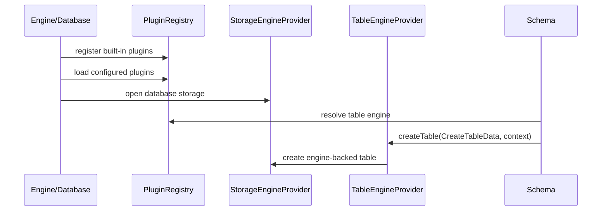

# H2 插件化架构改造设计方案（讨论稿）

## 背景

H2 当前已经存在局部扩展点，例如：

- `org.h2.api.TableEngine`：`CREATE TABLE ... ENGINE` 可通过类名创建自定义表实现。
- `DEFAULT_TABLE_ENGINE`：可配置默认表引擎。
- `JdbcUtils.loadUserClass()`：用于加载 table engine、trigger、aggregate、serializer 等用户类。
- `org.h2.mvstore.db.Store`：当前内置持久化主线，直接创建 `MVStore`、`TransactionStore` 和 `MVTable`。

这些扩展点还不是统一插件机制：表引擎靠类名即时加载，存储引擎没有同等级别抽象，内置 MVStore 也不是通过插件注册进入系统。未来如果要支持“通过插件扩展存储引擎和表引擎，内部自带能力也通过插件机制扩展”，需要先建立统一插件边界，再继续设计 S2 在线空间回收等深存储能力。

## 目标

| 目标 | 说明 |
| --- | --- |
| 统一扩展模型 | 表引擎、存储引擎、维护能力通过统一插件描述、注册、能力声明进入系统。 |
| 内置能力插件化 | 内置 MVStore 表引擎和存储引擎也通过同一注册路径提供，减少特殊分支。 |
| 支持能力探测 | 上层通过 capability 判断是否支持事务、索引、LOB、backup、online vacuum、crash-safe publish 等能力。 |
| 保持现有兼容 | 现有 `TableEngine`、`CREATE TABLE ... ENGINE`、`DEFAULT_TABLE_ENGINE` 不破坏。 |
| 控制第一阶段风险 | 第一阶段只做最小内核和内置适配，不引入复杂外部插件生态。 |
| 为 S2 铺路 | 在线空间回收必须面向存储引擎 capability，而不是写死 MVStore 类名。 |

## 非目标

- 第一阶段不做插件市场、远程下载、热插拔、动态卸载。
- 第一阶段不承诺跨 classloader 隔离和安全沙箱。
- 第一阶段不允许第三方插件修改 SQL parser、optimizer、wire protocol 等核心路径。
- 第一阶段不替换现有所有用户类加载机制；trigger、aggregate 等可后续纳入统一插件。
- 第一阶段不改变 `.mv.db` 磁盘格式。
- 第一阶段不实现 S2，只为 S2 定义能力边界。

## 现状/已有流程

| 流程 | 当前实现 | 问题 |
| --- | --- | --- |
| 默认表创建 | `Schema.createTable()` 在无 `DEFAULT_TABLE_ENGINE` 时直接调用 `database.getStore().createTable(data)` | 内置 MVStore 表不是 table engine 插件。 |
| 自定义表引擎 | `Database.getTableEngine()` 通过类名加载 `TableEngine` 并缓存 | 只有表引擎，缺少插件元数据、能力声明、生命周期。 |
| 存储打开 | `Store(Database, key)` 直接构造 `MVStore.Builder` 和 `TransactionStore` | 存储引擎无法替换，也无法声明维护能力。 |
| SQL 入口 | `CREATE TABLE ... ENGINE name WITH ...` | 语义绑定类名，不支持短名称、版本和插件能力。 |
| 维护能力 | compact、backup、recover 等散落在 MVStore / Store / tools 中 | 无统一 capability，S2 容易写成 MVStore 私有能力。 |

## 核心约束

| 约束 | 设计含义 |
| --- | --- |
| Java 8 兼容 | 插件 SPI 不使用 Java 8 之后 API。 |
| 向后兼容 | 旧的 `TableEngine` 类名仍可使用。 |
| 启动可恢复 | 插件注册失败不能让已有普通 MVStore 数据库不可打开，除非该数据库显式依赖缺失插件。 |
| 磁盘格式谨慎 | 任何持久化插件标识、版本和元数据变更必须有升级/回滚说明。 |
| 权限边界清晰 | 创建自定义表/存储插件仍需要 admin 或更严格权限。 |
| 能力显式声明 | 上层不得通过 `instanceof MVStore` 等方式推断能力。 |

## 总体设计

引入统一插件注册中心 `PluginRegistry`，插件通过 `H2Plugin` 描述自身，并按扩展类型注册 provider。

第一阶段只纳入两个扩展类型：

- `TableEngineProvider`：创建表引擎。
- `StorageEngineProvider`：打开数据库级存储引擎，并声明维护能力。

内置 MVStore 拆成两个内置 provider：

- `MVStoreStorageEngineProvider`
- `MVStoreTableEngineProvider`

`Schema.createTable()` 不再把“无自定义 table engine”直接解释为 `database.getStore().createTable(data)`，而是解析出有效 table engine id，默认指向内置 `mvstore` table engine。内置 table engine 再调用对应 storage engine 创建 `MVTable`。



## 落地范围

第一轮插件化改造的目标是“内部能力走统一插件路径，但外部行为基本不变”。它不是完整插件生态，而是为后续存储引擎、表引擎、S2 在线空间回收提供稳定边界。

| 范围 | 第一轮要求 |
| --- | --- |
| 插件注册中心 | 新增 registry、provider 描述、capability 查询和冲突校验。 |
| 内置 MVStore storage provider | 包装现有 `org.h2.mvstore.db.Store` 创建和生命周期。 |
| 内置 MVStore table provider | 包装现有 `Store.createTable(CreateTableData)`。 |
| legacy table engine | 保持现有类名加载，并在 registry 未命中时 fallback。 |
| 数据库默认路径 | 无 `ENGINE` 时也解析为内置 `mvstore` table provider。 |
| 维护能力 | 先暴露 capability 查询和 `StorageMaintenance` 边界；S2 后续再填充。 |
| 文档和测试 | 固定兼容行为、冲突行为、capability gate。 |

第一轮不要求真正可替换整个数据库存储文件格式。`StorageEngineProvider` 先是 MVStore 的抽象外壳，避免后续 S2 继续耦合；等第二个 storage engine 进入时，再补文件格式、URL 参数和恢复策略。

## 阶段一已确认决策

本轮按以下决策进入后续开发计划：

| 决策项 | 阶段一结论 |
| --- | --- |
| SPI 包位置 | 表引擎 provider 放入稳定 API；storage 相关先作为实验/内部接口服务 S2。 |
| 外部插件加载 | 阶段一不实现外部插件加载，只预留注册接口和来源字段。 |
| `StorageEngine` 公开性 | 阶段一先作为 H2 内部接口，不承诺第三方稳定 SPI。 |
| 默认 `mvstore` table engine | 内部解析为内置 provider，但不写入 `CreateTableData.tableEngine`，避免 `SCRIPT` 多输出 `ENGINE mvstore`。 |
| `Database.getStore()` | 过渡期保留，降低一次性改造风险。 |
| storage engine id 持久化 | 阶段一不持久化，旧库和新库缺省视为 `mvstore`。 |
| capability 表达 | 使用字符串常量，保留跨版本扩展性。 |
| 权限模型 | 阶段一沿用 admin 权限，不新增细粒度权限。 |
| S1 维护能力迁移 | 阶段一只建立 `StorageMaintenance` 边界和 capability，不迁移 S1 实现。 |
| 外部插件缺失策略 | 阶段一不处理；真正支持外部 storage 插件前单独设计。 |

这些决策只约束阶段一。后续阶段如果引入外部插件、第二存储引擎、持久化插件元数据或安全隔离，需要重新补充设计并评审。

## 包结构建议

| 包/类 | 类型 | 稳定性 | 说明 |
| --- | --- | --- | --- |
| `org.h2.api.H2Plugin` | 接口 | 对外 SPI | 插件描述入口。 |
| `org.h2.api.PluginProvider` | 接口 | 对外 SPI | provider 父接口。 |
| `org.h2.api.TableEngineProvider` | 接口 | 对外 SPI | 新表引擎 provider。 |
| `org.h2.api.PluginCapability` | 常量类 | 对外 SPI | capability 字符串常量。 |
| `org.h2.api.StorageEngineProvider` | 接口 | 实验 SPI | 存储引擎 provider；第一轮可标注 experimental。 |
| `org.h2.api.StorageEngine` | 接口 | 实验 SPI | 数据库级存储句柄。 |
| `org.h2.api.StorageMaintenance` | 接口 | 实验 SPI | 维护能力入口。 |
| `org.h2.engine.PluginRegistry` | 实现类 | 内部 | 注册、查找、校验 provider。 |
| `org.h2.engine.BuiltinPlugins` | 实现类 | 内部 | 注册内置 provider。 |
| `org.h2.engine.LegacyTableEngineProvider` | 适配器 | 后续 | 阶段一未新增类，先由 `Schema` 在 registry 未命中时 fallback 到旧 `Database.getTableEngine()`。 |
| `org.h2.mvstore.db.MVStoreStorageEngineProvider` | provider | 内置 | 打开 MVStore storage。 |
| `org.h2.mvstore.db.MVStoreTableEngineProvider` | provider | 内置 | 创建 MVTable。 |
| `org.h2.mvstore.db.MVStoreStorageEngine` | 适配器 | 内置 | 包装现有 `Store`。 |

如果担心公开 API 面过大，可以把 storage 相关 SPI 第一轮放在内部包并标注实验；但 S2 需要稳定 capability 模型，因此 capability 命名要提前固定。

## 阶段一实现结果

截至 2026-05-30，阶段一已按最小可落地范围实现：

| 类/入口 | 实现结果 |
| --- | --- |
| `org.h2.engine.PluginRegistry` | 支持按 provider type/id 注册、查找、capability 查询和内置 provider 冲突保护。 |
| `org.h2.engine.BuiltinPlugins` | 数据库启动期注册内置 `mvstore` storage/table provider。 |
| `org.h2.mvstore.db.MVStoreStorageEngineProvider` | 包装现有 `Store` 打开路径，保留旧库、只读、加密、内存库、持久库行为。 |
| `org.h2.mvstore.db.MVStoreStorageEngine` | 暴露 `StorageEngine`，内部持有现有 `Store`，过渡期继续支撑 `Database.getStore()`。 |
| `org.h2.mvstore.db.MVStoreTableEngineProvider` | 通过 `TableEngineProvider` 委托 `Store.createTable(CreateTableData)` 创建 `MVTable`。 |
| `org.h2.schema.Schema#createTable()` | 无显式 `ENGINE` 时走内置 `mvstore` provider；registry 未命中时继续走旧类名加载。 |
| `org.h2.api.StorageMaintenance` | 已建立维护能力边界；S2 相关 capability 保持 false / `UNSUPPORTED`。 |

阶段一仍不包含外部插件加载、稳定第三方 storage SPI、storage engine id 持久化、S1 迁移和 S2 在线空间回收实现。这些能力已保留在后续阶段待办中。

## 接口设计

### 插件描述

| 接口 | 作用 |
| --- | --- |
| `H2Plugin` | 插件根接口，提供 id、version、displayName、providers。 |
| `PluginProvider` | 所有 provider 的父接口，提供 provider id、type、capabilities。 |
| `PluginRegistry` | 数据库启动期注册、查找、校验 provider。 |
| `PluginContext` | 传递 trace、settings、class loader、database path、只读状态等上下文。 |

示意接口：

```java
public interface H2Plugin {
    String getId();
    String getVersion();
    Iterable<? extends PluginProvider> getProviders();
}

public interface PluginProvider {
    String getId();
    String getType();
    boolean supports(String capability);
}
```

补充约束：

- `getId()` 返回稳定短 id，只允许 ASCII 字母、数字、下划线、短横线和点，例如 `mvstore`、`h2.mvstore`。
- provider id 在同一 provider type 内唯一。
- 内置 provider id 不能被外部插件覆盖。
- `supports()` 必须是纯查询，不允许懒加载重资源。
- capability 未识别时返回 `false`，不得抛异常。
- 建议第一轮不要在 SPI 中暴露 `Iterable<String> getCapabilities()`，避免调用方依赖完整枚举；内部 registry 可以保存能力集合用于诊断。

### 表引擎 Provider

现有 `TableEngine` 保留。新增 provider 用于承载名称、能力和上下文。

| 接口 | 作用 |
| --- | --- |
| `TableEngineProvider` | 通过稳定 id 创建表，内部可适配旧 `TableEngine`。 |
| `TableEngineContext` | 提供 `Database`、`Schema`、storage engine handle、table params、trace。 |

示意接口：

```java
public interface TableEngineProvider extends PluginProvider {
    Table createTable(CreateTableData data, TableEngineContext context);
}
```

`TableEngineContext` 建议字段：

| 字段/方法 | 含义 |
| --- | --- |
| `Database getDatabase()` | 当前数据库。 |
| `Schema getSchema()` | 目标 schema。 |
| `StorageEngine getStorageEngine()` | 当前数据库 storage engine。 |
| `Trace getTrace()` | 诊断日志。 |
| `List<String> getTableEngineParams()` | `WITH` 参数，只读视图。 |
| `boolean isPersistent()` | 数据库是否持久化。 |
| `boolean isReadOnly()` | 数据库是否只读。 |

实现规则：

- `CreateTableData` 仍作为创建表的主数据结构，避免大范围改 parser 和 DDL。
- provider 不负责权限检查，权限仍由 `CreateTable.update()` 和 schema/database 层处理。
- provider 创建的 table 必须遵守现有 `Table` 生命周期，包括 `removeChildrenAndResources()`、`close()`、`getCreateSQL()`。
- 内置 `MVStoreTableEngineProvider` 第一轮只委托到 `MVStoreStorageEngine.createTable(data)`。

兼容策略：

- 如果 `ENGINE` 值命中注册 provider id，走 provider。
- 如果未命中，按旧逻辑尝试 `JdbcUtils.loadUserClass(engineName)` 加载 `TableEngine`。
- 旧 `TableEngine` 自动包成 `LegacyTableEngineProvider`，capability 仅声明 `table.create`。

解析优先级：

| 输入 | 解析结果 |
| --- | --- |
| `ENGINE mvstore` | 命中内置 provider id。 |
| `ENGINE "mvstore"` | 命中内置 provider id，保持 identifier 规则。 |
| `ENGINE org.example.MyEngine` | 若 registry 无短 id，则按旧类名加载。 |
| 未指定 `ENGINE`，配置 `DEFAULT_TABLE_ENGINE` | 先按 provider id 查找，再按旧类名 fallback。 |
| 未指定 `ENGINE`，未配置默认值 | 使用内置 `mvstore` provider，但 `getCreateSQL()` 不额外输出 `ENGINE mvstore`。 |

### 存储引擎 Provider

| 接口 | 作用 |
| --- | --- |
| `StorageEngineProvider` | 根据数据库配置打开或创建 storage engine。 |
| `StorageEngine` | 数据库级存储句柄，提供事务、flush、close、backup、maintenance capability。 |
| `StorageMaintenance` | 维护能力集合，如 compact、vacuum、recover、diagnostics。 |

示意接口：

```java
public interface StorageEngineProvider extends PluginProvider {
    StorageEngine open(StorageEngineContext context);
}

public interface StorageEngine {
    String getEngineId();
    boolean supports(String capability);
    void flush();
    void closeImmediately();
    StorageMaintenance getMaintenance();
}
```

`StorageEngineContext` 建议字段：

| 字段/方法 | 含义 |
| --- | --- |
| `Database getDatabase()` | 当前数据库对象。 |
| `String getDatabasePath()` | 数据库路径，不含 `.mv.db` 后缀。 |
| `byte[] getFilePasswordHash()` | 加密相关输入，沿用当前 `Store` 构造语义。 |
| `DbSettings getSettings()` | 数据库设置。 |
| `boolean isReadOnly()` | 是否只读打开。 |
| `Trace getTrace()` | 诊断日志。 |

`StorageEngine` 第一轮需要覆盖现有 `Store` 被 `Database` 使用的最小能力：

| 方法 | 对应现有能力 |
| --- | --- |
| `createTable(CreateTableData)` | `Store.createTable()`，可放在 MVStore 内置实现中，不急于公开。 |
| `flush()` | `Store.flush()`。 |
| `closeImmediately()` | `Store.closeImmediately()`。 |
| `removeTemporaryMaps(BitSet)` | `Store.removeTemporaryMaps()`。 |
| `getInDoubtTransactions()` | 现有事务恢复路径。 |
| `prepareCommit(SessionLocal, String)` / `commit(SessionLocal)` | 如果 Database 当前直接依赖 Store 事务方法，需要逐步纳入。 |
| `getMaintenance()` | compact / backup / S1 / S2 capability。 |

注意：不要一次性把 `Store` 的所有方法都提升为公开 SPI。第一轮可以让 `MVStoreStorageEngine` 暴露内部 accessor 给 H2 内部使用，同时把对外 SPI 保持较小。开发时按编译错误逐步收口 `Database -> Store` 的直接依赖。

`StorageMaintenance` 建议形态：

```java
public interface StorageMaintenance {
    boolean supports(String capability);
    MaintenanceResult compactClosed(MaintenanceOptions options);
    MaintenanceResult compactOnline(MaintenanceOptions options);
    MaintenanceResult vacuumOnline(MaintenanceOptions options);
}
```

第一轮 `vacuumOnline()` 可以统一返回 `UNSUPPORTED`；MVStore 的 S1 能力可以先适配 `compactClosed()` / `compactOnline()`，也可以只声明 capability 查询，不改 S1 调用入口。

第一阶段能力常量建议：

| Capability | 含义 |
| --- | --- |
| `storage.persistent` | 支持持久化数据库。 |
| `storage.transactional` | 支持数据库事务。 |
| `storage.mvcc` | 支持 MVCC / 旧版本可见性。 |
| `storage.backup` | 支持一致性备份。 |
| `storage.compact.closed` | 支持关闭态 compact。 |
| `storage.compact.online.maintenance` | 支持 S1 维护态在线 compact。 |
| `storage.vacuum.online` | 支持 S2 在线空间回收。 |
| `storage.publish.crashSafe` | 支持 crash-safe metadata publish。 |
| `storage.truncate.safe` | 支持安全物理截断。 |

## 内置 MVStore 适配设计

### 类职责

| 类 | 职责 |
| --- | --- |
| `MVStoreStorageEngineProvider` | 根据 `StorageEngineContext` 创建 `MVStoreStorageEngine`。 |
| `MVStoreStorageEngine` | 持有现有 `Store`，把 `Database` 需要的存储生命周期和维护能力委托给 `Store`。 |
| `MVStoreTableEngineProvider` | 校验当前 storage engine 是 MVStore 兼容实现，调用 `createTable()`。 |
| `MVStoreMaintenance` | 暴露 S1 / 后续 S2 能力查询和维护入口。 |

### 第一轮最小适配

第一轮不拆 `Store` 构造逻辑，只把它包起来：

```java
final class MVStoreStorageEngine implements StorageEngine {
    private final Store store;

    MVStoreStorageEngine(Database database, byte[] key) {
        this.store = new Store(database, key);
    }

    Store getStore() {
        return store;
    }
}
```

然后 `Database` 中的 `private Store store;` 可逐步替换为：

```java
private StorageEngine storageEngine;
private Store store; // 过渡期保留，只对 MVStoreStorageEngine 赋值
```

过渡期规则：

- `Database.getStore()` 暂时保留，返回 MVStore 内置 `Store`，减少一次性改动。
- 新增 `Database.getStorageEngine()`，供新路径和后续 S2 使用。
- 新建表默认路径先从 provider 进入，但 provider 内部仍调用 `Store.createTable()`。
- 等所有核心调用点迁移后，再评估是否移除或收窄 `getStore()`。

### 建表路径改造

当前：

```text
Schema.createTable()
  -> if no tableEngine: database.getStore().createTable(data)
  -> else database.getTableEngine(tableEngine).createTable(data)
```

目标：

```text
Schema.createTable()
  -> resolve table engine id
  -> database.getPluginRegistry().getTableEngineProvider(id)
  -> provider.createTable(data, context)
  -> fallback legacy TableEngine class name
```

为了保持 `getCreateSQL()` 输出兼容，`CreateTableData.tableEngine` 的含义需要区分：

| 场景 | `data.tableEngine` | SQL 输出 |
| --- | --- | --- |
| 用户显式指定 `ENGINE X` | `X` | 输出 `ENGINE X`。 |
| `DEFAULT_TABLE_ENGINE=X` | `X` | 维持当前规则，由 `TableBase.getCreateSQL()` 决定是否输出。 |
| 系统默认内置 `mvstore` | `null` 或内部标记 | 不输出 `ENGINE mvstore`。 |

建议第一轮保持 `data.tableEngine == null` 表示系统默认 MVStore，只在 `Schema.createTable()` 内部解析到 provider，不写回 `data.tableEngine`。这样旧 SQL 生成最稳。

## 插件解析与配置

### Provider 查找顺序

表引擎查找：

1. 当前数据库 registry 中按 `providerType=table`、`providerId=name` 查找。
2. 未命中时按旧逻辑加载 `org.h2.api.TableEngine` 类名。
3. 加载成功后创建 `LegacyTableEngineProvider` 并缓存。
4. 加载失败则抛出与当前一致的 `DbException.convert(e)`。

存储引擎查找：

1. 第一轮固定默认 `mvstore`。
2. 如果显式配置 storage engine id，必须命中 `providerType=storage`。
3. 未命中时数据库打开失败，不 fallback 到类名，避免误把 table engine 当 storage engine。

### 外部插件加载

第一轮建议只支持内置 registry，不实现外部插件加载；但接口设计预留 `registerPlugin(H2Plugin plugin, PluginSource source)`。

后续外部插件加载的候选配置来源：

| 来源 | 优点 | 风险 |
| --- | --- | --- |
| URL 参数 `PLUGINS=a.b.Plugin,c.d.Plugin` | 简单，随数据库打开配置 | URL 暴露类名，权限和安全需要严格校验。 |
| 系统属性 `h2.plugins` | 不改 SQL/URL | 多数据库共享，隔离较差。 |
| 数据库 setting | 可持久化 | 缺失插件时启动策略更复杂。 |
| `ServiceLoader` | Java 标准 | 类路径上插件自动生效，冲突和安全边界更难控。 |

## 数据结构

### 插件注册项

| 字段 | 含义 |
| --- | --- |
| `pluginId` | 插件稳定 id，如 `h2.mvstore`。 |
| `pluginVersion` | 插件版本，内置插件跟随 H2 版本。 |
| `providerType` | `storage`、`table` 等。 |
| `providerId` | provider 稳定 id，如 `mvstore`。 |
| `className` | 外部插件类名或内置 provider 类名。 |
| `capabilities` | capability 集合。 |
| `source` | `builtin`、`serviceLoader`、`legacyClassName`、`configuredClass`。 |

### 数据库持久化元数据

第一阶段建议只持久化数据库级 storage engine id，不持久化完整插件描述。

| 字段 | 位置 | 说明 |
| --- | --- | --- |
| `storageEngineId` | 数据库 setting 或 store header，待讨论 | 默认 `mvstore`。打开已有库时缺省视为 `mvstore`。 |
| `tableEngine` | 已有 table SQL | 继续由 `TableBase.getCreateSQL()` 输出。 |
| `tableEngineParams` | 已有 table SQL | 保持兼容。 |

待确认：数据库级 storage engine id 放在 `DbSettings`、URL 参数、还是 MVStore header。第一阶段如果只支持默认 `mvstore`，可以先不新增持久化字段，把该问题留到真正支持第二存储引擎前解决。

## 代码改造点

| 文件/类 | 改造内容 | 第一轮策略 |
| --- | --- | --- |
| `org.h2.engine.Database` | 增加 `PluginRegistry`、`StorageEngine` 字段；启动期注册内置插件；保留 `getStore()` 过渡。 | 小步改造。 |
| `org.h2.schema.Schema` | `createTable()` 改为默认走 table provider，legacy fallback。 | 重点兼容。 |
| `org.h2.command.ddl.CreateTable` | 权限规则基本不变；需要确认 provider id 是否也按 custom engine 要求 admin。 | 保持 admin 规则。 |
| `org.h2.table.TableBase` | SQL 输出规则保持；系统默认 `mvstore` 不输出 ENGINE。 | 尽量不改。 |
| `org.h2.mvstore.db.Store` | 不急于拆分，只由 `MVStoreStorageEngine` 包装。 | 降低风险。 |
| `org.h2.mvstore.db.MVTable` | 不直接感知插件 registry。 | 不改或少改。 |
| `org.h2.res.help.csv` | 后续若引入短 id 或插件配置，需要补文档。 | 第一轮可只补内部文档。 |
| 测试入口 | 新增插件 registry / table engine 兼容测试。 | 必须补。 |

## 实现顺序建议

这不是最终开发计划，但给出可落地拆分边界：

1. 新增 SPI 和内部 `PluginRegistry`，只注册内置 provider，不接业务路径。
2. 新增 `MVStoreStorageEngine` 包装现有 `Store`，`Database` 初始化时同时设置 `storageEngine` 和过渡期 `store`。
3. 新增 `MVStoreTableEngineProvider`，但 `Schema.createTable()` 暂不切换默认路径，只加测试验证 provider 可创建表。
4. 切换 `Schema.createTable()` 默认路径：无 `ENGINE` 时解析到内置 provider，但不写回 `data.tableEngine`。
5. 实现 legacy fallback：registry 未命中时保持旧 `Database.getTableEngine()` 行为或迁移为 `LegacyTableEngineProvider`。
6. 增加 capability 查询和 `StorageMaintenance`，S2 入口后续只允许从这里进入。
7. 清理重复缓存：确认 `Database.tableEngines` 是否保留为 legacy cache，还是迁移进 registry。

每一步都应保持 `CREATE TABLE`、`DEFAULT_TABLE_ENGINE`、旧自定义 `TableEngine` 测试通过。

## 状态机

### 插件注册状态

| 状态 | 说明 |
| --- | --- |
| `BOOTSTRAPPING` | 注册内置插件。 |
| `LOADING_CONFIGURED` | 加载显式配置的外部插件。 |
| `VALIDATING` | 校验 id 冲突、capability、版本和依赖。 |
| `READY` | registry 可被 Database / Schema 查询。 |
| `FAILED` | 显式依赖插件缺失或冲突，数据库打开失败。 |

### Provider 生命周期

| 状态 | 说明 |
| --- | --- |
| `REGISTERED` | provider 已登记但未实例化资源。 |
| `OPENING` | storage/table 资源创建中。 |
| `ACTIVE` | 可服务数据库请求。 |
| `CLOSING` | 数据库关闭，释放资源。 |
| `CLOSED` | 已关闭。 |
| `FAILED` | 初始化或运行失败。 |

## 时序流程

### 数据库打开

1. `Engine.openSession()` 创建或复用 `Database`。
2. `Database` 初始化 `PluginRegistry`。
3. 注册内置 `h2.mvstore` 插件。
4. 加载配置的外部插件，第一阶段可只支持显式 class name 列表。
5. 解析数据库 storage engine id，缺省为 `mvstore`。
6. 调用 `StorageEngineProvider.open()` 打开 storage engine。
7. 初始化 schema、meta、session。

### 创建表

1. Parser 读取 `ENGINE` 和 `WITH`，写入 `CreateTableData`。
2. `Schema.createTable()` 解析 table engine id。
3. 未指定时使用 schema/default/database 默认 table engine，缺省 `mvstore`。
4. registry 命中 provider 时调用 `TableEngineProvider.createTable()`。
5. 未命中时走旧类名加载并适配。

### S2 能力调用

1. 上层维护入口请求 `storage.vacuum.online`。
2. `StorageEngine.supports("storage.vacuum.online")` 为 false 时返回 `UNSUPPORTED`。
3. 为 true 时通过 `StorageMaintenance.vacuumOnline(options)` 调用具体实现。
4. MVStore 第一版 provider 内部再进入 `MVStore / FileStore` 的 S2 细化设计。

## 异常处理

| 场景 | 行为 |
| --- | --- |
| 内置插件注册失败 | 视为内部错误，数据库打开失败。 |
| 外部插件类找不到 | 如果数据库显式依赖该插件，打开失败；否则记录诊断并跳过。 |
| provider id 冲突 | 内置 provider 优先；外部冲突默认失败，避免静默替换。 |
| capability 不满足 | 调用方返回 `UNSUPPORTED` 或 SQL 层给出明确错误，不进入实现。 |
| storage engine 打开失败 | 转成现有数据库打开错误码，保留插件 id 和 provider id 诊断。 |
| legacy `TableEngine` 创建失败 | 保持现有异常转换路径。 |

## 幂等性

- 内置插件注册应可重复调用，重复注册同一实例或同一 id 应返回已有 provider。
- 外部插件加载失败不得污染 registry 的 READY 状态。
- 旧 `TableEngine` class name 适配缓存沿用 database 生命周期，不跨数据库共享可变状态。
- Storage maintenance 调用必须由具体 storage capability 自己定义幂等性；registry 不兜底。

## 回滚策略

- 第一阶段默认仍只启用内置 `mvstore`。
- 若插件 registry 出现问题，可通过开关回退到旧的 `Schema.createTable()` / `Database.getTableEngine()` 路径。
- 不新增磁盘格式时，回滚代码后旧库仍按 MVStore 打开。
- 外部插件支持进入生产前，必须增加“缺失插件时拒绝打开还是降级只读”的单独策略。

## 兼容性

| 维度 | 结论 |
| --- | --- |
| SQL | 保留 `CREATE TABLE ... ENGINE className WITH ...`。后续可支持短 id，但不破坏类名。 |
| URL 参数 | `DEFAULT_TABLE_ENGINE` 保留。新增 storage engine 参数需单独评审。 |
| 旧数据库 | 未持久化 storage engine id 的旧库视为 `mvstore`。 |
| TCP client | 插件化主要在服务端/embedded 内部，wire protocol 第一阶段不变。 |
| 权限 | 使用 custom table engine 仍需 admin；storage engine 配置应仅允许数据库打开配置。 |
| OSGi / classloader | 现有 manifest 导出 `org.h2.api`，第一阶段不承诺复杂隔离，但 SPI 应放在稳定包。 |

## 灰度/迁移

| 阶段 | 行为 | 验收 |
| --- | --- | --- |
| P0 设计冻结 | 只确认 SPI、capability、兼容策略 | RFC 评审通过。 |
| P1 内置 registry | 注册内置 table/storage provider，但默认行为不变 | 现有测试通过。 |
| P2 内置 MVStore 走 provider | 默认建表走 `mvstore` provider | `CREATE TABLE`、`DEFAULT_TABLE_ENGINE` 兼容测试通过。 |
| P3 legacy 适配 | 旧 `TableEngine` 类名通过 adapter 进入 registry | 自定义 table engine 回归通过。 |
| P4 storage capability | Store 维护能力通过 `StorageMaintenance` 暴露 | S1 能力可通过 capability 查询。 |
| P5 S2 设计 | 在线空间回收面向 capability 设计 | S2 RFC 更新完成。 |

## 后续阶段能力清单

以下能力不进入阶段一，但必须在文档中保留，后续按独立阶段或 RFC 补齐。

| 能力 | 进入阶段 | 需要补齐的设计 |
| --- | --- | --- |
| 外部插件加载 | P6+ | URL 参数、系统属性、数据库 setting、`ServiceLoader` 的取舍；插件加载失败和冲突策略。 |
| 第三方稳定 Storage SPI | P6+ | `StorageEngine` / `StorageEngineProvider` 是否公开、兼容承诺、最小接口面和版本策略。 |
| storage engine id 持久化 | 第二存储引擎前 | id 存放在 URL、database setting、store header 还是独立元数据；旧库升级和回滚。 |
| 缺失 storage 插件处理 | 第二存储引擎前 | 打开失败、只读降级、可配置降级的语义和错误码。 |
| 外部插件安全边界 | P6+ | classloader 隔离、权限限制、禁止核心路径扩展、敏感配置脱敏。 |
| 插件依赖与版本校验 | P6+ | 插件依赖声明、H2 版本范围、provider capability 版本、冲突诊断。 |
| 细粒度权限模型 | P6+ | custom table provider、storage provider、maintenance capability 的权限边界。 |
| S1 迁入 `StorageMaintenance` | 插件骨架稳定后 | S1 compact/manifest/recover 如何通过 maintenance 接口暴露并保持现有 API 兼容。 |
| S2 在线空间回收 | 插件骨架稳定后 | 只通过 `storage.vacuum.online`、`storage.publish.crashSafe`、`storage.truncate.safe` capability 进入。 |
| ServiceLoader 自动发现 | 外部插件阶段 | 自动发现是否默认启用、如何处理同名 provider、如何禁用。 |
| 插件诊断与可观测性 | P6+ | `INFORMATION_SCHEMA` 暴露、trace 日志、启动诊断、capability 列表。 |
| 插件卸载/热插拔 | 远期 | 是否支持；若支持，数据库对象、事务、缓存和 classloader 生命周期。 |
| 非 MVStore 表引擎与存储引擎组合 | 第二表/存储引擎前 | 表引擎如何声明依赖 storage capability，组合不满足时如何失败。 |
| 插件文档与示例 | 外部插件阶段 | 最小 table provider 示例、storage capability 示例、兼容性说明。 |

## 验收门禁

| 门禁 | 要求 |
| --- | --- |
| G0 兼容门禁 | 无 `ENGINE` 普通建表 SQL 输出、元数据、重启后行为不变。 |
| G1 legacy 门禁 | 现有 `TableEngine` 类名用法不变，异常转换不变。 |
| G2 内置门禁 | 内置 MVStore provider id 冲突不可被外部覆盖。 |
| G3 能力门禁 | S2 / compact 等维护入口不得绕过 capability 查询。 |
| G4 回滚门禁 | 禁用插件 registry 开关后可回退旧路径，旧库可打开。 |
| G5 编译门禁 | `h2/` 下 `.\gradlew.bat compileJava` 通过。 |

## 测试方案

新增测试代码约束：

- 后续生产代码实现必须同步新增或更新测试代码。
- 新增测试优先使用 JUnit，保持简单、直观、聚焦单一行为。
- 每个阶段性实现都需要能映射到明确的 `T-PLUGIN-*` 测试编号。
- 只有现有 JUnit/单元测试无法自然覆盖的场景，才新增 Gradle 专项入口或 H2 传统 `TestBase` 风格测试。

| 编号 | 内容 |
| --- | --- |
| `T-PLUGIN-BUILTIN-REGISTRY-01` | 启动时内置 `mvstore` table/storage provider 注册成功。 |
| `T-PLUGIN-DEFAULT-TABLE-ENGINE-01` | 未指定 `ENGINE` 时行为与当前 MVStore 建表一致。 |
| `T-PLUGIN-LEGACY-TABLE-ENGINE-01` | 旧 `CREATE TABLE ... ENGINE className` 仍可创建表。 |
| `T-PLUGIN-PROVIDER-ID-CONFLICT-01` | provider id 冲突给出明确错误，不静默覆盖。 |
| `T-PLUGIN-CAPABILITY-UNSUPPORTED-01` | 不支持的 capability 返回 `UNSUPPORTED`，不进入 MVStore 私有逻辑。 |
| `T-PLUGIN-STORAGE-OPEN-FAIL-01` | storage provider 打开失败时错误信息包含 engine id。 |
| `T-PLUGIN-OLD-DATABASE-MVSTORE-01` | 旧库未记录 storage engine id 时仍按 MVStore 打开。 |
| `T-PLUGIN-S2-CAPABILITY-GATE-01` | S2 入口必须先检查 `storage.vacuum.online`。 |
| `T-PLUGIN-CREATE-SQL-COMPAT-01` | 系统默认 `mvstore` 不导致 `SCRIPT` 输出额外 `ENGINE mvstore`。 |
| `T-PLUGIN-DEFAULT-TABLE-ENGINE-CLASSNAME-01` | `DEFAULT_TABLE_ENGINE` 使用旧类名时仍按旧逻辑创建表。 |
| `T-PLUGIN-BUILTIN-MVSTORE-PROVIDER-01` | `mvstore` provider 创建的表与旧 `Store.createTable()` 行为一致。 |
| `T-PLUGIN-READONLY-OPEN-01` | 只读打开时 storage provider 正确传递 readOnly 设置。 |
| `T-PLUGIN-ENCRYPTED-OPEN-01` | 加密库打开仍通过 MVStore provider 传递 key。 |
| `T-PLUGIN-PERSISTENT-FLAG-01` | 内存库、持久库对 storage capability 的声明正确。 |

## 风险点

| 风险 | 影响 | 缓解 |
| --- | --- | --- |
| 过早做完整插件生态 | 拖慢 S2 和空间回收主线 | 第一阶段只做最小内核、内置 provider、legacy 适配。 |
| SPI 泄漏内部复杂对象 | 后续兼容困难 | 对外接口只暴露稳定上下文和 capability，MVStore 私有对象留在内置实现。 |
| 内置 MVStore 改造范围过大 | 引入建表/事务回归 | 先 adapter 包装现有 `Store.createTable()`，再逐步拆分。 |
| storage engine id 持久化位置过早确定 | 影响磁盘兼容 | 第一阶段不新增持久化字段，等第二存储引擎前单独 RFC。 |
| classloader 行为变化 | 破坏现有用户类加载 | legacy 路径保留 `JdbcUtils.loadUserClass()`。 |
| capability 粒度过粗 | S2 等维护能力无法安全判断 | 维护类 capability 单独命名，不用一个 `supportsMaintenance` 概括。 |

## 对 S2 的约束

- S2 设计必须通过 `StorageEngine` / `StorageMaintenance` capability 进入。
- S2 不能要求所有 storage engine 都有 chunk、page、layout map。
- S2 第一版可以只由内置 MVStore provider 返回支持。
- 表引擎如果不使用 MVStore，不应被迫理解 MVStore page pos 或 chunk metadata。
- `crash-safe publish`、`safe truncate`、`online vacuum` 必须是显式 capability，不得用类名推断。

## 分阶段实施计划

详细执行计划见 [h2db-plugin-architecture-implementation-plan.md](h2db-plugin-architecture-implementation-plan.md)。

1. 先确认 SPI 命名、包位置、capability 常量和兼容策略。
2. 再确认内置 MVStore 是“先 adapter 包装”还是“直接拆 provider”。
3. 按 [h2db-plugin-architecture-implementation-plan.md](h2db-plugin-architecture-implementation-plan.md) 推进阶段一开发。
4. 插件化最小骨架完成后，再回到 S2 在线空间回收详细设计。

## 开放问题

- 新 SPI 放在 `org.h2.api` 还是 `org.h2.plugin`？如果要长期稳定，对外包更合适，但会扩大公开 API 面。
- storage engine id 最终应来自 URL、database setting、还是文件 header？
- 内置 MVStore table engine 和 storage engine 是否拆成两个 provider id，还是一个 provider 同时提供两类能力？
- 外部插件加载第一阶段是否只允许显式 class name，还是同时支持 `ServiceLoader`？
- 缺失 storage 插件时是否允许只读打开，还是一律拒绝打开？
- capability 是否使用字符串常量，还是 enum？Java 8 下 enum 类型安全更好，但跨插件版本扩展性较弱。

## 决策建议表

| 问题 | 候选方案 | 建议 |
| --- | --- | --- |
| 新 SPI 放在 `org.h2.api` 还是新包？ | A. `org.h2.api`；B. `org.h2.plugin`；C. storage 先内部包 | 表引擎 provider 放 `org.h2.api`；storage SPI 第一轮可标 experimental，位置需讨论。 |
| capability 用字符串还是 enum？ | A. 字符串常量；B. enum | 建议字符串常量，跨插件版本扩展更稳。 |
| 内置 MVStore 是否拆两个 provider？ | A. table/storage 两个 provider；B. 一个 plugin 多 provider | 建议一个 `h2.mvstore` plugin，两个 provider。 |
| 默认 `mvstore` 是否写入 `CreateTableData.tableEngine`？ | A. 写入；B. 内部解析但不写入 | 建议 B，避免 `SCRIPT` 多输出 `ENGINE mvstore`。 |
| `Database.getStore()` 是否立即移除？ | A. 立即替换；B. 过渡期保留 | 建议 B，降低一次性改造风险。 |
| storage engine id 第一轮是否持久化？ | A. 持久化；B. 不持久化，只默认 mvstore | 建议 B，等第二 storage engine 前单独设计。 |
| 外部插件加载第一轮是否实现？ | A. 不实现；B. 显式 class name；C. `ServiceLoader` | 建议 A 或 B；若目标只是给 S2 铺路，A 足够。 |
| 缺失 storage 插件时能否只读打开？ | A. 一律失败；B. 可只读；C. 可配置 | 第一轮不处理；未来建议显式配置，默认失败。 |
| 自定义 provider id 是否允许覆盖旧类名？ | A. provider 优先；B. 类名优先 | 建议 provider 优先；类名 fallback 只在 registry 未命中时触发。 |
| 使用短 id 创建表是否仍需 admin？ | A. 是；B. 只有外部 provider 需要 | 建议是，先保持当前 custom table engine 权限收敛。 |
| S1 维护 API 是否立即迁入 `StorageMaintenance`？ | A. 立即迁；B. 只加 capability，后续迁 | 建议 B，避免插件化和空间回收同时扩大范围。 |
| 外部插件冲突策略 | A. 内置优先并失败；B. 外部覆盖；C. 最后注册获胜 | 建议 A，避免静默替换核心能力。 |

## 需要讨论确定的问题

进入开发计划前，需要至少确认以下决策：

1. SPI 包位置：`org.h2.api`、`org.h2.plugin`，还是 storage 先内部实验。
2. 第一轮是否实现外部插件加载；如果实现，使用 URL 参数、系统属性、还是 `ServiceLoader`。
3. `StorageEngine` 是否作为公开 SPI，还是先作为 H2 内部接口服务 S2。
4. 默认 `mvstore` provider 是否不写入 `CreateTableData.tableEngine`，以保持 `SCRIPT` 输出完全兼容。
5. `Database.getStore()` 过渡期保留多久，哪些调用点本轮必须迁到 `StorageEngine`。
6. storage engine id 是否在第一轮持久化；如果不持久化，何时补单独 RFC。
7. capability 使用字符串常量是否接受；是否需要版本号或 namespace 规则。
8. 自定义 table provider / storage provider 的权限模型是否沿用 admin，还是引入更细权限。
9. S1 维护能力是否本轮迁入 `StorageMaintenance`，还是只让 S2 以后从新入口开始。
10. 外部插件缺失时的数据库打开策略：失败、只读、还是可配置。
