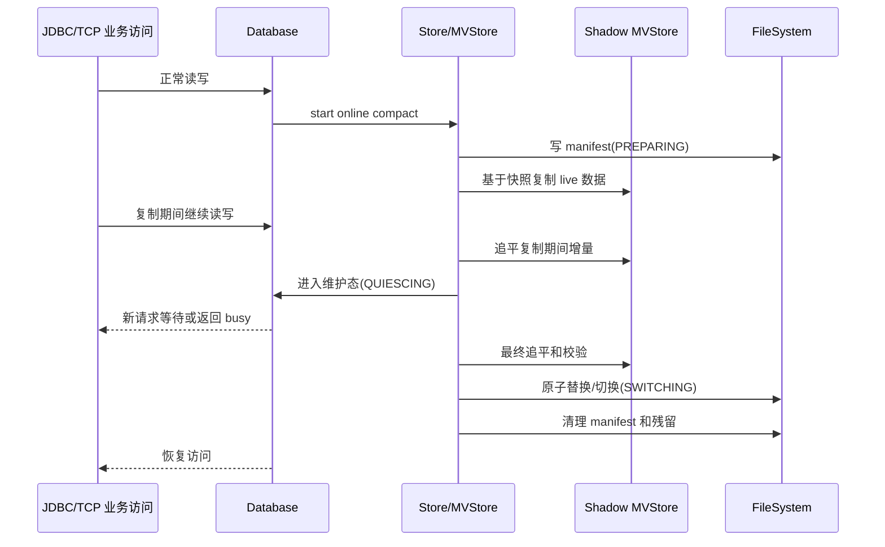

# H2 MVStore 空间回收优化 RFC（草案）

## 背景

当前 `.mv.db` 文件损坏排查主线已经证明，关闭自动 compact 后，大量写入再删除会让文件保持明显膨胀，即使 live 数据只剩很少。相关回归入口已经登记在 [h2db-corruption-investigation-plan.md](h2db-corruption-investigation-plan.md)：

| 测试编号 | 结论 |
| --- | --- |
| `T-NO-AUTO-COMPACT-BLOAT-01` | 关闭自动 compact 后，大量写入再删除只剩 marker，`.mv.db` 文件仍保持明显膨胀且 fill rate 很低。 |
| `T-OFFLINE-COMPACT-SHRINK-01` | 对同一膨胀样本执行离线 full compact，新文件明显缩小且 marker 可读。 |

这类问题属于空间回收优化，不应混入当前文件损坏修复主线。优化目标是稳定回收物理空间，同时尽量降低业务不可用时间，并且不重新引入 `File corrupted while reading record`、`unable to recover a valid set of chunks`、静默丢数据等风险。

## 目标

- 提供不依赖业务侧手工导出导入的空间回收能力。
- 支持服务进程不停的维护方式；中期方案允许数据库访问短暂进入维护态。
- 回收关闭自动 compact 后产生的明显膨胀空间，目标是接近离线 full compact 的收缩效果。
- 所有切换、失败和 crash 场景必须具备可恢复路径。
- 所有新增风险必须先登记测试编号，再进入生产代码实现。
- 保持 Java 8 兼容。

## 非目标

- 不把本方案作为当前 `.mv.db` 文件损坏 root cause 修复的替代方案。
- 不支持 `FILE_LOCK=NO`、`nolock:`、多 JVM embedded 同写这类 unsupported 场景。
- 不承诺完全无阻塞。中期方案目标是把长耗时阶段放到后台，把阻塞集中到受控切换窗口。
- 不在第一阶段改变 `.mv.db` 磁盘格式。若长期方案需要格式变更，必须另起兼容性 RFC。
- 不把 `MVStoreTool.repair` 作为空间回收机制。

## 现状/已有流程

| 入口 | 当前行为 | 优化关注点 |
| --- | --- | --- |
| `MVStore.compactFile(int maxCompactTime)` | 调用 `fileStore.compactStore(maxCompactTime)`，属于运行中 compact。 | 对纯 dead/free 空间不保证稳定缩小文件，不能作为膨胀文件收缩主方案。 |
| `MVStore.close(int allowedCompactionTime)` | `allowedCompactionTime == -1` 时 close 后调用 `MVStoreTool.compact(fileName, true)`。 | 可稳定重写文件，但需要关闭 store。 |
| `mvstore.db.Store.close(int allowedCompactionTime)` | full compact 时创建目标 FileStore，关闭源 store 后执行 `MVStoreTool.compact(source, target)`，最后 `moveAtomicReplace`。 | 安全性较好，但本质是关闭期重写。 |
| `MVStoreTool.compact(...)` | 生成临时文件后替换原文件；启动时可用 `compactCleanUp` 处理残留。 | 可复用 shadow 文件、校验、原子替换和残留清理思想。 |
| `SHUTDOWN COMPACT` / `SHUTDOWN DEFRAG` | 关闭数据库并 compact；`SHUTDOWN DEFRAG` 当前等价于 `COMPACT`。 | 不满足不停服诉求。 |
| `MAX_COMPACT_TIME` / `DEFRAG_ALWAYS` | 控制关闭时 compact 时间或 defrag 行为。 | 属于关闭流程配置，不解决在线空间回收。 |

## 核心约束

- MVStore 的 root、chunk metadata、page pos 和 file block 必须一致，不能出现 layout 指向旧 block 而旧 block 已被复用的状态。
- 复制或搬迁期间允许业务写入时，必须处理增量，否则切换会丢数据。
- 切换阶段必须阻止新事务进入，并明确已有事务等待、完成、超时或失败的行为。
- 文件替换必须考虑 Windows 上 atomic move 失败后的 fallback 行为。
- crash 后启动必须能识别 shadow/temp/new/manifest 残留，并确定使用旧库、新库还是清理失败产物。
- 备份、restore、TCP server、只读打开、加密、压缩、长事务都不能被静默破坏。

## 方案分层

| 层级 | 名称 | 服务进程 | 数据库访问阻塞 | 收缩效果 | 实现风险 | 建议定位 |
| --- | --- | --- | --- | --- | --- | --- |
| S0 | 维护态 full compact | 不停 | 可能较长，取决于库大小 | 接近离线 full compact | 低到中 | 短期过渡 |
| S1 | shadow compact + 增量追平 + 短切换 | 不停 | 只在切换期短暂阻塞 | 接近离线 full compact | 中到高 | 中期主方案 |
| S2 | MVStore 在线 chunk vacuum | 不停 | 极短内部锁 | 渐进回收，理论最优 | 高 | 长期优化 |

当前建议优先推进 S1，中期解决生产可用问题；S2 作为长期路线，先沉淀测试框架和不变量，不直接开干。

## 中期方案：shadow compact + 短切换

### 接口设计

第一阶段建议先做内部 API 和测试入口，暂不暴露新的 SQL 语法。公开入口等方案稳定后再讨论。

| 接口/对象 | 类型 | 作用 |
| --- | --- | --- |
| `OnlineCompactOptions` | 内部配置对象 | 控制最大后台复制时间、切换等待时间、校验级别、是否压缩、失败策略。 |
| `OnlineCompactResult` | 内部结果对象 | 返回是否收缩、旧文件大小、新文件大小、阻塞耗时、失败阶段、诊断信息。 |
| `Store.compactOnline(OnlineCompactOptions)` | 内部入口 | SQL 层数据库使用的在线 compact 入口，协调维护态、shadow 文件和切换。 |
| `MVStore.compactToShadow(...)` | 内部实现入口 | 基于一致性快照生成 shadow 文件，并支持后续增量追平或重试。 |
| `Database.enterMaintenance(...)` | 内部维护态入口 | 阻止新事务进入，等待已有事务完成，控制 TCP/embedded 访问行为。 |
| `OnlineCompactManifest` | 持久化 manifest | 记录 shadow compact 进度，供 crash recovery 使用。 |

公开入口待确认：

| 候选入口 | 优点 | 风险 |
| --- | --- | --- |
| 新 SQL，如 `COMPACT ONLINE` | 用户可显式调用，语义清晰。 | 需要 parser、help、兼容模式、权限和错误码设计。 |
| 新数据库设置，如 `ONLINE_COMPACT_*` | 便于自动调度。 | 容易和现有 auto compact 混淆。 |
| 新工具 API | 对 SQL 兼容影响小。 | TCP server 场景下需要明确权限和远程触发方式。 |

### 数据结构

`OnlineCompactManifest` 建议使用独立文本或二进制 manifest 文件，文件名示例：`<db>.mv.db.compact.manifest`。第一阶段优先使用易诊断文本格式。

| 字段 | 含义 |
| --- | --- |
| `magic` | 固定标识，例如 `H2_ONLINE_COMPACT`。 |
| `manifestVersion` | manifest 格式版本。 |
| `sourceFile` | 源 `.mv.db` 文件路径。 |
| `shadowFile` | shadow compact 文件路径。 |
| `phase` | 当前状态机阶段。 |
| `sourceFileSize` | 开始时源文件大小，用于诊断和保守校验。 |
| `baseVersion` | shadow copy 基于的 MVStore 版本。 |
| `catchupVersion` | 已追平到的版本，是否需要该字段待实现确认。 |
| `createdAt` / `updatedAt` | 诊断用时间戳。 |
| `verifyResult` | shadow 文件校验结果摘要。 |
| `switchToken` | 切换幂等标识，避免重复执行不一致操作。 |

### 状态机

| 状态 | 说明 | 可恢复行为 |
| --- | --- | --- |
| `IDLE` | 无任务。 | 无。 |
| `PREPARING` | 创建 manifest、检查空间和权限。 | 删除未使用 shadow，回到旧库。 |
| `COPYING_SNAPSHOT` | 后台从一致性快照构建 shadow 文件。 | 旧库仍权威，shadow 可删除。 |
| `CATCHING_UP` | 追平 copy 期间的增量写入。 | 旧库仍权威，shadow 可重建或继续。 |
| `QUIESCING` | 进入维护态，阻止新事务，等待已有事务完成。 | 超时则退出维护态，旧库继续服务。 |
| `VERIFYING` | 打开并校验 shadow 文件。 | 失败则删除 shadow，旧库继续服务。 |
| `SWITCHING` | 原子替换或重新绑定文件。 | 由 manifest 和 `compactCleanUp` 确定旧库或新库。 |
| `CLEANING` | 清理 manifest 和旧残留。 | 可重试清理。 |
| `COMPLETED` | 完成。 | 无。 |
| `ABORTED` | 主动或失败终止。 | 旧库继续服务，残留可清理。 |
| `RECOVERING` | 启动时处理未完成任务。 | 根据 phase 选择旧库、新库或清理残留。 |

### 时序流程



### 增量追平策略

中期方案成败取决于增量处理。候选策略如下：

| 策略 | 内容 | 优点 | 风险 |
| --- | --- | --- | --- |
| A. 维护态后重做 full copy | 后台预复制只用于估算，进入维护态后重新 compact。 | 简单安全。 | 阻塞时间仍和库大小相关，不能满足短阻塞目标。 |
| B. 版本快照 + 增量扫描 | shadow 基于 baseVersion，切换前扫描 baseVersion 后变化并补写。 | 对业务侵入较小。 | 需要可靠枚举变更范围，设计复杂。 |
| C. 双写/变更日志 | compact 期间业务写入同时记录到 shadow delta。 | 切换快。 | 改动事务写路径，风险高。 |

建议第一轮实现以 B 为目标做 RFC 细化；若 B 的变更枚举无法可靠证明，则退回 A 作为短期过渡，C 作为后续增强。

## 长期方案：MVStore 在线 chunk vacuum

长期方案不重写整个文件，而是在 MVStore 内部渐进搬迁低利用率 chunk：

1. 扫描低利用率 chunk。
2. 判断是否仍被活跃版本或长事务引用。
3. 将存活 page 复制到新 chunk。
4. 原子发布新的 root / chunk metadata。
5. 旧 chunk 无引用后进入可回收集合。
6. 文件尾部连续 chunk 全部可回收时 truncate。

该方案阻塞最短、长期效果最好，但直接触碰 page relocation、chunk metadata、MVCC 可见性和 crash recovery，不建议在中期方案之前直接实现。

### 长期方案不变量

- 已发布 root 引用的 page 必须始终可读。
- 活跃事务可见的旧版本 page 所在 chunk 不得提前释放。
- relocation 后新旧 page 内容必须按 map key 等价。
- 任何 crash 点后，启动恢复必须选择一个完整版本，而不是半发布版本。
- truncate 只能发生在所有可恢复版本都不再引用尾部 chunk 之后。

## 异常处理

| 故障点 | 期望行为 |
| --- | --- |
| 创建 manifest 失败 | 不开始 compact，旧库继续服务。 |
| shadow copy 期间 IO 失败 | 标记 `ABORTED`，删除 shadow，旧库继续服务。 |
| 进入维护态超时 | 退出维护态，旧库继续服务，返回可诊断错误。 |
| shadow 校验失败 | 不替换旧库，保留诊断信息。 |
| 原子替换失败 | 使用现有 `moveAtomicReplace` fallback 思路，并通过 manifest 保证可恢复。 |
| 切换中 crash | 启动时根据 manifest、source、shadow、newFile/temp 文件状态恢复到旧库或新库。 |
| 清理残留失败 | 不影响数据库打开，后续重试清理。 |

## 幂等性

- `OnlineCompactManifest.switchToken` 标识一次切换，重复恢复时只能完成同一次切换或回滚到旧库。
- `PREPARING`、`COPYING_SNAPSHOT`、`CATCHING_UP` 阶段 crash 后默认旧库权威。
- `VERIFYING` 阶段 shadow 未通过校验前不得替换。
- `SWITCHING` 阶段必须能通过 source、shadow、newFile/temp 和 manifest 判断是否已完成替换。

## 回滚策略

- 默认通过配置或入口参数关闭在线空间回收。
- 中期方案不改磁盘格式，回滚代码后旧 `.mv.db` 仍可按原逻辑打开。
- 如果 manifest 存在但当前版本不支持在线 compact，应保守使用旧库并清理未完成 shadow，或拒绝打开并给出明确诊断。
- 如果新文件已完成切换，旧版本代码应能按普通 `.mv.db` 打开。

## 兼容性

- Java 8 兼容。
- TCP server 和 embedded 入口行为一致，差异只体现在客户端等待或异常返回。
- 第一阶段不改变 `.mv.db` 文件格式。
- 不改变现有 `SHUTDOWN COMPACT` 语义。
- 新 SQL 或配置若引入，必须同步 `help.csv`、错误码和兼容模式说明。

## 灰度/迁移

| 阶段 | 默认行为 | 验收 |
| --- | --- | --- |
| 实验开关 | 默认关闭，只允许测试入口触发。 | 单机 fault injection 通过。 |
| 内部灰度 | 仍默认关闭，可通过显式配置触发。 | 大库、慢盘、TCP server 压测通过。 |
| 受控生产 | 显式开启，限制并发和时间窗口。 | 可观测指标和失败回退稳定。 |
| 默认策略评估 | 评估是否作为推荐维护命令。 | 需要长期 soak 结果支持。 |

## 测试方案

新增测试必须先登记编号。建议从以下矩阵开始：

| 编号 | 覆盖内容 | 所属方案 |
| --- | --- | --- |
| `T-SPACE-BLOAT-BASELINE-01` | 复用 `T-NO-AUTO-COMPACT-BLOAT-01`，确认膨胀样本稳定。 | 基线 |
| `T-SHADOW-COMPACT-SHRINK-01` | shadow compact 后文件显著缩小，marker 可读。 | S1 |
| `T-ONLINE-COMPACT-BLOCKS-WRITES-01` | 维护态阻止新写入，读写策略明确。 | S1 |
| `T-ONLINE-COMPACT-CATCHUP-WRITES-01` | copy 期间提交的数据切换后不丢。 | S1 |
| `T-ONLINE-COMPACT-LONG-TRANSACTION-01` | 长事务存在时不会提前切换或回收仍可见版本。 | S1/S2 |
| `T-ONLINE-COMPACT-CRASH-BEFORE-SWITCH-01` | 切换前 crash 后旧库可打开。 | S1 |
| `T-ONLINE-COMPACT-CRASH-DURING-SWITCH-01` | 切换中 crash 后可恢复到旧库或新库。 | S1 |
| `T-ONLINE-COMPACT-VERIFY-FAIL-01` | shadow 校验失败不替换旧库。 | S1 |
| `T-ONLINE-COMPACT-TCP-BEHAVIOR-01` | TCP server 模式下等待、busy 或 timeout 行为稳定。 | S1 |
| `T-ONLINE-COMPACT-BACKUP-INTERACTION-01` | 与 `SCRIPT DROP TO` / backup 并发时不会破坏库。 | S1 |
| `T-ONLINE-VACUUM-RELOCATE-CHUNK-01` | 搬迁 chunk 后 root 和 page 内容等价。 | S2 |
| `T-ONLINE-VACUUM-LONG-TRANSACTION-01` | 长事务引用旧 page 时旧 chunk 不被释放。 | S2 |
| `T-ONLINE-VACUUM-CRASH-PUBLISH-01` | 发布新 metadata 前后 crash 均可恢复。 | S2 |
| `T-ONLINE-VACUUM-TRUNCATE-01` | truncate 只发生在尾部 chunk 全部无引用之后。 | S2 |
| `T-ONLINE-VACUUM-RANDOMIZED-01` | 随机 put/remove/commit/rollback/vacuum/crash 后与模型比对。 | S2 |

验收命令以 `h2/` 目录为准，至少包括：

```powershell
.\gradlew.bat compileJava
.\gradlew.bat runMvStoreRecoveryCheck
.\gradlew.bat "-Dh2.test.mvStoreRecoveryCorruption.characterize=true" runMvStoreRecoveryCheck
```

后续应新增专门入口，例如 `runMvStoreSpaceReclamationCheck`，避免把优化测试全部塞进损坏恢复测试。

## 风险点

| 风险 | 影响 | 缓解 |
| --- | --- | --- |
| 增量追平不完整 | 静默丢数据 | marker、随机模型、copy 期间写入回归必须覆盖。 |
| 切换状态机不完整 | crash 后无法打开或使用错误文件 | manifest + crash injection + 启动恢复测试。 |
| 维护态锁顺序错误 | 死锁或长时间阻塞业务 | 明确锁层级，所有等待必须有超时和诊断。 |
| Windows 文件替换行为差异 | 替换失败或残留文件 | 复用并扩展 `moveAtomicReplace` / `compactCleanUp` 测试。 |
| 与 backup/restore 并发 | 备份半文件或误恢复 | 维护态互斥矩阵和测试。 |
| 长期 vacuum 提前释放旧 chunk | 文件损坏或旧事务读失败 | MVCC 引用保护和长期 soak 测试。 |

## 分阶段实施计划

详细执行计划见 [h2db-space-reclamation-implementation-plan.md](h2db-space-reclamation-implementation-plan.md)。

1. 先完成 RFC 评审和开放问题收敛。
2. 建立空间回收专用测试入口和 crash/fault injection 基础设施。
3. 先做中期 S1 的 shadow compact 原型。
4. 补齐 manifest、维护态、校验、切换和恢复。
5. 灰度验证中期方案。
6. 长期 S2 只先做研究、测试框架和不变量验证，不与 S1 混在一个变更中实现。

## 开放问题

- S1 增量追平采用版本扫描还是双写/变更日志，需要继续读 `MVStore` 和 `TransactionStore` 代码后定稿。
- 维护态下读请求是否允许继续执行，还是和写请求一样等待，需要结合事务可见性和运维期望决定。
- 公共入口使用 SQL、工具 API 还是数据库设置，需在实现稳定后再讨论。
- manifest 使用文本格式还是二进制格式，需权衡可诊断性和实现复杂度。
- 长期 S2 是否需要任何磁盘格式扩展，目前默认不需要，但必须在详细设计中证明。
