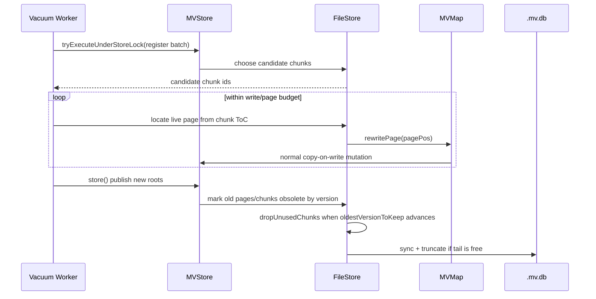

# H2 MVStore S2 在线 Chunk Vacuum 设计方案（讨论稿）

## 前置依赖

S2 在线空间回收应排在插件化最小架构之后推进。原因是 S2 触及存储引擎内部的 page、chunk、metadata publish 和 truncate 语义，如果先写死在 MVStore 类名和内置 `Store` 路径上，后续存储引擎 / 表引擎插件化会产生较大返工。

本设计后续需要改为面向 [H2 插件化架构改造设计方案](h2db-plugin-architecture-rfc.md) 中的 `StorageEngine` / `StorageMaintenance` capability：

- `storage.vacuum.online`
- `storage.publish.crashSafe`
- `storage.truncate.safe`

第一版 S2 可以只由内置 MVStore storage provider 声明支持；其他存储引擎应返回 `UNSUPPORTED` 或 `SKIPPED`。

## 背景

现有空间回收路线已经把问题拆成两层：

- S1：基于 shadow 文件的维护态 compact，侧重可回滚、可验证、可受控试用。
- S2：MVStore 内部的在线 chunk vacuum，目标是在不重写整个文件、不暴露长时间维护窗口的前提下，渐进搬迁低利用率 chunk 中仍存活的 page，并在安全边界内释放旧 chunk 和截断尾部空间。

当前 S1 已经形成内部维护 API、manifest、source fingerprint、shadow 切换和保守 full-copy 降级路径。S1 证明了整文件 shadow compact 可以安全收缩文件，但也留下了两个长期问题：一是 copy 期间增量追平在当前文件级方案中不可行；二是维护态 full-copy 的阻塞和 IO 成本仍然与库大小强相关。S2 要解决的是更底层的空间碎片和低利用率 chunk 问题。

## 目标

| 目标 | 说明 |
| --- | --- |
| 渐进回收空间 | 按 chunk 粒度搬迁低利用率 page，避免每次重写整个 `.mv.db` 文件。 |
| 保持在线读写 | 普通读写继续执行，S2 只在短时间内部锁、metadata 发布或 truncate 时进入受控临界区。 |
| 不破坏 MVCC 可见性 | 长事务、旧版本 root、undo log 和 openVersion 仍能读取其可见 page。 |
| crash 后可恢复 | 任何 relocation、metadata 发布、dead chunk 标记、truncate 前后 crash 都必须能打开一个完整版本。 |
| 默认不改磁盘格式 | 第一版设计以复用现有 chunk metadata、layout map、page pos 和 store header 为目标。是否真的可行是本设计的重点证明对象。 |
| 先测试后实现 | 先补齐 relocation 不变量和 fault injection，再进入生产代码实现。 |

## 非目标

- 不替代 S1 的维护态 compact；S1 仍作为受控整文件收缩路径。
- 不新增 SQL 入口、不新增自动调度策略、不定义运维 API 的公开语义。
- 不支持 `FILE_LOCK=NO`、`nolock:`、多 JVM embedded 同写等 unsupported 场景。
- 不在第一版引入新的 `.mv.db` 磁盘格式、外部 sidecar 索引或跨版本必须理解的新元数据。
- 不把 S2 作为当前文件损坏修复主线；S2 是空间回收优化。

## 现状/已有流程

| 模块 | 当前事实 |
| --- | --- |
| `MVStore.store()` | 在 `storeLock` 下推进 `currentVersion`，收集 changed roots，再由 `FileStore.storeIt()` 写入新 chunk。 |
| `FileStore.dropUnusedChunks()` | 依赖 `oldestVersionToKeep`、retention time、chunk `unusedAtVersion` 判断 dead chunk 是否可释放。 |
| `FileStore.rewriteChunks()` | 当前已有低利用率 chunk 重写能力：扫描 chunk ToC，定位 live page，调用 `MVMap.rewritePage(pagePos)` 让 map 通过普通写路径重写 page。 |
| `MVMap.rewritePage()` | 读取旧 page，以 page 第一个 key 作为入口，通过 `RewriteDecisionMaker` 触发一次等价写。该能力更接近“重写存活 page”，不是完整的 page graph relocation。 |
| `RandomAccessStore.compactMoveChunks()` | 支持移动物理 chunk 到前部空洞，并写入新的 chunk metadata；它移动的是整个 chunk，而不是抽取 live page。 |
| `RandomAccessStore.shrinkStoreIfPossible()` | 只在尾部连续空闲时 `sync()` 后 truncate。 |
| `MVStoreSpaceReclamation` | S1 侧工具，处理 shadow 文件、manifest、fingerprint、verify、switch 和 recover；S2 不应复用它的文件替换语义，但可复用诊断、fault injection 和测试登记方式。 |

## 核心约束

| 约束 | 设计含义 |
| --- | --- |
| Page pos 是持久引用 | 已发布 root 或 parent page 中保存的 page pos 必须始终能读到对应 page，直到所有可见版本都不再引用它。 |
| Chunk metadata 是权威布局 | 正常读路径必须以 layout map / chunk metadata 为准，不能依赖 recovery 物理扫描候选。 |
| `oldestVersionToKeep` 是回收下界 | chunk 只有在不再被任何活跃版本引用，且超过 retention 后才能从 layout 中移除并释放空间。 |
| 发布必须原子化 | 新 root / 新 page / chunk metadata 必须通过一次正常 store 版本发布，不允许出现半发布版本。 |
| Truncate 必须保守 | 只有尾部连续 chunk 已从 layout 删除、page cache 清理、freeSpace 标记为空闲并完成必要 sync 后才能 truncate。 |
| Java 8 兼容 | 新增 API 和测试不得使用 Java 8 之后语法或库方法。 |

## 设计总览

S2 不直接“改写旧 page pos”，而是把 vacuum 建模为一组受控的普通 MVStore 写入：

1. 选择候选 chunk：按低利用率、位置、年龄、是否尾部阻塞等维度挑选。
2. 建立 relocation 批次：记录 candidate chunk、baseVersion、budget、预期收益和诊断信息。
3. 重写 live page：对候选 chunk 中仍被当前 root 引用的 page，走 map 层 rewrite，让新 page 写入新的 chunk。
4. 发布新版本：通过现有 `store()` 生成新 root 和新 chunk metadata。
5. 延迟释放旧 chunk：旧 chunk 进入 dead/reclaimable 队列，只有 `unusedAtVersion < oldestVersionToKeep` 后才释放。
6. 尾部截断：释放后若尾部连续空闲，执行 sync + truncate。

这一路径复用 copy-on-write 和现有版本保留机制，避免在旧版本仍可见时原地修改 page 或删除 chunk。

## 接口设计

第一阶段只设计内部接口，不新增 SQL、JDBC 或 TCP 协议语义。

在插件化骨架完成后，S2 的最终入口不应是直接公开 `MVStore.vacuumChunks(...)`，而应先通过 storage capability gate：

1. `StorageEngine.supports("storage.vacuum.online")`
2. `StorageMaintenance.vacuumOnline(options)`
3. 内置 MVStore provider 内部再委托到 `MVStore / FileStore` 具体实现

| 接口/对象 | 类型 | 作用 |
| --- | --- | --- |
| `MVStoreVacuumOptions` | 内部配置对象 | 控制 chunk 数量、page rewrite budget、最大耗时、目标 fill rate、是否允许 truncate、诊断 listener、测试 fault injection。 |
| `MVStoreVacuumResult` | 内部结果对象 | 返回扫描 chunk 数、重写 page 数、释放 chunk 数、truncate 字节数、跳过原因、失败阶段。 |
| `MVStore.vacuumChunks(MVStoreVacuumOptions)` | 内部入口 | 在 MVStore 层协调锁、版本使用登记、store 发布和异常转 panic。 |
| `FileStore.vacuumChunks(MVStoreVacuumOptions)` | 存储层入口 | 选择候选 chunk，执行 page rewrite，标记旧 chunk 可回收，触发安全 truncate。 |
| `VacuumBatch` | 内部批次状态 | 保存 batchId、baseVersion、candidateChunks、phase、startedAt、预算和诊断计数。 |
| `VacuumFaultInjector` | 测试接口 | 在 select/rewrite/publish/free/truncate 等阶段注入异常或模拟 crash。 |

候选 public API 待讨论后另起方案；本设计不提前承诺。

## 数据结构

### `MVStoreVacuumOptions`

| 字段 | 含义 | 默认建议 |
| --- | --- | --- |
| `targetFillRate` | 候选 chunk 低于该利用率才考虑重写 | 50 |
| `maxChunksPerRun` | 单次最多处理 chunk 数 | 4 |
| `maxPagesPerRun` | 单次最多 rewrite page 数 | 1024 |
| `maxBytesToWrite` | 单次额外写入预算 | `autoCommitMemory` 派生 |
| `maxMillis` | 单次最大耗时 | 100-500ms 内部默认，待压测 |
| `allowTruncate` | 是否允许本轮执行尾部 truncate | true |
| `force` | 测试入口是否忽略部分收益阈值 | false |
| `diagnosticListener` | 诊断事件监听 | null |
| `faultInjector` | 测试注入点 | null |

### `VacuumBatch`

| 字段 | 含义 |
| --- | --- |
| `batchId` | JVM 内单调递增诊断 id，不持久化。 |
| `baseVersion` | 本轮开始时的 `currentVersion`。 |
| `oldestVersionAtStart` | 本轮开始时的 `oldestVersionToKeep`。 |
| `candidateChunkIds` | 选中的 chunk id 集合。 |
| `phase` | 当前状态。 |
| `rewrittenPages` | 已触发 rewrite 的 page 数。 |
| `publishedVersion` | 成功 store 后的新版本；未发布时为 `INITIAL_VERSION`。 |
| `releasedChunks` | 本轮或后续 drop 中释放的 chunk 数。 |
| `truncatedBytes` | 本轮 truncate 收缩字节数。 |

### 是否需要磁盘格式变更

提案：第一版 S2 不新增持久化字段。

理由：

- 新 page 通过现有 store 流程写入新 chunk。
- 新 root 通过现有 layout map 发布。
- 旧 chunk 是否可删除沿用 `unusedAtVersion`、retention 和 `oldestVersionToKeep`。
- crash recovery 仍从现有 store header、last chunk、layout map 和 chunk header/footer 选择完整版本。

待证明点：

- 当前 `rewritePage(pagePos)` 是否覆盖所有 live page 类型，尤其是非叶子 page、layout/meta map page、RTree 和事务 undo log 相关 page。
- 第二轮 rewrite 非叶子 page 是否足以把 parent 引用更新到新 child pos，避免旧 chunk 残留。
- rewrite 过程中 page 被并发修改、删除、map closed 时，旧 chunk 统计和 `occupancy` 是否仍能正确收敛。

## 状态机

| 状态 | 说明 | 允许转移 |
| --- | --- | --- |
| `IDLE` | 无 vacuum 批次 | `SELECTING` |
| `SELECTING` | 选择低利用率 chunk 并建立批次 | `REWRITING` / `SKIPPED` / `ABORTED` |
| `REWRITING` | 按预算触发 live page rewrite | `PUBLISHING` / `ABORTED` |
| `PUBLISHING` | 调用正常 store 发布新 roots 和 chunk metadata | `WAITING_OLD_VERSIONS` / `ABORTED` |
| `WAITING_OLD_VERSIONS` | 等待 `oldestVersionToKeep` 越过旧 chunk 的 `unusedAtVersion` | `RELEASING` / `IDLE` |
| `RELEASING` | `dropUnusedChunks()` 删除 layout chunk metadata 并释放 freeSpace | `TRUNCATING` / `COMPLETED` |
| `TRUNCATING` | 尾部连续空闲时 sync + truncate | `COMPLETED` / `ABORTED` |
| `COMPLETED` | 本轮完成 | `IDLE` |
| `SKIPPED` | 无收益、预算不足、store busy 或存在不安全条件 | `IDLE` |
| `ABORTED` | 本轮失败，旧数据仍由已发布版本保护 | `IDLE` |

非法转移：

- `REWRITING` 不能直接 `RELEASING`；必须经过一次成功发布。
- `PUBLISHING` 失败后不能释放候选 chunk。
- `TRUNCATING` 不能处理 layout 中仍存在的 chunk。

## 时序流程

### 正常成功路径

1. 后台线程或显式内部入口尝试获取 `storeLock`，失败则跳过本轮。
2. flush 当前 FileStore 序列化队列，确保候选判断面对稳定的已提交 chunk metadata。
3. 读取当前版本和 `oldestVersionToKeep`，选择 candidate chunk。
4. 释放长时间全局锁，只保留必要的 serialization 边界，按 page budget 调用 `MVMap.rewritePage()`。
5. 对 rewrite 产生的 unsaved changes 执行一次普通 `store()`。
6. 后续 `dropUnusedChunks()` 根据版本保留规则释放 old chunk。
7. 如尾部连续空闲，执行 `sync()` 后 truncate。

### 并发写入

- 用户写入与 vacuum rewrite 都走 MVMap copy-on-write。
- 若用户先修改某个 page，vacuum 读到的旧 page rewrite 可以被 `RewriteDecisionMaker` 判定 abort 或无效。
- 若 vacuum 先 rewrite，用户后续写入会基于新 root 继续前进。
- 无论顺序如何，旧 page 所在 chunk 只有在旧版本不可见后才能释放。

### 长事务/旧版本

- vacuum 开始时必须调用 `registerVersionUsage()` 或等价机制保护本轮读取的版本。
- 发布后，旧 chunk 不因“当前 root 不再引用”立即释放；必须等所有活跃 transaction/openVersion 释放。
- `TransactionStore` 的 earliest store version tracker 是 S2 的硬依赖，不能绕开。

## 异常处理

| 故障点 | 期望行为 |
| --- | --- |
| 选择候选失败 | 返回 `SKIPPED` 或 `ABORTED` 诊断，不改变文件。 |
| 读取候选 chunk/page 失败 | 触发 MVStore panic 或返回明确错误；不得继续释放该 chunk。 |
| `rewritePage()` 返回 abort | 记录 skipped page，继续处理同批次其他 page；达到阈值可终止本轮。 |
| 发布前 crash | 只有未发布的新 page 可能残留在最后 chunk；恢复按现有 last valid chunk 规则选择完整版本。 |
| 发布后 crash | 新 root 或旧 root 二者至少有一个完整可恢复；旧 chunk 仍在 layout 或 dead retention 保护范围内。 |
| 释放 chunk 前 crash | chunk metadata 仍在 layout 或 dead queue 可重建，文件可打开。 |
| 释放 chunk 后、truncate 前 crash | freeSpace 可由 layout 中仍分配 chunk 重建；已删除 chunk 不再被可恢复版本引用。 |
| truncate 中 crash | store header 和 last chunk 必须已经指向不依赖被截断区域的完整版本；恢复不能要求读取截断区。 |

## 幂等性

S2 第一版不持久化 batch manifest，因此幂等性来自 MVStore 的版本发布语义：

- 未发布的 rewrite 不对可恢复版本生效。
- 已发布的 rewrite 可重复发生，最多产生额外新 page，不改变逻辑数据。
- dead chunk 释放以 chunk id 和 layout metadata 为准，重复 `dropUnusedChunks()` 应无副作用。
- truncate 以当前 layout 重建出的 file length in use 为准，重复 truncate 到同一或更大安全边界应无副作用。

## 回滚策略

- 默认关闭 S2 自动调度；只有内部显式入口或测试入口触发。
- 发现风险后关闭入口即可；已发布的新 page 是普通 MVStore 版本，不需要数据迁移回滚。
- 若发现 rewrite 路径有兼容性风险，可保留 S1，停用 S2。
- 若发现 truncate 边界风险，第一时间关闭 `allowTruncate`，保留 page rewrite 但不执行物理截断。
- 不改磁盘格式意味着回滚代码后，已被 S2 写过的 `.mv.db` 仍应可由旧逻辑打开；前提是旧逻辑支持现有 chunk/page 格式。

## 兼容性

| 维度 | 结论 |
| --- | --- |
| Java | 必须保持 Java 8。 |
| 磁盘格式 | 第一版不变更 format read/write 版本。 |
| 旧客户端 | 不暴露 SQL/JDBC/TCP 新语义，客户端无感。 |
| 旧数据 | 打开旧 `.mv.db` 后可运行 vacuum；不需要预迁移。 |
| mixed version | H2 embedded 场景不是集群 mixed-version；TCP client 不感知内部 vacuum。 |
| 多文件 store | `AppendOnlyMultiFileStore` 当前 `compactStore()` 为空实现，S2 第一版限定 `SingleFileStore` / `RandomAccessStore`，其他 FileStore 返回 skipped。 |

## 灰度/迁移

本节只定义设计灰度边界，不展开开发计划。

| 阶段 | 默认行为 | 进入条件 |
| --- | --- | --- |
| 实验入口 | 默认关闭，只允许测试或内部显式调用 | relocation 不变量测试通过。 |
| 内部灰度 | 默认关闭，可手动触发，不允许自动后台调度 | crash/fault injection 通过。 |
| 受控自动 | 仍需开关，限制每轮预算和 truncate | 长稳压测通过并有诊断指标。 |

自动调度、SQL 入口和运维可观测指标将在方案讨论后单独设计。

## 测试方案

| 编号 | 覆盖内容 |
| --- | --- |
| `T-ONLINE-VACUUM-RELOCATE-CHUNK-01` | 搬迁低利用率 chunk 中 live page 后，所有 map 数据与模型一致。 |
| `T-ONLINE-VACUUM-LONG-TRANSACTION-01` | 长事务持有旧版本时，旧 chunk 不被释放或截断。 |
| `T-ONLINE-VACUUM-CRASH-BEFORE-PUBLISH-01` | rewrite 后、store 发布前 crash，恢复后旧版本可打开且数据一致。 |
| `T-ONLINE-VACUUM-CRASH-PUBLISH-01` | store 发布前后 crash，恢复选择完整版本，数据一致。 |
| `T-ONLINE-VACUUM-CRASH-FREE-01` | chunk metadata 删除前后 crash，恢复不引用已释放空间。 |
| `T-ONLINE-VACUUM-TRUNCATE-01` | truncate 只发生在尾部 chunk 全部无引用之后。 |
| `T-ONLINE-VACUUM-META-LAYOUT-01` | layout/meta map page 被候选 chunk 覆盖时，rewrite 和恢复仍正确。 |
| `T-ONLINE-VACUUM-CONCURRENT-WRITES-01` | vacuum 与并发 put/remove/commit/rollback 交错，最终与模型一致。 |
| `T-ONLINE-VACUUM-RANDOMIZED-01` | 随机 put/remove/commit/rollback/vacuum/crash 后与内存模型比对。 |
| `T-ONLINE-VACUUM-NO-FORMAT-CHANGE-01` | vacuum 后文件 format read/write 版本不变，普通只读打开成功。 |

建议验证命令仍以后续计划为准；设计阶段不要求运行。

## 风险点

| 风险 | 影响 | 缓解 |
| --- | --- | --- |
| `rewritePage()` 不能覆盖所有 page graph | 旧 chunk 长期无法释放，或错误释放仍可见 page | 先做白盒覆盖和随机模型；不满足时扩大 rewrite 能力，而不是提前 truncate。 |
| 非叶子 page 引用旧 child pos | 旧 chunk 无法释放或旧版本读取异常 | 两阶段 rewrite 与 root 等价性测试必须通过。 |
| 长事务版本下界判断错误 | 文件损坏或旧事务读取失败 | 所有释放必须依赖 `oldestVersionToKeep`，并加入长事务 crash 测试。 |
| layout/meta map 自身 relocation | 恢复找不到权威 metadata | 单独覆盖 meta/layout 候选场景，必要时第一版排除这些 chunk。 |
| truncate 边界错误 | 截断仍被引用的尾部 chunk | 第一版可先禁用 truncate，只验证 rewrite/free；truncate 单独 gate。 |
| 后台 vacuum 与 auto compact 交错 | 锁顺序错误、重复 rewrite、性能抖动 | 统一走 `storeLock` / `serializationLock` 顺序，单次预算严格限制。 |
| IO 放大 | 在线业务延迟上升 | 小批量、时间预算、idle 优先、诊断统计。 |

## 设计约束给实现阶段

- 不允许原地修改已发布 page 内容。
- 不允许在 `unusedAtVersion >= oldestVersionToKeep` 时释放或截断 chunk。
- 不允许把 recovery 物理扫描候选作为正常读写或 vacuum 的权威来源。
- 不允许在第一版修改 `.mv.db` format read/write 版本。
- 不允许 S2 入口绕过 `storeLock`、`serializationLock` 和现有 panic 处理。
- 可接受的第一版降级：只 rewrite，不 truncate；只处理普通用户 map，跳过 layout/meta/特殊 map；只在 idle 时运行。

## 分阶段实施计划

待方案讨论结束后再写。

本设计阶段只确认架构约束、接口边界、不变量、异常语义和测试矩阵；开发拆分、里程碑、任务顺序、验收命令和排期不在本文展开。

## 开放问题

- 当前 `FileStore.rewriteChunks()` + `MVMap.rewritePage()` 是否可以作为 S2 第一版核心，还是需要新增显式 page relocation API？
- 第一版是否应跳过 layout/meta map 所在 chunk，先降低风险，还是必须从一开始覆盖？
- 第一版是否允许 truncate，还是先只做 rewrite + dead chunk release，不收缩文件尾部？
- vacuum 的触发入口是继续复用 `compactFile()` 内部路径，还是新增独立内部 API？
- S2 与现有 auto compact 的优先级、互斥关系和预算共享规则如何定义？
