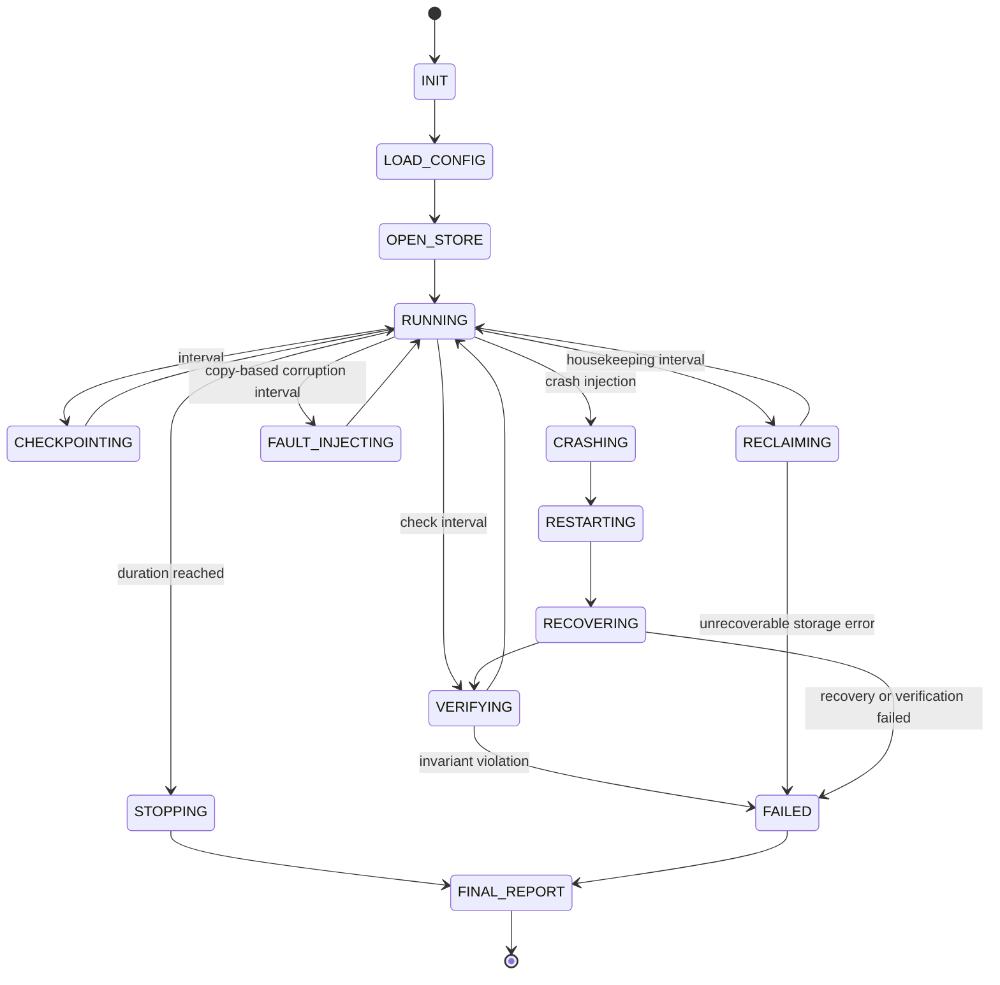
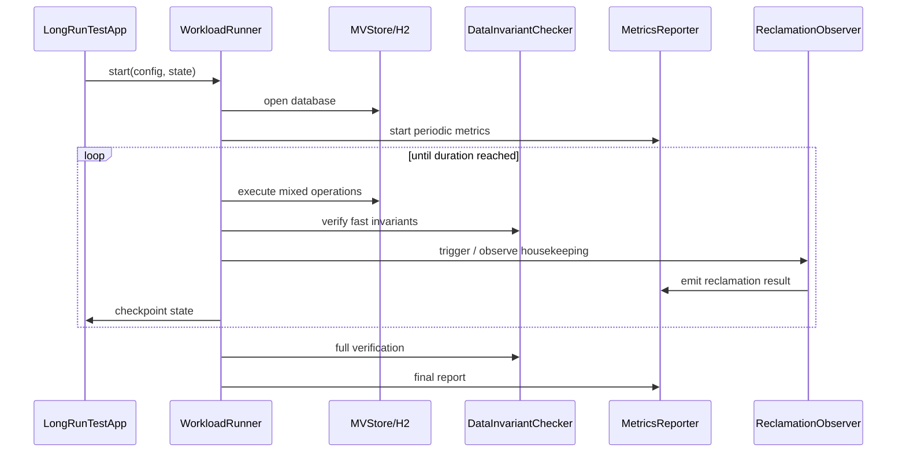

# H2 Standalone Long-Running Stress Test Application Design

This document designs a long-running stress test application that is independent from the H2 main artifact and regular test suites. It simulates realistic data access, long-duration runs, sustained pressure, failure injection, and automatic space reclamation acceptance. The application is packaged as a standalone jar for developer machines, nightly validation machines, or dedicated soak-test hosts.

## Background

Regular JUnit and legacy smoke tests are good at deterministic behavior checks, but they do not cover these issues well:

| Issue | Limitation of regular tests |
| --- | --- |
| Long-term resource leaks | Minute-scale tests rarely expose handle, thread, cache, or metadata leaks. |
| Long-term file growth | Single-round compact/reclaim tests do not prove multi-day or multi-week size stability. |
| Rare concurrency interleavings | Short tests rarely combine long transactions, background reclamation, read/write peaks, and recovery. |
| Crash recovery reliability | Repeated kill, restart, recovery verification, and retained failure artifacts are needed. |
| Performance degradation | Throughput, latency, file size, fill rate, and background-task metrics need continuous collection. |

The solution is a configurable, resumable, observable, independently packaged test application rather than a one-month run inside the default test suite.

## Goals

| Goal | Acceptance |
| --- | --- |
| Independent artifact | Produce `h2-longrun.jar`, outside the H2 main jar. |
| Independent source boundary | Keep long-run sources in a dedicated source set, separate from `src/main` and regular `src/test`. |
| Long-duration support | Support 10-minute smoke, 6-12 hour nightly runs, and 7-30 day soak runs. |
| Realistic access simulation | Support MVStore and H2 SQL workloads: reads, writes, updates, deletes, range scans, batches, and long transactions. |
| Resumable and reproducible | Record seed, state file, operation log, and the last N events for failure reproduction. |
| Continuous consistency checks | Store checksum / version / counters and verify committed data visibility after restart. |
| Space reclamation acceptance | Continuously trigger or observe S2 automatic reclamation and record round results, codes, and file-size changes. |
| Failure injection | Support process kill, abnormal close, restart recovery, copy-based file corruption injection, and optional FilePath delay/failure simulation. |
| Metrics output | Emit machine-readable metrics, event logs, and final reports. |

## Non-Goals

| Non-goal | Notes |
| --- | --- |
| Replace JUnit / TestAll | Long-running stress tests complement deterministic regressions. |
| Enter default CI | Default builds do not run soak tests; only explicit smoke or soak tasks do. |
| Change the H2 release jar | The long-run jar is a test product and is not mixed into the main jar. |
| Cover every database feature in the first version | Start with MVStore and core SQL access, then add complex SQL, LOB, indexes, and network mode. |
| Depend on external monitoring | The first version writes local files; Prometheus, JFR, or external collectors can come later. |

## Existing Flow

Current repository gates include:

| Entry | Purpose | Relationship to long-run tests |
| --- | --- | --- |
| `runMvStoreReclamationJUnitCheck` | S2 JUnit contract checks | Remains the fast gate. |
| `runMvStoreSpaceReclamationCheck` | MVStore space reclamation legacy check | Remains functional regression coverage. |
| `runMvStoreRecoveryCheck` | MVStore recovery checks | Long-run tests reuse the same recovery concerns. |
| `runH2LegacySmoke` | H2 legacy smoke | Long-run tests do not enter this task. |
| `runH2TestAllCi` | Full legacy CI | Long-run tests do not replace it. |
| `runLongRunJUnitCheck` | Longrun JUnit checks | Covers deterministic longrun app logic without starting long soaks. |

S2 complete automatic space reclamation already has the default scheduler, persistent journal, relocation-map read path, tail-shrink metrics, and adaptive scheduling. The long-running application needs to observe these capabilities under realistic workloads.

## Core Constraints

| Constraint | Requirement |
| --- | --- |
| Build boundary | Add a source set and jar task without changing the H2 main jar. |
| Java compatibility | Keep long-run sources Java 8 compatible. |
| Explicit execution | All long-run tasks must be explicitly invoked; default `build` and `check` do not run 30-day tasks. |
| Reproducibility | Every run records config, seed, H2 version, git commit, and JVM arguments. |
| Failure artifacts | Failed runs retain database files, state files, operation logs, and recent metrics by default. |
| Resource limits | Config must support max duration, max database size, max threads, and max disk directory. |
| Result judgement | Success requires data, recovery, space, and metric checks, not just “the process did not crash”. |

## Modules And Directory Layout

Proposed dedicated source directory:

```text
h2/src/longrun/org/h2/test/longrun/
  LongRunTestApp.java
  LongRunConfig.java
  LongRunState.java
  LongRunMode.java
  WorkloadRunner.java
  WorkloadProfile.java
  WorkloadOperation.java
  DataInvariantChecker.java
  MetricsReporter.java
  EventLogWriter.java
  CrashHarness.java
  ReclamationObserver.java
  mvstore/
    MVStoreWorkload.java
    MVStoreModel.java
  sql/
    SqlWorkload.java
    SqlModel.java
```

| Module | Responsibility |
| --- | --- |
| `LongRunTestApp` | CLI entrypoint, config loading, work-dir creation, runner startup, exit codes. |
| `LongRunConfig` | Parses properties / CLI arguments, applies defaults, validates fields. |
| `LongRunState` | Records run id, seed, iteration, confirmed committed version, and latest checkpoint. |
| `WorkloadRunner` | Manages thread groups, pressure curves, periodic checks, and stop conditions. |
| `WorkloadProfile` | Defines read/write ratio, transaction length, scan ratio, value sizes, and hot-key distribution. |
| `DataInvariantChecker` | Checks model invariants, checksums, counters, and commit/rollback visibility. |
| `MetricsReporter` | Periodically writes throughput samples with lifecycle phase, latency, file size, chunk data, and reclamation results. |
| `EventLogWriter` | Writes operation events, failure context, and a ring buffer of recent operations. |
| `CrashHarness` | Manages child-process mode, random kill, restart, and post-recovery verification. |
| `ReclamationObserver` | Triggers or observes online reclamation and records diagnostic codes and space changes. |

## Build And Artifact Design

Add Gradle source set and tasks:

| Task | Description | Runs by default |
| --- | --- | --- |
| `compileLongRunJava` | Compiles long-run application sources. | No, unless explicitly depended on. |
| `longRunTestJar` | Builds `h2-longrun.jar`. | No. |
| `longRunTestDistZip` | Builds `h2-longrun.zip` with jar, scripts, configs, and README files. | No. |
| `longRunTestDistTar` | Builds `h2-longrun.tar.gz` for Linux-oriented distribution. | No. |
| `longRunTestDist` | Builds both zip and tar.gz distributions. | No. |
| `runLongRunSmoke` | Runs a 5-10 minute smoke profile. | No, manual fast validation. |
| `runLongRunSoak` | Runs the configured long soak. | No, explicit only. |
| `printLongRunSampleConfig` | Prints a sample config. | No. |

Recommended artifacts:

```text
h2/build/libs/h2-longrun.jar
h2/build/distributions/h2-longrun.zip
h2/build/distributions/h2-longrun.tar.gz
```

Distribution layout:

```text
h2-longrun/
  bin/
    h2-longrun
    h2-longrun.bat
  config/
    smoke.properties
    nightly.properties
    soak-30d.properties
  lib/
    h2-longrun.jar
  README.md
  README.en.md
```

Linux run command from an unpacked tar.gz distribution:

```sh
tar -xzf h2-longrun.tar.gz
cd h2-longrun
./bin/h2-longrun start --config config/smoke.properties
```

Windows run command from an unpacked zip distribution:

```powershell
bin\h2-longrun.bat --config config\smoke.properties
```

Linux / macOS `bin/h2-longrun` is a small background-process wrapper. `start` is the default action, `run` keeps the process in the foreground, `watch` starts or reuses a background process and follows its log, and `status`, `logs`, `stop`, and `restart` manage the background process. `watch` exits only the log follower on Ctrl-C; the background longrun keeps running. The default log and pid files are:

```text
logs/longrun.out
logs/longrun.pid
```

For a new background start, the wrapper rotates an existing instance log by default. `--append-log`, `--truncate-log`, and `H2_LONGRUN_LOG_POLICY=rotate|append|truncate` select the startup log policy.

Supported modes over time:

| Mode | Notes |
| --- | --- |
| embedded mode | The jar uses H2 classes from the current source build; good for branch validation. |
| external mode | `--h2-jar path/to/h2.jar` targets a release candidate jar. |

The first version should implement embedded mode first; external mode can follow.

## Interface Design

### CLI Arguments

| Argument | Example | Notes |
| --- | --- | --- |
| `--config` | `longrun.properties` | Required config path. |
| `--work-dir` | `D:/h2-longrun/run-001` | Overrides configured work directory. |
| `--duration` | `30d` | Overrides run duration. |
| `--seed` | `20260601` | Overrides random seed. |
| `--mode` | `mvstore` / `sql` / `mixed` | Selects workload type. |
| `--resume` | `true` | Resumes from existing state file. |
| `--h2-jar` | `D:/dist/h2.jar` | External mode target; validated and recorded in run output. |

External mode keeps the candidate jar on the front of the Gradle or child-process classpath. The app validates that the jar exists, reads manifest metadata, computes SHA-256, prints the metadata at startup, and writes it into `final-report.properties`.

Default packaged runs write under `work/` instead of `build/`: smoke uses `work/smoke`, nightly uses `work/nightly`, and 30-day soak uses `work/soak-30d`.

### Config File

The first version uses `.properties` for simple Java 8 parsing:

```properties
run.name=mvstore-s2-soak
run.duration=30d
run.seed=20260601
run.workDir=D:/h2-longrun/mvstore-s2

workload.mode=mvstore
workload.readThreads=16
workload.writeThreads=8
workload.scanThreads=4
workload.longTransactionThreads=2
workload.valueSizeMin=128
workload.valueSizeMax=131072
workload.keySpace=10000000
workload.hotKeyPercent=20
workload.ledgerMode=bounded
workload.ledgerMaxEntries=1000000

check.intervalSeconds=30
check.fullScanIntervalMinutes=30
check.reopenIntervalMinutes=120

reclamation.enabled=true
reclamation.housekeepingIntervalSeconds=10
reclamation.expectNoUnboundedGrowth=true

crash.enabled=true
crash.intervalMinutes=120
crash.mode=process-kill

limits.maxDbSizeGb=200
limits.maxErrors=1
metrics.intervalSeconds=10
```

## Data Structures

### State File

`longrun-state.properties`:

| Field | Notes |
| --- | --- |
| `schemaVersion` | State-file version, initially `1`. |
| `runId` | Unique id for this run. |
| `seed` | Random seed. |
| `startTimeMillis` | First startup time. |
| `lastCheckpointTimeMillis` | Latest state checkpoint time. |
| `operationSequence` | Global operation sequence. |
| `committedModelVersion` | Confirmed committed model version. |
| `lastVerifiedSequence` | Latest successfully verified operation sequence. |

### Test Data Model

The first MVStore version should use three maps:

| Map | Key | Value | Purpose |
| --- | --- | --- | --- |
| `data` | `long key` | payload + checksum + version | Main data. |
| `ledger` | `long sequence` or bounded slot | sequence + operation summary | Committed operation ledger. Bounded by default so smoke runs are not dominated by unbounded audit-log growth. |
| `counters` | counter name | long value | Fast counts, versions, watermarks. |

`workload.ledgerMode=bounded` uses `workload.ledgerMaxEntries` to cap the ledger map and is the default baseline for smoke and nightly profiles. This mode is closer to real workloads with bounded secondary data. `workload.ledgerMode=append-only` keeps all write / remove events and should be used when the goal is to manufacture historical-version pressure for S2 reclamation, not as the normal smoke file-size baseline.

The first SQL version should mirror the same semantics:

| Table | Purpose |
| --- | --- |
| `LONGRUN_DATA` | Main data, checksum, version, payload. |
| `LONGRUN_LEDGER` | Committed operation ledger. |
| `LONGRUN_COUNTERS` | Fast consistency counters. |

## State Machine



## Runtime Flow

### Normal Flow



### Crash Harness Flow

The first crash implementation should use a parent/child process model:

1. The parent process starts the worker child process.
2. The child process runs workload and periodically writes state and metrics.
3. The parent randomly kills the child according to config.
4. The parent restarts the child with `--resume=true`.
5. The child performs recovery / reopen, verifies consistency, then continues workload.

This covers real process-level abnormal exits instead of only throwing exceptions inside the same JVM.

## Error Handling

| Error | Handling |
| --- | --- |
| Invalid config | Startup fails with exit code `2`, field and reason printed. |
| Data invariant violation | Stop workload, retain artifacts, exit code `10`. |
| Recovery failure | Retain database and state files, exit code `11`. |
| Unbounded space growth | Exit code `12` when `limits.maxDbSizeGb` or growth thresholds are exceeded. |
| Background reclamation failure | Record diagnostic code; recoverable failures continue, storage exceptions stop. |
| Metrics write failure | Degrade to stderr unless the report directory itself is unusable. |
| Max error count reached | Stop and write final report. |

## Idempotency

| Scenario | Strategy |
| --- | --- |
| State checkpoint rewrite | Write temporary file first, then atomically replace. |
| Operation log append | Use global `operationSequence`; ignore duplicate events before confirmed sequence on recovery. |
| Restart verification | Use `ledger` and `counters` as source of truth; allow the last non-checkpointed operation to be absent. |
| Metrics output | Include timestamp, runId, and sequence in every metric; duplicate collection does not affect judgement. |

## Rollback Strategy

The long-running test app does not change production storage formats and does not enter the main jar:

| Change | Rollback |
| --- | --- |
| Gradle source set / task | Remove the longrun source set and tasks; main build is unaffected. |
| Long-run sources | Remove `src/longrun`; `src/main` is unaffected. |
| Documentation | Delete or mark as deprecated. |
| Runtime artifacts | Delete work dir; generated databases must never be treated as production data. |

## Compatibility

| Item | Requirement |
| --- | --- |
| Java | Java 8 compatible, no Java 9+ APIs. |
| H2 main jar | Do not package long-run classes into the main jar. |
| Database files | Generated databases are test-only; cross-version comparisons must record versions. |
| Gradle | Do not depend on the `test` task; use explicit longrun tasks. |
| Platform | Support Windows / Linux paths in the first version; avoid hard-coded separators. |

## Rollout

| Phase | Default state | Notes |
| --- | --- | --- |
| LR1 | Manual | Jar and 10-minute smoke only. |
| LR2 | Optional nightly | Add 6-12 hour config and report archival. |
| LR3 | Dedicated soak host | Add 7-30 day config, crash harness, and failure-artifact packaging. |
| LR4 | Release-candidate gate | Require at least one nightly or soak acceptance for release candidates. |

## Test Plan

| Layer | Coverage |
| --- | --- |
| JUnit | Config parsing, duration parsing, seed reproducibility, checksum, state-file read/write. |
| Short smoke | `runLongRunSmoke`, default 5 minutes, fixed seed, MVStore workload. |
| MVStore soak | Long transaction pins, automatic space reclamation, reopen, file-size trend. |
| SQL soak | JDBC transactions, indexes, range scans, batch writes, rollback visibility. |
| Crash soak | Parent/child kill / restart / recover / verify. |
| File corruption soak | Copy active MVStore file, inject truncate / bit flip / zero range / random range / partial page damage, then classify read-only recovery or detection. |
| Compatibility | External mode targeting a candidate `h2.jar`. |
| Report analysis | Normal runs automatically produce Markdown and properties summaries, and print the Markdown summary to stdout; `report --work-dir <dir> --log-file <file>` is only for re-analyzing existing data. Throughput-drop checks use `RUNNING` metric samples so startup and crash-recovery windows remain visible without polluting sustained throughput warnings. |

## Risks

| Risk | Impact | Mitigation |
| --- | --- | --- |
| Bugs in the long-run app | False positives or false negatives | Add JUnit for config, model, and checkers; retain artifacts for review. |
| Excessive resource usage | Disk or host exhaustion | Enforce `maxDbSizeGb`, work dir, and metrics rollover. |
| Random failure cannot reproduce | Hard diagnosis | Fixed seed, operation sequence, last-N operation retention. |
| Crash harness kills parent | Test manager interruption | Use explicit pid files and role arguments. |
| Too much metrics data | Long-run disk growth | Roll metrics by day and optionally compress event logs. |

## Implementation Plan

| Phase | Goal | Deliverable | Validation |
| --- | --- | --- | --- |
| LR1 | Independent jar skeleton | `src/longrun`, `longRunTestJar`, CLI, sample config | Jar builds and `--help` runs. |
| LR2 | MVStore smoke workload | MVStore read/write/delete, checksum, state file, metrics | `runLongRunSmoke` passes with the default 10-minute duration. |
| LR3 | S2 automatic reclamation observation | `ReclamationObserver`, file-size and diagnostic metrics | Housekeeping results are recorded during workload. |
| LR4 | Consistency and reopen | ledger/counters/full scan/reopen verification | Data model is consistent after restart. |
| LR5 | Crash harness | Parent/child kill/restart/resume | Multiple crash cycles recover and verify. |
| LR6 | SQL workload | JDBC table model, transactions, indexes, range scans | SQL smoke passes. |
| LR7 | Nightly and soak configs | 12-hour and 30-day configs, report archival | Dedicated-host dry run passes. |
| LR8 | External mode | `--h2-jar` candidate validation | Smoke can target a specified jar. |
| LR9 | Distribution packages | `h2-longrun.zip` and `h2-longrun.tar.gz` with jar, scripts, configs, and README files | Unpacked script runs smoke. |
| LR10 | Report analyzer | PASS/WARN/FAIL summaries from final report, metrics, and logs | Completed smoke automatically produces report files. |
| LR11 | Copy-based file corruption injection | `fault-injection.properties`, `runLongRunFaultInjection`, fault metrics, and read-only verification of corrupted copies | Fault profile records recovered/detected/unexpected outcomes without damaging the primary workload file; enabled profiles with zero fault events return WARN. |

## File Corruption Injection

The first implementation is copy-based and destructive only to copied artifacts. The runner asks the workload to commit and verify, closes the primary store, copies the `.mv.db` file into a `fault/` subdirectory, mutates the copy, opens the copy read-only, and verifies checksum / counters / ledger if it can be opened. The primary store is reopened and verified after the injection.

Supported first-version mutations:

| Kind | Behavior |
| --- | --- |
| `truncate` | Randomly truncates the tail by up to `fault.maxBytes`. |
| `bit-flip` | Flips one random bit. |
| `zero-range` | Overwrites a random byte range with zeroes. |
| `random-range` | Overwrites a random byte range with random bytes. |
| `partial-page` | Damages a range within a 4 KB MVStore block. |

Classification:

| Status | Meaning |
| --- | --- |
| `RECOVERED` | The damaged copy opened read-only and passed data verification. |
| `DETECTED` | MVStore rejected the damaged copy with an MVStore exception. |
| `UNEXPECTED_*` | The damaged copy opened but failed data verification or produced another unexpected result. This fails the run. |

Live write-order, torn-write, and FilePath-level chaos remain a later phase. They can damage the active database and therefore need a separate profile, stronger guardrails, and dedicated reporting.

## Confirmed Decisions

| Question | Decision |
| --- | --- |
| Source directory name | Use `h2/src/longrun` to stay separate from `src/test`. |
| Jar name | Use `h2-longrun.jar`. |
| First workload | Implement MVStore first, then SQL. |
| Config format | Use `.properties` first; add JSON later if needed. |
| Crash harness timing | Implement in LR5; do not block LR1-LR4. |
| CI integration | Keep `runLongRunSmoke` as an optional manual task; do not add to default CI. |
| External mode priority | Defer to LR8 to avoid first-version classpath complexity. |
| First smoke duration | Default to 5 minutes. |
| Phase commit flow | Commit locally after each LR phase is completed. |
