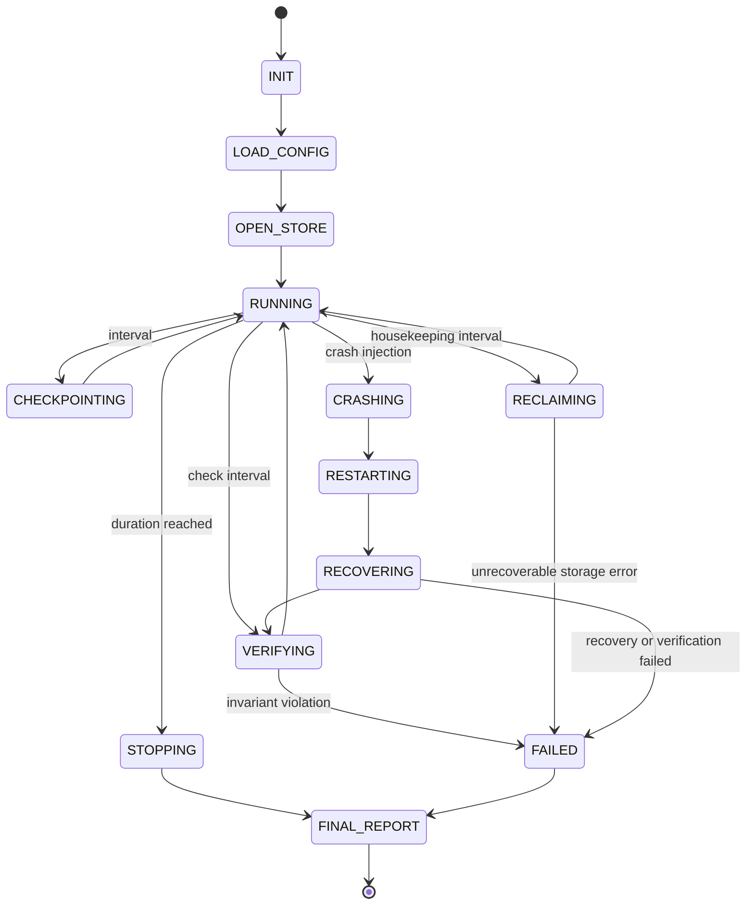
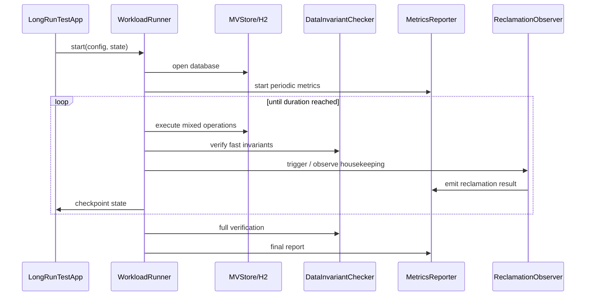

# H2 长稳压测独立应用设计

本文设计一个独立于 H2 主产物和普通测试套件的长稳压测应用，用于模拟真实数据访问、长时间运行、持续加压、故障注入和自动空间整理验收。该应用最终打包为独立 jar，在开发机、夜间验证机或专用长跑机器上运行。

## 背景

普通 JUnit 和 legacy smoke 更适合验证确定性行为，难以覆盖以下问题：

| 问题类型 | 普通测试的不足 |
| --- | --- |
| 长时间资源泄漏 | 分钟级测试难以发现句柄、线程、缓存、元数据残留。 |
| 空间长期膨胀 | 单轮 compact/reclaim 测试不能证明数天或数周内文件大小稳定。 |
| 稀有并发交错 | 短测试很难覆盖长事务、后台整理、读写高峰和恢复流程的组合。 |
| 崩溃恢复可靠性 | 需要重复 kill、重启、恢复校验和保留现场。 |
| 性能衰退 | 需要持续采集吞吐、延迟、文件大小、fill rate 和后台任务指标。 |

因此需要一个可配置、可恢复、可观测、可独立发布的测试应用，而不是把一个月长跑混进默认测试。

## 目标

| 目标 | 验收标准 |
| --- | --- |
| 独立产物 | 生成 `h2-longrun.jar`，不进入 H2 主 jar。 |
| 独立源码边界 | 长测源码放在独立 source set，不和 `src/main`、普通 `src/test` 混放。 |
| 支持长时间运行 | 支持 5 分钟 smoke、夜间 6-12 小时、7-30 天 soak。 |
| 真实访问模拟 | 支持 MVStore 和 H2 SQL 两类 workload：读、写、更新、删除、范围扫描、批量、长事务。 |
| 可恢复与可复现 | 通过 seed、状态文件、操作日志、最后 N 条事件复现失败。 |
| 持续一致性校验 | 数据带 checksum / version / counter，重启后验证已提交数据可读、未提交数据不可见。 |
| 空间整理验收 | 运行期间持续触发或观察 S2 自动空间整理，记录每轮结果、诊断码和文件变化。 |
| 故障注入 | 支持进程 kill、异常关闭、重启恢复、可选 FilePath 延迟/失败模拟。 |
| 指标输出 | 输出机器可读 metrics、事件日志、最终报告，便于长期观察和报警。 |

## 非目标

| 非目标 | 说明 |
| --- | --- |
| 替代 JUnit / TestAll | 长稳压测是补充，不替代确定性回归。 |
| 进入默认 CI | 默认构建不运行长测；只提供 smoke 或显式任务。 |
| 改变 H2 发布 jar | 长测 jar 是测试产品，不随主 jar 混包。 |
| 一开始覆盖所有数据库特性 | 先覆盖 MVStore 和核心 SQL 读写，再逐步增加复杂 SQL、LOB、索引、网络模式。 |
| 依赖外部监控系统 | 首版只输出本地文件；后续可接 Prometheus、JFR 或外部采集器。 |

## 现状 / 已有流程

当前仓库已有以下测试入口：

| 入口 | 用途 | 与长稳压测关系 |
| --- | --- | --- |
| `runMvStoreReclamationJUnitCheck` | S2 JUnit contract 检查 | 保留为快速门禁。 |
| `runMvStoreSpaceReclamationCheck` | MVStore 空间整理专项 legacy check | 保留为功能回归。 |
| `runMvStoreRecoveryCheck` | MVStore recovery 检查 | 长测复用其恢复关注点。 |
| `runH2LegacySmoke` | H2 legacy smoke | 长测不进入该任务。 |
| `runH2TestAllCi` | 完整 legacy CI | 长测不替代。 |
| `runLongRunJUnitCheck` | longrun JUnit 检查 | 覆盖长测应用自身的确定性逻辑，不启动长时间 soak。 |

S2 完整自动空间整理已经具备默认 scheduler、persistent journal、relocation map 读路径、tail shrink 指标和自适应调度。长稳压测需要把这些能力放到真实 workload 中长期观察。

## 核心约束

| 约束 | 设计要求 |
| --- | --- |
| 构建边界 | 新增 source set 和 jar task，不修改 H2 主 jar 内容。 |
| Java 兼容 | 长测源码保持 Java 8 兼容。 |
| 可关闭 | 所有长测任务都必须显式执行；默认 `build`、`check` 不自动跑 30 天任务。 |
| 可复现 | 每次运行必须记录 config、seed、H2 版本、git commit、JVM 参数。 |
| 可保留现场 | 失败时默认保留数据库文件、状态文件、操作日志和最近 metrics。 |
| 资源上限 | 配置必须支持最大运行时间、最大数据库大小、最大线程数、最大磁盘目录。 |
| 结果判定 | 不能只以“进程未崩”为成功；必须持续校验数据、恢复、空间和指标阈值。 |

## 模块与目录设计

建议新增独立源码目录：

```text
h2/src/longrun/org/h2/test/longrun/
  LongRunTestApp.java
  LongRunConfig.java
  LongRunState.java
  LongRunMode.java
  WorkloadRunner.java
  WorkloadProfile.java
  WorkloadOperation.java
  DataInvariantChecker.java
  MetricsReporter.java
  EventLogWriter.java
  CrashHarness.java
  ReclamationObserver.java
  mvstore/
    MVStoreWorkload.java
    MVStoreModel.java
  sql/
    SqlWorkload.java
    SqlModel.java
```

| 模块 | 责任 |
| --- | --- |
| `LongRunTestApp` | CLI 入口，加载配置、创建工作目录、启动 runner、处理退出码。 |
| `LongRunConfig` | 解析 properties / CLI 参数，完成默认值和校验。 |
| `LongRunState` | 记录 run id、seed、轮次、已确认提交版本、最近 checkpoint。 |
| `WorkloadRunner` | 管理线程组、压力曲线、定期校验、停止条件。 |
| `WorkloadProfile` | 描述读写比例、事务长度、扫描比例、value 大小、热点分布。 |
| `DataInvariantChecker` | 校验业务模型、checksum、计数器、提交/回滚可见性。 |
| `MetricsReporter` | 周期输出带生命周期 phase 的吞吐样本、延迟、文件大小、chunk、reclamation 结果。 |
| `EventLogWriter` | 写入操作事件、失败上下文、最后 N 条操作 ring buffer。 |
| `CrashHarness` | 管理子进程模式、随机 kill、重启、恢复后校验。 |
| `ReclamationObserver` | 触发或观察 online reclamation，记录诊断码和空间变化。 |

## 构建与产物设计

新增 Gradle source set 与任务：

| 任务 | 说明 | 默认构建是否执行 |
| --- | --- | --- |
| `compileLongRunJava` | 编译长测应用源码 | 否，除非显式依赖。 |
| `longRunTestJar` | 生成 `h2-longrun.jar` | 否。 |
| `longRunTestDistZip` | 生成包含 jar、脚本、配置和 README 的 `h2-longrun.zip` | 否。 |
| `longRunTestDistTar` | 生成面向 Linux 使用的 `h2-longrun.tar.gz` | 否。 |
| `longRunTestDist` | 同时生成 zip 和 tar.gz 发布包 | 否。 |
| `runLongRunSmoke` | 运行 5-10 分钟 smoke 配置 | 否，可作为手工快速验证。 |
| `runLongRunSoak` | 按指定配置运行长稳压测 | 否，只能显式执行。 |
| `printLongRunSampleConfig` | 输出样例配置 | 否。 |

产物建议：

```text
h2/build/libs/h2-longrun.jar
h2/build/distributions/h2-longrun.zip
h2/build/distributions/h2-longrun.tar.gz
```

发布包结构：

```text
h2-longrun/
  bin/
    h2-longrun
    h2-longrun.bat
  config/
    smoke.properties
    nightly.properties
    soak-30d.properties
  lib/
    h2-longrun.jar
  README.md
  README.en.md
```

Linux 解压 tar.gz 后运行：

```sh
tar -xzf h2-longrun.tar.gz
cd h2-longrun
./bin/h2-longrun start --config config/smoke.properties
```

Windows 解压 zip 后运行：

```powershell
bin\h2-longrun.bat --config config\smoke.properties
```

Linux / macOS 的 `bin/h2-longrun` 是一个后台进程包装脚本。`start` 是默认动作，`run` 保持前台运行，`watch` 会启动或复用后台进程并跟随日志，`status`、`logs`、`stop`、`restart` 用于管理后台进程。`watch` 下按 Ctrl-C 只退出日志跟随，后台 longrun 会继续运行。默认日志和 pid 文件为：

```text
logs/longrun.out
logs/longrun.pid
```

新的后台启动默认轮转已有实例日志。可以用 `--append-log`、`--truncate-log` 或 `H2_LONGRUN_LOG_POLICY=rotate|append|truncate` 选择启动日志策略。

后续可支持两种模式：

| 模式 | 说明 |
| --- | --- |
| embedded mode | jar 使用当前源码构建出的 H2 classes，适合开发分支验证。 |
| external mode | 通过 `--h2-jar path/to/h2.jar` 指定待测 H2 版本，适合候选发布版长跑。 |

首版优先实现 embedded mode，external mode 作为第二阶段。

## 接口设计

### CLI 参数

| 参数 | 示例 | 说明 |
| --- | --- | --- |
| `--config` | `longrun.properties` | 必填，配置文件路径。 |
| `--work-dir` | `D:/h2-longrun/run-001` | 覆盖配置中的运行目录。 |
| `--duration` | `30d` | 覆盖运行时长。 |
| `--seed` | `20260601` | 覆盖随机 seed。 |
| `--mode` | `mvstore` / `sql` / `mixed` | 选择 workload 类型。 |
| `--resume` | `true` | 从已有状态文件恢复。 |
| `--h2-jar` | `D:/dist/h2.jar` | external mode 使用，校验并记录到运行输出。 |

external mode 会把候选 jar 放在 Gradle 或子进程 classpath 前面。应用启动时校验 jar 存在、读取 manifest 元数据、计算 SHA-256，打印元数据并写入 `final-report.properties`。

发布包默认运行目录使用 `work/` 而不是 `build/`：smoke 使用 `work/smoke`，nightly 使用 `work/nightly`，30 天 soak 使用 `work/soak-30d`。

### 配置文件

首版使用 `.properties`，便于 Java 8 直接解析：

```properties
run.name=mvstore-s2-soak
run.duration=30d
run.seed=20260601
run.workDir=D:/h2-longrun/mvstore-s2

workload.mode=mvstore
workload.readThreads=16
workload.writeThreads=8
workload.scanThreads=4
workload.longTransactionThreads=2
workload.valueSizeMin=128
workload.valueSizeMax=131072
workload.keySpace=10000000
workload.hotKeyPercent=20
workload.ledgerMode=bounded
workload.ledgerMaxEntries=1000000

check.intervalSeconds=30
check.fullScanIntervalMinutes=30
check.reopenIntervalMinutes=120

reclamation.enabled=true
reclamation.housekeepingIntervalSeconds=10
reclamation.expectNoUnboundedGrowth=true

crash.enabled=true
crash.intervalMinutes=120
crash.mode=process-kill

limits.maxDbSizeGb=200
limits.maxErrors=1
metrics.intervalSeconds=10
```

## 数据结构

### 状态文件

`longrun-state.properties`：

| 字段 | 说明 |
| --- | --- |
| `schemaVersion` | 状态文件版本，首版为 `1`。 |
| `runId` | 本次长跑唯一 id。 |
| `seed` | 随机 seed。 |
| `startTimeMillis` | 首次启动时间。 |
| `lastCheckpointTimeMillis` | 最近一次状态 checkpoint。 |
| `operationSequence` | 全局操作序号。 |
| `committedModelVersion` | 已确认提交的业务模型版本。 |
| `lastVerifiedSequence` | 最近一次成功校验的操作序号。 |

### 测试数据模型

MVStore 首版建议使用三类 map：

| Map | Key | Value | 用途 |
| --- | --- | --- | --- |
| `data` | `long key` | payload + checksum + version | 主数据。 |
| `ledger` | `long sequence` 或 bounded slot | sequence + operation summary | 提交操作账本。默认 bounded，避免 smoke 被无限追加审计日志放大。 |
| `counters` | counter name | long value | 快速校验计数、版本、水位。 |

`workload.ledgerMode=bounded` 使用 `workload.ledgerMaxEntries` 控制账本 map 上限，作为 smoke / nightly / soak 的默认基线，更接近真实业务里的有限二级数据。`workload.ledgerMode=append-only` 保留所有写入 / 删除事件，用于专门制造历史版本和 S2 回收压力，不作为普通 smoke 或长期 soak 文件大小基线。

SQL 首版建议使用相同语义的表：

| 表 | 用途 |
| --- | --- |
| `LONGRUN_DATA` | 主数据、checksum、version、payload。 |
| `LONGRUN_LEDGER` | 已提交操作账本。 |
| `LONGRUN_COUNTERS` | 快速一致性计数。 |

## 状态机



## 时序流程

### 正常长跑流程



### crash harness 流程

首版 crash 建议采用父子进程：

1. 父进程负责启动 worker 子进程。
2. 子进程运行 workload，并周期性写状态文件和 metrics。
3. 父进程按配置随机 kill 子进程。
4. 父进程重启子进程并传入 `--resume=true`。
5. 子进程先 recovery / reopen，再执行一致性校验，成功后继续 workload。

这样可以真实覆盖进程级异常退出，而不是只在同一 JVM 中抛异常。

## 异常处理

| 异常 | 处理 |
| --- | --- |
| 配置非法 | 启动失败，退出码 `2`，打印字段和原因。 |
| 数据校验失败 | 停止 workload，保留现场，退出码 `10`。 |
| 恢复失败 | 保留数据库和状态文件，退出码 `11`。 |
| 空间失控 | 超过 `limits.maxDbSizeGb` 或增长阈值时退出码 `12`。 |
| 后台整理失败 | 记录诊断码；可恢复失败继续，存储异常停止。 |
| 指标写入失败 | 降级到 stderr；不应影响数据库 workload，除非报告目录不可用。 |
| 达到最大错误数 | 停止并生成最终报告。 |

## 幂等性

| 场景 | 幂等策略 |
| --- | --- |
| 状态 checkpoint 重写 | 先写临时文件，再原子替换。 |
| 操作日志追加 | 使用全局 `operationSequence`，恢复时忽略已确认序号之前的重复事件。 |
| 重启恢复校验 | 以 `ledger` 和 `counters` 为准，允许最后一个未 checkpoint 操作不存在。 |
| metrics 输出 | 每条 metrics 带 timestamp、runId、sequence，重复采集不影响判定。 |

## 回滚策略

长稳压测应用不改变生产数据格式，也不进入主 jar。回滚方式：

| 变更 | 回滚 |
| --- | --- |
| Gradle source set / task | 删除 longrun source set 和任务，不影响主构建。 |
| 长测源码 | 删除 `src/longrun`，不影响 `src/main`。 |
| 文档 | 删除或标记为废弃。 |
| 运行现场 | 删除 work dir 即可；测试数据库不能作为生产数据使用。 |

## 兼容性

| 项 | 要求 |
| --- | --- |
| Java | Java 8 兼容，不使用 Java 9+ API。 |
| H2 主 jar | 不把长测类打进主 jar。 |
| 数据库文件 | 长测生成的数据库仅用于测试；不同 H2 版本对比时必须记录版本。 |
| Gradle | 不依赖 `test` 任务；使用显式 longrun task。 |
| 平台 | 首版支持 Windows / Linux 路径；配置中避免硬编码分隔符。 |

## 灰度 / 迁移

| 阶段 | 默认状态 | 说明 |
| --- | --- | --- |
| LR1 | 手工运行 | 只提供 jar 和 5 分钟 smoke。 |
| LR2 | 夜间可选 | 增加 6-12 小时配置和报告归档。 |
| LR3 | 专机长跑 | 增加 7-30 天配置、crash harness、失败现场压缩。 |
| LR4 | 发布候选门禁 | 发布候选版本至少完成一次夜间或长跑验收。 |

## 测试方案

| 测试层级 | 覆盖 |
| --- | --- |
| JUnit | 配置解析、duration 解析、seed 复现、checksum、状态文件读写。 |
| 短 smoke | `runLongRunSmoke`，默认 5 分钟，固定 seed，MVStore workload。 |
| MVStore soak | 长事务 pin、自动空间整理、reopen、文件大小趋势。 |
| SQL soak | JDBC 事务、索引、范围查询、批量写、回滚可见性。 |
| crash soak | 父子进程 kill / restart / recover / verify。 |
| 文件损坏 soak | 复制活动 MVStore 文件，注入 truncate / bit flip / zero range / random range / partial page 损坏，再分类只读恢复或检测结果。 |
| 兼容验证 | external mode 指定候选 `h2.jar`。 |
| 报告分析 | 正常运行结束后自动生成 Markdown 和 properties 摘要，并把 Markdown summary 打印到 stdout；`report --work-dir <dir> --log-file <file>` 仅用于重跑旧数据分析。吞吐跌幅检查使用 `RUNNING` metric 样本，让 startup 和 crash-recovery 窗口仍显示在报告中，但不污染稳定吞吐告警。 |

## 风险点

| 风险 | 影响 | 缓解 |
| --- | --- | --- |
| 长测本身有 bug | 误报或漏报 | 先为配置、模型和校验器写 JUnit；失败现场保留可人工复核。 |
| 运行资源过大 | 占满磁盘或机器 | 强制 `maxDbSizeGb`、work dir、metrics rollover。 |
| 随机失败不可复现 | 难定位 | 固定 seed、记录操作序号、保留最后 N 条操作。 |
| crash harness 误杀父进程 | 中断测试管理 | 父子进程明确 pid 文件和角色参数。 |
| 指标太多 | 长跑磁盘膨胀 | metrics 按天滚动，event log 可压缩。 |

## 分阶段实施计划

| 阶段 | 目标 | 交付物 | 验证 |
| --- | --- | --- | --- |
| LR1 | 独立 jar 骨架 | `src/longrun`、`longRunTestJar`、CLI、样例 config | jar 可构建，`--help` 可运行。 |
| LR2 | MVStore smoke workload | MVStore 读写删、checksum、状态文件、metrics | `runLongRunSmoke` 默认 5 分钟通过。 |
| LR3 | S2 自动空间整理观察 | `ReclamationObserver`、文件大小和 diagnostic metrics | workload 期间可记录 housekeeping 结果。 |
| LR4 | 一致性和 reopen | ledger/counters/full scan/reopen verify | 重启后数据模型一致。 |
| LR5 | crash harness | 父子进程 kill/restart/resume | 多轮 crash 后恢复校验通过。 |
| LR6 | SQL workload | JDBC 表模型、事务、索引、范围扫描 | SQL smoke 通过。 |
| LR7 | 夜间与长跑配置 | 12 小时和 30 天样例配置、报告归档 | 专机 dry run 通过。 |
| LR8 | external mode | `--h2-jar` 验证候选版本 | 可对指定 jar 跑 smoke。 |
| LR9 | 发布包 | 包含 jar、脚本、配置和 README 的 `h2-longrun.zip` / `h2-longrun.tar.gz` | 解压后脚本可跑 smoke。 |
| LR10 | 报告分析器 | 基于 final report、metrics 和日志生成 PASS/WARN/FAIL 摘要 | smoke 完成后自动生成报告文件。 |
| LR11 | copy-based 文件损坏注入 | `fault-injection.properties`、`runLongRunFaultInjection`、fault metrics、损坏副本只读校验 | fault profile 记录 recovered/detected/unexpected 结果；启用但零 fault 事件时报告 WARN。 |

## 已拍板的问题

| 问题 | 结论 |
| --- | --- |
| 源码目录命名 | 使用 `h2/src/longrun`，与 `src/test` 明确分离。 |
| jar 名称 | 使用 `h2-longrun.jar`。 |
| 首版 workload | 先做 MVStore，再做 SQL。 |
| 配置格式 | 首版 `.properties`，后续如需要再加 JSON。 |
| crash harness 是否首版做 | 建议 LR5 做，不阻塞 LR1-LR4。 |
| 是否进入 CI | 只把 `runLongRunSmoke` 作为可选手工任务；不进默认 CI。 |
| external mode 优先级 | 放到 LR8，避免首版 classpath 复杂化。 |
| 首版 smoke 默认时长 | 默认 5 分钟。 |
| 阶段提交策略 | 每个 LR 阶段完成后本地提交。 |
