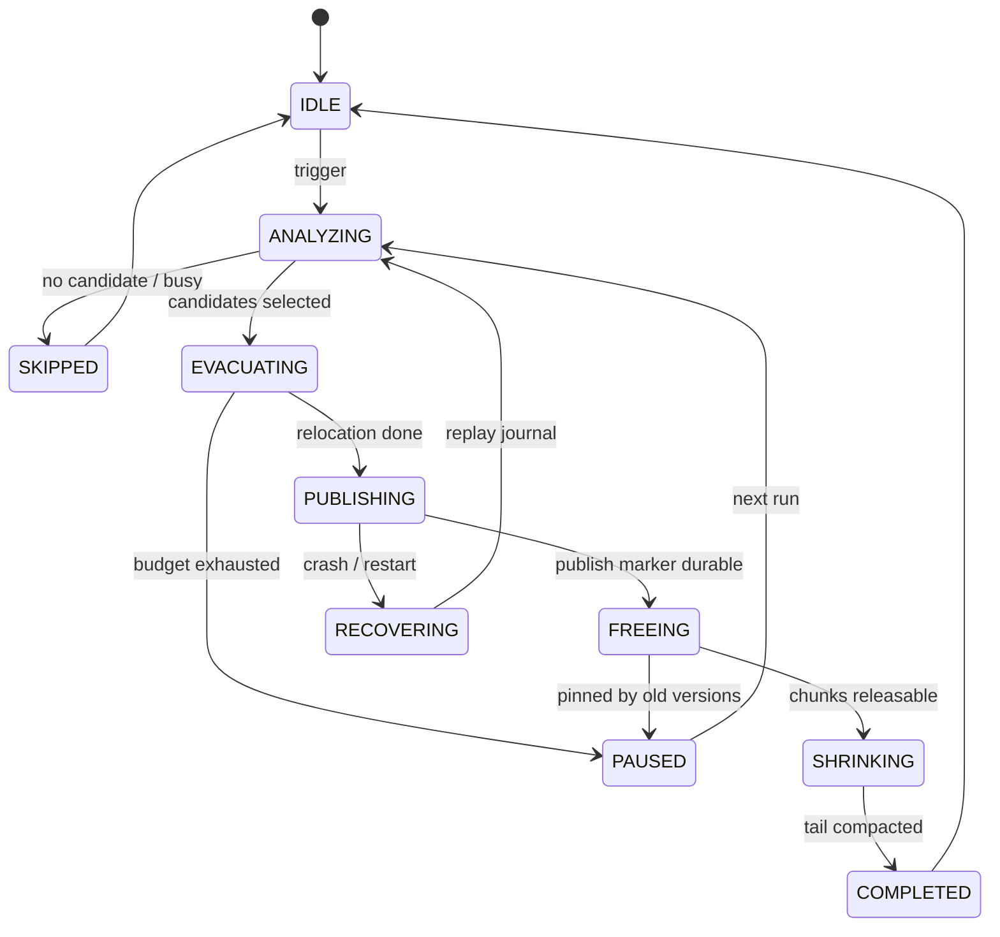

# MVStore 空间回收 S2 长期方案架构设计

本文是 S2 长期终极方案的新设计文档。此前 S1 中期方案已经完成并归档；本文不继续扩写归档文档，也不把 S2 降级为 `compactFile()` 的包装。S2 的目标是在 MVStore 内部建设 chunk/page 级在线空间回收体系，逐步做到可观测、可恢复、可预算、可调度。

## 背景

MVStore 采用追加写和 chunk 管理。数据删除或更新后，旧 page 变成 dead space，chunk 的 live bytes 下降。空间不能及时归还通常有四类原因：

| 原因 | 影响 |
| --- | --- |
| chunk 中仍有 live page | 不能直接释放整个 chunk。 |
| long transaction / old version pin | 即使最新版本不再需要，旧版本仍可能读取旧 page。 |
| map 未打开或 ownership 不清晰 | 现有 rewrite path 主要处理 open maps。 |
| 文件尾部仍有 live chunk | 即使中间有空洞，也不能 truncate 到更小文件。 |

现有代码已经有可复用基础：

| 代码锚点 | 当前能力 | S2 角色 |
| --- | --- | --- |
| `MVStore.compact(int targetFillRate, int write)` | 触发低填充 chunk 的 page rewrite | S2.2 的治理入口，S2.3 的 page relocation 基础。 |
| `FileStore.rewriteChunks()` | 选择 rewritable chunks 并调用 map rewrite | S2.1/S2.3 的 candidate 与 relocation 起点。 |
| `MVMap.rewritePage(long pagePos)` | 通过 map 操作重写 live page | S2.3 的最小 page relocation 原语。 |
| `RandomAccessStore.compactMoveChunks()` | 移动物理 chunk 并 shrink tail | S2.6 的 tail mover 基础。 |
| `FileStore.dropUnusedChunks()` | 根据 retention 和 live 状态释放 dead chunks | S2.4/S2.5/S2.6 的释放边界。 |
| `MVStore.oldestVersionToKeep` | 控制旧版本保留窗口 | S2.5 relocation map 的正确性边界。 |

## 目标

| 目标 | 验收方式 |
| --- | --- |
| chunk/page 级在线回收 | 不整库复制，不整体替换文件；每轮可处理有限 chunk/page。 |
| 可观测 | 能输出候选 chunk、跳过原因、pinning 原因、rewrite bytes、freed/moved chunks。 |
| 可恢复 | 引入 evacuation journal 后，崩溃可继续、回滚或清理。 |
| 可预算 | 支持 max chunks、max live bytes、max run millis、IO budget。 |
| long transaction 安全 | 不强制释放仍被旧版本读取的数据；relocation map 成熟后再释放 pinned chunks。 |
| tail 收缩闭环 | page relocation 后能移动尾部 chunk 并 truncate 文件。 |
| 运维可控 | 后台调度默认低强度启用，支持关闭开关、预算、退避、dry-run 和清晰诊断。 |

## 非目标

| 非目标 | 说明 |
| --- | --- |
| 整库 shadow publish 作为主线 | 只保留为离线 compact 或兜底工具。 |
| S2 起点新增 SQL 命令 | 先稳定 Java maintenance API 和内部诊断。 |
| 绕过 MVCC / retention | 被旧版本引用的数据必须继续可读。 |
| 一次任务回收所有空间 | S2 设计为多轮、可中断、可恢复推进。 |

## 核心组件


| 组件 | 职责 |
| --- | --- |
| `MVStoreReclamationCoordinator` | 维护入口、互斥、预算、恢复、阶段编排、结果汇总。 |
| `ChunkLivenessAnalyzer` | 生成 chunk liveness snapshot，识别 live/dead bytes、map ownership、pinning reason。 |
| `ReclamationCandidateSelector` | 根据收益、风险、位置、预算选候选 chunk。 |
| `PageRelocator` | 将候选 chunk 中 live page copy-on-write 到新 chunk，更新 map root 或 relocation metadata。 |
| `EvacuationJournal` | 持久化 job、phase、candidate、page relocation progress、publish marker。 |
| `ChunkReleaser` | 在 retention 允许后释放 dead chunk，调用现有 drop/free 机制。 |
| `TailCompactor` | 移动尾部 live chunks，形成连续尾部空闲区并 truncate。 |

## 接口设计

对外入口继续复用：

```java
StorageMaintenanceResult vacuumOnline();
```

S2 内部建议新增：

```java
final class MVStoreOnlineReclamation {
    MVStoreReclamationAnalysis analyze(MVStore store, MVStoreReclamationRequest request);
    MVStoreReclamationResult run(MVStore store, MVStoreReclamationRequest request);
    MVStoreReclamationRecovery recover(MVStore store);
}
```

`MVStoreReclamationRequest`：

| 字段 | 默认值 | 说明 |
| --- | --- | --- |
| `dryRun` | `false` | 仅分析候选和预估收益，不写入。 |
| `targetFillRate` | `50` | 候选 chunk 填充率目标。 |
| `maxCandidateChunks` | `1` | 单轮候选 chunk 上限。 |
| `maxLiveBytesToRewrite` | `16MB` | 单轮 live page rewrite 上限。 |
| `maxRunMillis` | `0` | `0` 表示手动入口不限时；后台调度必须设置。 |
| `allowRelocationMap` | `false` | 是否允许写入 relocation map。 |
| `allowTailCompaction` | `true` | 是否允许移动尾部 chunk 并 shrink。 |

`MVStoreReclamationResult`：

| 字段 | 说明 |
| --- | --- |
| `status` | `SUCCESS`、`SKIPPED`、`BUSY`、`NO_PROGRESS`、`FAILED`。 |
| `message` | 稳定前缀 + 诊断摘要。 |
| `beforeFileSize` / `afterFileSize` | 文件大小变化。 |
| `beforeFillRate` / `afterFillRate` | store fill rate。 |
| `beforeChunksFillRate` / `afterChunksFillRate` | chunk fill rate。 |
| `candidateChunks` | 被选中的 chunk ids。 |
| `relocatedPages` / `relocatedBytes` | page relocation 结果。 |
| `freedChunks` / `movedChunks` | 释放和移动的 chunk。 |
| `pinnedChunks` | 因 old version、unknown map 或 recent chunk 跳过的 chunk。 |

## 数据结构

### ChunkLivenessSnapshot

| 字段 | 说明 |
| --- | --- |
| `chunkId` | chunk id。 |
| `block` / `len` | 文件位置和长度。 |
| `fillRate` | chunk live ratio。 |
| `liveBytes` / `deadBytes` | 估算的 live/dead 字节。 |
| `mapIds` | chunk 内 page 归属的 map。 |
| `oldestVersion` / `unusedAtVersion` | 与 retention 和 long transaction 相关。 |
| `pinnedReason` | `NONE`、`ACTIVE_VERSION`、`UNKNOWN_MAP`、`RECENT_CHUNK`。 |

### EvacuationJournal

S2.4 引入持久 journal，建议写入 layout/meta map：

| key | value |
| --- | --- |
| `reclaim.job` | 当前 job id、phase、创建 version、创建时间。 |
| `reclaim.job.<id>.chunk.<chunkId>` | candidate 信息、原位置、预估收益、phase。 |
| `reclaim.job.<id>.page.<oldPos>` | 可选，old page pos 到 new page pos。 |
| `reclaim.job.<id>.publish` | publish marker，表示新 root 或 relocation metadata 已持久化。 |

S2.1-S2.3 可先使用内存态 journal；一旦允许释放 pinned old pages 或支持崩溃续跑，必须持久化。

### RelocationMap

S2.5 引入，用于解决旧版本仍可能读取 old page 的场景。

| 项 | 设计 |
| --- | --- |
| key | old page position 或 `(chunkId, pageNo)`。 |
| value | new page position、map id、source version、expire version。 |
| 生命周期 | `oldestVersionToKeep` 超过 expire version 后删除。 |
| 兼容 | 必须使用 feature flag；旧版本写打开必须拒绝。 |
| 默认 | 显式门控，只在需要释放 pinned chunks 时启用。 |

## 状态机



## 时序流程

1. `vacuumOnline()` 进入 coordinator。
2. coordinator 检查互斥：close、backup、store、已有 reclaim job。
3. 读取并恢复未完成 journal。
4. analyzer 生成 chunk liveness snapshot。
5. selector 选择候选 chunk。
6. relocator 按预算迁移 live pages。
7. journal 写入 publish marker。
8. releaser 释放可释放 dead chunks。
9. tail compactor 移动尾部 chunk 并 shrink。
10. 输出 result 和 diagnostics。

## 异常处理

| 场景 | 处理 |
| --- | --- |
| 迁移中崩溃 | 无 publish marker：丢弃未发布迁移或重放。 |
| publish 后崩溃 | 有 publish marker：继续 free/shrink 或保留到下一轮。 |
| map ownership 不清 | candidate 标记 `UNKNOWN_MAP`，不迁移。 |
| long transaction pin | candidate 标记 `ACTIVE_VERSION`，默认跳过。 |
| relocation map 不完整 | 不释放 old chunk，保守保留旧 page。 |
| tail move 失败 | page relocation 正确性不受影响，记录 no-shrink。 |

## 兼容性

| 阶段 | 格式影响 | 兼容策略 |
| --- | --- | --- |
| S2.1-S2.3 | 不改磁盘格式 | 只增强观测、决策和 open map relocation。 |
| S2.4 | 增加 journal keys | feature flag；旧版本发现未完成 job 应拒绝写打开。 |
| S2.5 | 增加 relocation map | feature flag；旧版本写打开必须拒绝，只读降级单独验证。 |
| S2.6-S2.8 | 默认不新增格式 | 调度和 tail mover 使用既有 chunk metadata。 |

## 测试方案

| 层级 | 覆盖 |
| --- | --- |
| JUnit | request/result、candidate scoring、budget、message、feature flag。 |
| MVStore 专项 | chunk bloat、page relocation、unknown map、long transaction、tail shrink、no-progress。 |
| 故障注入 | crash before/after publish、during free、during shrink、missing relocation map。 |
| 并发 | 写入同时回收、长读事务、close/backup/compact 互斥。 |
| 兼容 | 旧库打开、新 feature flag、未完成 journal 恢复、只读降级。 |

## 设计结论

S2 长期方案是 MVStore 内部的在线 chunk/page 级回收系统。实现可以从现有 `compact()`、`compactFile()`、`rewriteChunks()`、`compactMoveChunks()` 出发，但最终交付不是包装这些方法，而是形成 coordinator、liveness analyzer、candidate selector、page relocator、evacuation journal、relocation map、tail compactor 的闭环。

## 已落地 API 面

当前实现提供以下内部 API 锚点：

| API | 角色 |
| --- | --- |
| `MVStoreReclamationAnalyzer` | 生成只读 chunk liveness 和候选分析。 |
| `MVStoreReclamationCoordinator` | 执行单轮有界在线回收，并提供 recovery 入口。 |
| `MVStoreReclamationRequest` | 控制 dry-run、目标填充率、rewrite 预算、journal、relocation map gate 和 tail 预算。 |
| `MVStoreOnlineReclamationResult` | 输出状态、前后 fill rate / 文件大小、候选 chunk、估算回收字节、relocation map 标志和 tail compaction 标志。 |
| `MVStoreReclamationScheduler` | 提供接入 MVStore housekeeping 的低强度默认 scheduler，支持关闭和退避控制。 |

影响持久化格式的能力仍然保持 gate：journal 需要显式启用，relocation map 只在存在显式映射时参与读页解析。scheduler 已接入 MVStore housekeeping 并默认低强度启用，可通过 `onlineReclamationEnabled(false)` 关闭。
