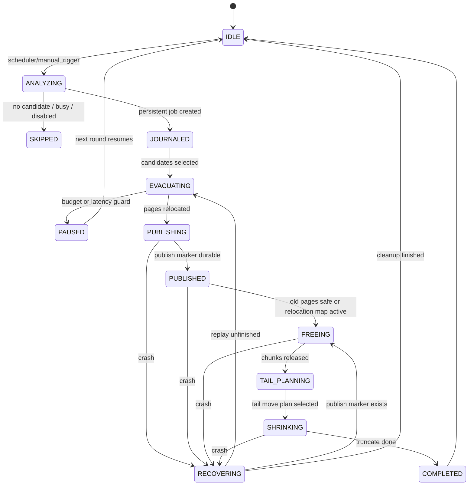

# MVStore 空间回收 S2 完整自动空间整理推进计划

本文记录 S2 从“低强度默认在线部分回收”继续推进到“完整自动空间整理”的后续规划。当前结论是：暂不发布正式版本，后续目标不是保守可用，而是默认自动、可恢复、可观测、可持续整理 MVStore 文件空间。

## 目标定义

完整自动空间整理需要同时满足以下行为：

| 目标 | 验收标准 |
| --- | --- |
| 自动发现空间碎片 | 后台 scheduler 能持续发现低填充 chunk、tail 空洞、旧版本 pin 和 unknown-map 阻塞。 |
| 自动迁移 live pages | 不依赖用户预先打开所有 map，能安全迁移候选 chunk 中仍然存活的 pages。 |
| 旧版本读取安全 | 被迁移的旧 page 在旧版本仍可能读取时，能通过 relocation map 安全解析。 |
| crash-safe publish | 崩溃发生在 analyze、evacuate、publish、free、tail move 任一阶段时，重启后可继续、回滚或清理。 |
| 自动 tail shrink | page relocation 后能在预算内移动尾部 live chunks，并最终 truncate 文件。 |
| 业务低扰动 | 后台任务有 idle 检测、限速、失败退避、写延迟保护和关闭开关。 |
| 运维可解释 | 所有 skip、pause、failure、recovery、shrink 结果都有稳定诊断码和可追踪指标。 |
| 发布可证明 | 有 JUnit、MVStore 专项、故障注入、兼容、并发、性能和完整 TestAll 门禁。 |

## 非目标

| 非目标 | 说明 |
| --- | --- |
| 用整库 shadow copy 替代自动整理 | shadow copy 只能作为离线兜底，不作为完整自动空间整理主线。 |
| 绕过 MVCC / retention | 旧版本仍可能读取的数据必须继续可读。 |
| 无预算地后台整理 | 自动不等于无限制执行，所有后台整理都必须可限速、可暂停、可关闭。 |
| 一次运行回收全部空间 | 完整方案仍然是多轮、可中断、可恢复推进。 |

## 当前基线

S2.0-S2.8 已完成以下基础：

| 能力 | 当前状态 |
| --- | --- |
| `MVStoreReclamationAnalyzer` | 已能生成 chunk liveness 和候选分析。 |
| `MVStoreReclamationCoordinator` | 已能执行单轮有界在线回收，返回结构化结果。 |
| `MVStoreReclamationRequest` / `MVStoreOnlineReclamationResult` | 已有预算、journal、relocation map、tail compaction 和诊断字段。 |
| `MVStoreReclamationScheduler` | 已接入 MVStore housekeeping，低强度默认启用，可关闭和退避。 |
| journal scaffold | 已有 opt-in phase 记录、完成清理和 recovery 入口。 |
| relocation map gate | 已有 feature gate 和 result 诊断字段，默认不启用真实读路径。 |
| tail compaction | 已有显式预算触发路径和诊断字段。 |
| 测试底座 | 已有 JUnit gate、MVStore 专项 gate、plugin gate、recovery gate 和完整 TestAll 门禁记录。 |

## 新阶段任务

| 阶段 | 状态 | 目标 | 主要交付 | 最小门禁 |
| --- | --- | --- | --- | --- |
| S2.9 | Done | 发布暂缓和目标重置 | 文档标记暂不发布；正式目标切换为完整自动空间整理；关闭旧 release-ready 表述 | docs + `runMvStoreReclamationJUnitCheck` |
| S2.10 | Done | 持久 journal v1 | job id、phase、candidate chunks、page progress、publish marker、幂等 recovery | JUnit + MVStore fault injection |
| S2.11 | Done | relocation map 真实读路径 | old page pos 到 new page pos 解析、expire version、清理、兼容拒写 | JUnit + compatibility + recovery |
| S2.12 | Done | crash-safe publish/free | analyze / evacuate / publish / free / shrink 全阶段崩溃恢复和回滚 | fault injection + corruption/recovery |
| S2.13 | Done | map ownership 自动化 | lazy-open / map ownership 解析、unknown-map 专用诊断、无需用户预打开全部 map | MVStore 专项 + concurrency |
| S2.14 | Done | 自动 tail shrink planner | tail 空洞识别、尾部 live chunk 搬迁计划、truncate 验证、IO 预算 | MVStore 专项 + slow baseline |
| S2.15 | Done | 自适应后台调度 | idle 检测、写延迟保护、全局互斥、动态退避、空间压力触发 | scheduler + stress + performance |
| S2.16 | Done | 完整自动模式验收 | 默认自动整理策略、发布说明重写、长稳压测、完整 CI 和回归矩阵 | full release gates |

## 关键接口规划

### MVStoreReclamationRequest 扩展

| 字段 | 默认 | 阶段 | 说明 |
| --- | --- | --- | --- |
| `autoMode` | `false` | S2.15 | scheduler 自动空间整理模式，手动入口默认不启用。 |
| `journalMode` | `NONE` | S2.10 | `NONE`、`MEMORY`、`PERSISTENT`。完整自动模式必须为 `PERSISTENT`。 |
| `relocationMapMode` | `DISABLED` | S2.11 | `DISABLED`、`READ_ONLY_RESOLVE`、`WRITE_AND_RESOLVE`。 |
| `maxPagesToRelocate` | `0` | S2.10 | 单轮 page relocation 上限，`0` 表示由 byte budget 控制。 |
| `maxTailChunksToMove` | `0` | S2.14 | 单轮 tail mover 上限，避免大文件尾部整理抢占 IO。 |
| `foregroundLatencyBudgetMillis` | `0` | S2.15 | 后台任务检测前台延迟超过预算时主动暂停。 |
| `spacePressureThreshold` | `0` | S2.15 | 文件膨胀或 fill rate 低于阈值时提高调度优先级。 |

### S2.16 默认自动模式

默认 MVStore housekeeping 现在使用完整自动整理请求：

| 能力 | 默认策略 |
| --- | --- |
| scheduler | 默认启用，可通过 `onlineReclamationEnabled(false)` 关闭。 |
| persistent journal | 默认启用，单轮完成后清理 journal marker。 |
| relocation map | 默认允许，为后续真实 relocation 写入/解析保留兼容读路径。 |
| tail shrink | 默认给予极小后台预算，避免抢占前台 IO。 |
| 安全阈值 | 继续使用低强度 rewrite budget、运行时间预算、最小调度间隔和失败退避。 |

### MVStoreOnlineReclamationResult 扩展

| 字段 | 阶段 | 说明 |
| --- | --- | --- |
| `jobId` | S2.10 | 本轮或恢复中的持久 job id。 |
| `phase` | S2.10 | 最终停留阶段：`ANALYZED`、`EVACUATED`、`PUBLISHED`、`FREED`、`SHRUNK`。 |
| `relocatedPages` | S2.10 | 实际迁移 page 数。 |
| `relocationMapEntries` | S2.11 | 本轮写入或清理的 relocation map 条目数。 |
| `freedChunks` | S2.12 | 本轮释放 chunk 数。 |
| `unknownMapChunkCount` | S2.13 | map ownership 无法解析的 chunk 数；正常 lazy-open 路径应为 0。 |
| `lazyMapOwnershipSupported` | S2.13 | 是否启用无需用户预打开 map 的 lazy ownership 解析能力。 |
| `movedTailChunks` | S2.14 | 本轮移动尾部 chunk 数。 |
| `shrinkBytes` | S2.14 | 文件 truncate 收缩字节数。 |
| `pauseReason` | S2.15 | `TIME_BUDGET`、`IO_BUDGET`、`FOREGROUND_LATENCY`、`BACKOFF`、`CLOSED` 等。 |

## 状态机

## 数据结构规划

### Persistent Journal

| key | value | 阶段 |
| --- | --- | --- |
| `reclaim.s2.job` | active job id、phase、createdVersion、createdTime、request hash | S2.10 |
| `reclaim.s2.job.<id>.candidate.<chunkId>` | chunk snapshot、score、selected reason、pin state | S2.10 |
| `reclaim.s2.job.<id>.page.<oldPos>` | map id、new pos、source version、publish state | S2.10 / S2.11 |
| `reclaim.s2.job.<id>.publish` | durable publish marker、published version、checksum | S2.12 |
| `reclaim.s2.job.<id>.tail` | tail move plan、moved chunks、truncate target | S2.14 |

### Relocation Map

| 字段 | 说明 |
| --- | --- |
| `oldPagePos` | 旧 page position，必须能唯一定位原 page。 |
| `newPagePos` | 新 page position。 |
| `mapId` | 所属 map，用于避免跨 map 误读。 |
| `sourceVersion` | 迁移发生时版本。 |
| `expireVersion` | `oldestVersionToKeep` 超过该版本后可清理。 |
| `checksum` | 可选，用于恢复和调试阶段校验。 |

## 兼容和回滚

| 场景 | 策略 |
| --- | --- |
| 旧版本写打开带 journal 的 store | 拒绝写打开，避免未完成 job 被忽略。 |
| 旧版本写打开带 relocation map 的 store | 拒绝写打开，避免旧 page 读路径不可用。 |
| 只读打开 | 仅在无 active job 且 relocation map 可解析时允许；否则拒绝并提示诊断码。 |
| 禁用自动整理 | `onlineReclamationEnabled(false)` 仍必须立即生效；已有 job 只允许 recovery cleanup，不继续新迁移。 |
| 回滚到保守策略 | `autoMode=false`、`journalMode=NONE`、`relocationMapMode=DISABLED`、tail mover 仅显式预算触发。 |

## 测试矩阵

| 层级 | 覆盖 |
| --- | --- |
| JUnit contract | request/result 默认值、非法参数、诊断码、状态机非法迁移、feature gate。 |
| MVStore 专项 | page relocation、lazy map ownership、relocation map resolve、tail shrink、无 candidate、budget pause。 |
| 故障注入 | crash before journal、during evacuation、after publish、during free、during tail move、during cleanup。 |
| 兼容 | 旧库打开、新 metadata 拒写、只读降级、禁用 gate 打开失败、升级后 recovery。 |
| 并发 | 前台写入、长读事务、close/backup/compact 互斥、scheduler 多轮重入。 |
| 性能 | 小库、膨胀库、无 candidate、大量 map、大值 LOB、网络模式、真实写延迟基线。 |
| 完整门禁 | `runMvStoreReclamationJUnitCheck`、`runMvStoreSpaceReclamationCheck`、`runPluginArchitectureCheck`、`runMvStoreRecoveryCheck`、`runH2LegacySmoke`、`runH2TestAllCi`。 |

## 阶段完成标准

每个阶段必须满足：

1. 生产代码和测试同阶段提交。
2. JUnit 可覆盖的契约必须进入 `runMvStoreReclamationJUnitCheck`。
3. 文件、崩溃、并发、兼容场景必须进入 `runMvStoreSpaceReclamationCheck` 或已有 legacy gate。
4. 对外行为变化必须同步中文和英文文档。
5. 涉及持久格式的阶段必须说明旧版本读写、禁用 gate、回滚和恢复语义。
6. 每阶段完成后本地提交一次。

## 当前拍板

| 问题 | 决策 |
| --- | --- |
| 是否按当前 S2.0-S2.8 发布正式版 | 暂不发布。 |
| 最终发布目标 | 完整自动空间整理，而不是保守在线部分回收。 |
| 当前默认后台低强度回收是否保留 | 保留为基础能力，但不是最终发布充分条件。 |
| journal / relocation map / tail compaction 是否继续显式门控 | 在完整自动模式验收前继续门控；完成后再重新拍板默认策略。 |
| 下一步优先级 | S2.10 持久 journal v1，然后 S2.11 relocation map 真实读路径。 |
