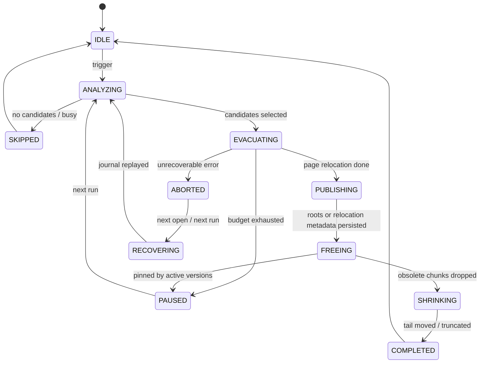

# MVStore S2 Long-Term Space Reclamation Design

This document defines the S2 long-term solution for MVStore space reclamation. The phase boundary is explicit: S1, the medium-term solution, is complete; S2 is the long-term solution itself, and all following space reclamation work is tracked as S2.0-S2.8. The long-term solution is not whole-file copy, offline compact, or a simple wrapper around `compactFile()`. It is an online partial reclamation system inside MVStore: chunk-based selection, page relocation as the core mechanism, recoverable maintenance metadata for crash safety, and scheduler/budget controls for online availability.

## Phase Positioning

| Phase | Status | Positioning |
| --- | --- | --- |
| S1 | Done | Medium-term solution. Existing partial compact, shadow/closed-store scaffolding, test gates, and pluginized maintenance boundaries are the base. |
| S2 | Current work | Long-term solution. The goal is chunk/page-level online reclamation, recoverable incremental evacuation, relocation metadata, tail compaction, and governed background scheduling. |

All future space reclamation work is tracked as S2.0-S2.8. Do not use the old L-phase naming, and do not split S2 into a short-term wrapper layer.

## Background

MVStore uses append-style writes and chunk management. After heavy deletes and updates, old pages become dead space and chunk live bytes drop. Space cannot always be returned to the file system when old versions, long transactions, unopened maps, or tail layout block reclamation.

Current base capabilities:

| Capability | Current state | Long-term gap |
| --- | --- | --- |
| `MVStore.compact(int targetFillRate, int write)` | Rewrites live pages from low-fill chunks through `FileStore.rewriteChunks()` and `MVMap.rewritePage()` | Works mainly for open maps; diagnostics, budgets, recovery, and scheduling are incomplete. |
| `MVStore.compactFile(int maxCompactTime)` | Calls `FileStore.compactStore()`, which may rewrite chunks, move chunks, and shrink the file | Coarse entrypoint with unclear strategy, progress, and skip reasons. |
| `RandomAccessStore.compactMoveChunks()` | Physically moves chunks and shrinks tail holes | Mostly physical layout cleanup; it does not solve live-page relocation or long-transaction pinning by itself. |
| `dropUnusedChunks()` | Frees chunks once they are no longer live and retention allows it | Blocked by old versions, long transactions, and chunk lifecycle rules. |
| `MVStoreSpaceReclamation` | Closed-store shadow compact scaffolding | Useful as offline/fallback model, not the online long-term main path. |

The long-term solution should compose these capabilities into a clear chunk cleaner + page relocator + tail mover system.

## Goals

| Goal | Acceptance |
| --- | --- |
| Real partial reclamation | No full-store copy and no whole-file replacement; progress is chunk/page incremental. |
| Online availability | Reads and writes continue; maintenance yields by budget and must not hold global locks for too long. |
| Recoverability | After crash or power loss, maintenance state can be replayed, rolled back, or cleaned. |
| Observability | Explain why each chunk was selected, skipped, failed, freed, or still pinned. |
| Governability | Support time, write-size, candidate-count, IO, and tail-shrink budgets. |
| Long-transaction friendliness | Do not forcibly free old-version data; optionally relocate old pages while keeping reads possible. |
| No requirement to pre-open all maps | Eventually open maps on demand or identify map ownership, removing the current open-map limitation. |
| Compatible evolution | Early phases keep disk format unchanged; persistent relocation metadata needs feature flags and downgrade policy. |

## Non-goals

| Non-goal | Notes |
| --- | --- |
| Default background execution during S2.0-S2.6 | Automatic scheduling waits until manual flow and recovery semantics are stable. |
| Replacing online reclamation with whole-file shadow publish | Whole-file shadow remains offline/fallback, not the long-term main path. |
| Bypassing MVCC and retention | Data referenced by old versions must not be deleted directly. |
| Completing all reclamation in one run | The long-term system must support small, multi-run, interruptible progress. |

## Core Architecture

The long-term solution has six components:

| Component | Responsibility |
| --- | --- |
| `MVStoreReclamationCoordinator` | Unified entrypoint for capability checks, budgets, mutual exclusion, recovery, and result aggregation. |
| `ChunkLivenessAnalyzer` | Reads chunk metadata, fill rate, live bytes, pinned versions, and map/page ownership. |
| `ReclamationCandidateSelector` | Scores chunks and selects the most valuable candidates. |
| `PageRelocator` | Moves live pages out of candidate chunks and updates map roots or page references. |
| `ChunkEvacuationJournal` | Persists job, phase, candidate chunks, migration progress, and publish markers in layout/meta. |
| `TailCompactor` | Moves tail chunks and shrinks the file after chunks become dead. |


## Interface Design

### External Entry

Keep `StorageMaintenance.vacuumOnline()` as the public entrypoint. Long-term capabilities evolve through options and internal requests before adding SQL commands.

```java
StorageMaintenanceResult vacuumOnline();
```

Suggested internal entry:

```java
final class MVStoreOnlineReclamation {
    MVStoreReclamationResult run(MVStore store, MVStoreReclamationRequest request);
    MVStoreReclamationAnalysis analyze(MVStore store, MVStoreReclamationRequest request);
    MVStoreReclamationRecoveryResult recover(MVStore store);
}
```

### Request

| Field | Default | Description |
| --- | --- | --- |
| `targetFillRate` | `50` | Chunks below this fill rate are preferred candidates. |
| `maxChunks` | `1` | Maximum candidate chunks per run. |
| `maxLiveBytesToRewrite` | `16MB` | Maximum live-page bytes to rewrite per run. |
| `maxRunMillis` | `0` | `0` means no strict time limit; background mode must set one. |
| `allowRelocationMap` | `false` | Whether persistent relocation metadata may be written for old-version pages. |
| `allowTailMove` | `true` | Whether tail chunks may be moved and the file shrunk after relocation. |
| `dryRun` | `false` | Analyze candidates and expected benefit without writing. |

### Result

| Field | Description |
| --- | --- |
| `status` | `SUCCESS`, `SKIPPED`, `BUSY`, `NO_PROGRESS`, `FAILED`. |
| `beforeFileSize` / `afterFileSize` | File size change. |
| `beforeFillRate` / `afterFillRate` | Store fill rate. |
| `beforeChunksFillRate` / `afterChunksFillRate` | Chunk fill rate. |
| `candidateChunks` | Selected chunk ids. |
| `relocatedPages` / `relocatedBytes` | Page relocation progress. |
| `freedChunks` / `movedChunks` | Freed or moved chunks. |
| `pinnedChunks` | Chunks still pinned by old versions or long transactions. |
| `message` | Stable prefix plus diagnostic summary. |

## Data Structures

### Chunk Liveness Snapshot

Runtime structure, not necessarily persisted:

| Field | Description |
| --- | --- |
| `chunkId` | Chunk id. |
| `block` / `len` | Physical location and length. |
| `fillRate` | Live-page percentage in the chunk. |
| `liveBytes` / `deadBytes` | Estimated live/dead bytes. |
| `oldestVersion` / `unusedAtVersion` | Retention and long-transaction data. |
| `mapIds` | Maps owning pages in the chunk. |
| `pinnedReason` | `ACTIVE_VERSION`, `UNKNOWN_MAP`, `RECENT_CHUNK`, `NONE`. |

### Chunk Evacuation Journal

The long-term final state needs a persistent journal in the layout/meta map with fixed key prefixes:

| Key | Value |
| --- | --- |
| `reclaim.job` | Current job id, phase, creation version, creation time. |
| `reclaim.job.<id>.chunk.<chunkId>` | Candidate chunk, original location, expected benefit, phase. |
| `reclaim.job.<id>.page.<oldPos>` | Optional. Old page position to new page position. |
| `reclaim.job.<id>.publish` | Publish marker indicating new roots or relocation metadata are durable. |

S2.1-S2.3 can use an in-memory journal only. Before freeing pinned old pages or supporting crash-interrupted continuation, persistent journal support is required.

### Relocation Map

This is the most sensitive part of the long-term solution and should only be enabled when reclaiming chunks that old versions may still read. The read path needs to consult the relocation map when an old page position has been moved.

| Design point | Requirement |
| --- | --- |
| Key | Old page position or `(chunkId, pageNo)`. |
| Value | New page position, map id, source version, expire version. |
| Lifecycle | Delete after `oldestVersionToKeep` passes the expire version. |
| Compatibility | Requires a store feature flag; old versions should reject write-open or use a separately tested read-only downgrade. |
| Performance | Low-intensity background scheduling is enabled by default with budgets and a disable switch; relocation-map and journal-driven behavior stay explicitly gated. |

## State Machine



## Sequence

### Single Online Run

1. `Coordinator` attempts to enter the maintenance gate. If backup, close, store, or another reclamation is active, return `BUSY`.
2. Recover or clean the previous journal. If safe recovery is impossible, return `FAILED` and stop.
3. `ChunkLivenessAnalyzer` builds a snapshot and filters recent chunks, active-version-pinned chunks, and unknown-map chunks.
4. `CandidateSelector` scores chunks by benefit, position, live bytes, and tail-shrink potential.
5. `PageRelocator` rewrites live pages from candidate chunks with copy-on-write semantics.
6. `Coordinator` stores new roots or relocation metadata and writes a publish marker.
7. Chunks with no live references and permitted by retention are dropped/freed.
8. `TailCompactor` tries to move tail chunks and shrink the file.
9. Result and diagnostics are emitted.

### Background Scheduling

Background scheduling is now implemented as a low-intensity default path with explicit controls:

| Condition | Behavior |
| --- | --- |
| Store is idle | Increase `maxLiveBytesToRewrite` and `maxChunks`. |
| Active writes exist | Reduce budget or skip. |
| Fill rate is high | Do not run. |
| Chunks fill rate is low but tail cannot shrink | Relocate pages only and wait for later drop. |
| Long transaction exists | Do not wait; only process candidates that are not pinned. |

## Error Handling

| Scenario | Handling |
| --- | --- |
| Crash during relocation | Journal exists without publish marker: discard unpublished migration or continue replay. |
| Crash after publish | Journal has publish marker: complete free/drop/shrink or preserve for next run. |
| Incomplete relocation map | Do not free old chunk; conservatively keep old pages. |
| Map cannot be opened | Mark candidate `UNKNOWN_MAP` and skip. |
| Long transaction pins data | Mark candidate `ACTIVE_VERSION`; skip or only move latest-visible pages. |
| Tail move fails | Correctness of page relocation is unaffected; record no-shrink. |

## Idempotency

| Operation | Rule |
| --- | --- |
| analyze | Repeatable; results may change with current version. |
| evacuate page | Repeated old-pos migration must detect existing new pos or rewrite and replace journal. |
| publish | Publish marker only moves forward; roots must not roll back. |
| free chunk | Only after no live references and retention permits. |
| shrink | Based only on current free-space/tail state; failed shrink can retry. |

## Compatibility

| Phase | Disk format | Compatibility strategy |
| --- | --- | --- |
| S2.1-S2.3 | Unchanged | Only governance around existing rewrite/move capabilities. |
| S2.4 | Adds journal keys | Old versions ignore or reject unfinished jobs; feature flag required. |
| S2.5 | Adds relocation map | Old versions must reject write-open; read-only downgrade needs separate validation. |
| S2.7 | Background scheduling | No format change; low-intensity default scheduling with disable switch. |

## Test Plan

| Level | Coverage |
| --- | --- |
| JUnit | Request/result defaults, candidate scoring, budgets, message prefixes, feature flags. |
| MVStore legacy dedicated | Chunk bloat, page relocation, unknown map, long-transaction pinning, tail shrink, no-progress. |
| Fault injection | Crash before publish, after publish, during free, during shrink, missing relocation map. |
| Concurrency | Writes during reclamation, long read transactions, close/backup/compact mutual exclusion. |
| Compatibility | Old database open, new feature flag, unfinished journal recovery, read-only downgrade. |
| Performance / slow tests | Large store, small pages, low fill rate, many maps, tail fragmentation, background budgets. |

Minimum command for each implementation phase:

```powershell
.\gradlew.bat runMvStoreSpaceReclamationCheck
```

When `StorageMaintenance` or plugin capabilities change, also run:

```powershell
.\gradlew.bat runPluginArchitectureCheck
```

Higher-risk phases should also run the daily gate or related `TestAll ci` phase.

## Phased Implementation Plan

| Phase | Goal | Deliverable |
| --- | --- | --- |
| S2.0 | Close the design | This document, English copy, and confirmed test gates. |
| S2.1 | Observability and decision | Chunk liveness snapshot, candidate scoring, dry-run result. |
| S2.2 | Govern existing partial compact | `vacuumOnline()` enters coordinator, wraps `compact()` / `compactFile()`, emits budgets and no-progress. |
| S2.3 | Page relocation main path | Page relocation for open maps, with long-transaction and unknown-map skips. |
| S2.4 | Persistent evacuation journal | Crash recovery, continuation, or cleanup of unfinished jobs. |
| S2.5 | Relocation map | Move pages that old versions may still read and free long-retention-pinned chunks. |
| S2.6 | Integrated tail mover | Move tail chunks and shrink after relocation, within budget. |
| S2.7 | Background scheduling | Low-intensity default scheduling; idle budgets, throttling, diagnostic dry-run, and disable switch. |
| S2.8 | Operationalization | Chinese/English user docs, diagnostic table, configuration guide, long-running slow tests. |

## Decisions Needed

| Question | Recommendation |
| --- | --- |
| Should the long-term solution allow a relocation map? | Yes, but only behind a feature flag, and old versions must reject write-open. |
| Should reclamation work without pre-opening all maps? | Yes as the final goal; start with open maps, then add lazy open / unknown-map diagnostics. |
| Should background execution be default? | Yes, as low-intensity default scheduling after the manual entrypoint is stable; disable with `onlineReclamationEnabled(false)`. |
| Should whole-file shadow compact remain? | Yes as offline tooling and fallback, not the online main path. |
| Should long transactions be forced to wait? | No. Skip pinned chunks by default; handle old-version reads after relocation map is mature. |

## Design Conclusion

The S2 long-term solution is an online chunk/page-level reclamation system inside MVStore. Implementation can start from the existing `compact()`, `compactFile()`, `rewriteChunks()`, and `compactMoveChunks()` mechanisms, but these are early implementation paths within S2, not a separate short-term plan. S2 must ultimately form a closed loop of coordinator, liveness analyzer, candidate selector, page relocator, evacuation journal, relocation map, and tail compactor. This is the path to reclaim fragmented space continuously, recoverably, and observably without whole-store copying.
