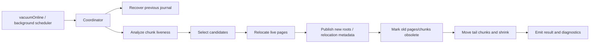
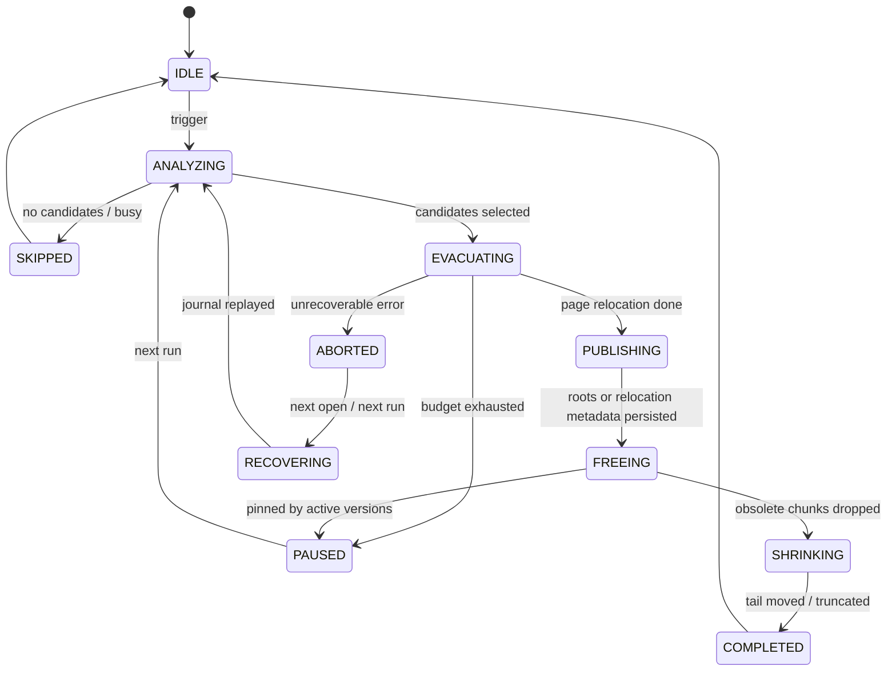

# MVStore 空间回收长期终极方案设计

本文档定义 MVStore 空间回收的长期终极方案。这里的“终极方案”不是整库复制、离线 compact 或简单包装 `compactFile()`，而是在 MVStore 内部建立可长期演进的在线部分回收体系：以 chunk 为回收单位，以 page relocation 为核心，以可恢复的维护元数据保证 crash safety，以后台调度和预算控制保证在线业务可用性。

## 背景

MVStore 采用追加写和 chunk 管理。删除或更新数据后，旧 page 会逐步变成无效空间，chunk 的 live bytes 下降；当旧版本、长事务、未打开 map 或文件尾部布局阻塞时，空间不能及时归还给文件系统。

当前已有基础能力：

| 能力 | 现状 | 长期问题 |
| --- | --- | --- |
| `MVStore.compact(int targetFillRate, int write)` | 通过 `FileStore.rewriteChunks()` 和 `MVMap.rewritePage()` 重写低填充 chunk 的 live page | 只处理 open maps，诊断、预算、恢复和调度不完整。 |
| `MVStore.compactFile(int maxCompactTime)` | 调用 `FileStore.compactStore()`，可能 rewrite chunks、move chunks、shrink file | 入口粗，策略不可观测，失败/无进展原因不清晰。 |
| `RandomAccessStore.compactMoveChunks()` | 物理移动 chunk，压缩文件尾部空洞 | 更偏物理布局整理，不能单独解决 live page 迁移和长事务 pinning。 |
| `dropUnusedChunks()` | 当 chunk 不再 live 且超过 retention 后释放空间 | 被旧版本、长事务和 chunk 生命周期约束。 |
| `MVStoreSpaceReclamation` | closed-store shadow compact 脚手架 | 可作为离线/兜底模型，不是在线终局主线。 |

长期方案要把这些能力组合成一套明确的“chunk cleaner + page relocator + tail mover”系统。

## 目标

| 目标 | 验收标准 |
| --- | --- |
| 真正部分回收 | 不整库复制，不整体替换文件；按 chunk/page 增量推进。 |
| 在线可用 | 业务读写可继续运行；维护任务按预算让步，不能长期持有全局锁。 |
| 可恢复 | 进程崩溃或断电后，维护状态可重放、回滚或清理。 |
| 可观测 | 能解释每个 chunk 为什么被选中、跳过、失败、释放或仍被 pin。 |
| 可治理 | 支持时间、写入量、候选数量、IO、尾部收缩比例等预算。 |
| 长事务友好 | 长事务 pin 住旧版本时不强行释放；可选择迁移旧 page 并保留读取能力。 |
| 不要求所有 map 预先打开 | 能通过元数据按需打开或识别 map，最终消除“只移动 open maps”的限制。 |
| 兼容演进 | 第一阶段不改变磁盘格式；引入持久 relocation 元数据时必须有版本和降级策略。 |

## 非目标

| 非目标 | 说明 |
| --- | --- |
| 第一阶段就默认后台自动执行 | 自动调度必须等手动路径和恢复语义稳定后再开启。 |
| 用整库 shadow publish 代替在线回收 | 整库 shadow 只作为离线/兜底，不是终局主线。 |
| 绕过 MVCC 和 retention | 被旧版本引用的数据不能被直接删除。 |
| 一次任务必须完成所有回收 | 长期方案必须允许小步、多轮、可中断推进。 |

## 核心架构

长期方案由六个组件组成：

| 组件 | 职责 |
| --- | --- |
| `MVStoreReclamationCoordinator` | 统一入口，负责 capability、预算、互斥、状态恢复和结果汇总。 |
| `ChunkLivenessAnalyzer` | 读取 chunk 元数据、fill rate、live bytes、pinning 版本、map/page ownership。 |
| `ReclamationCandidateSelector` | 给 chunk 打分，选择最值得回收的一组候选。 |
| `PageRelocator` | 将候选 chunk 中仍然 live 的 page 迁移到新 chunk，并更新对应 map root / page 引用。 |
| `ChunkEvacuationJournal` | 在 layout/meta 中持久记录任务、阶段、候选 chunk、迁移进度和 publish marker。 |
| `TailCompactor` | 在 chunk 已经死亡后移动尾部 chunk、释放空洞并 shrink file。 |



## 接口设计

### 外部入口

保持 `StorageMaintenance.vacuumOnline()` 作为对外入口。长期能力通过 options / internal request 演进，不先增加 SQL 命令。

```java
StorageMaintenanceResult vacuumOnline();
```

建议内部入口：

```java
final class MVStoreOnlineReclamation {
    MVStoreReclamationResult run(MVStore store, MVStoreReclamationRequest request);
    MVStoreReclamationAnalysis analyze(MVStore store, MVStoreReclamationRequest request);
    MVStoreReclamationRecoveryResult recover(MVStore store);
}
```

### Request

| 字段 | 默认 | 说明 |
| --- | --- | --- |
| `targetFillRate` | `50` | 低于该填充率的 chunk 优先进入候选。 |
| `maxChunks` | `1` | 单轮最多处理候选 chunk 数。 |
| `maxLiveBytesToRewrite` | `16MB` | 单轮最多重写 live page 字节数。 |
| `maxRunMillis` | `0` | `0` 表示不强制限时；后台模式必须设置。 |
| `allowRelocationMap` | `false` | 是否允许为被旧版本引用的 page 写入 relocation metadata。 |
| `allowTailMove` | `true` | page relocation 后是否尝试移动尾部 chunk 并 shrink。 |
| `dryRun` | `false` | 只分析候选和收益，不写入。 |

### Result

| 字段 | 说明 |
| --- | --- |
| `status` | `SUCCESS`、`SKIPPED`、`BUSY`、`NO_PROGRESS`、`FAILED`。 |
| `beforeFileSize` / `afterFileSize` | 文件大小变化。 |
| `beforeFillRate` / `afterFillRate` | store fill rate。 |
| `beforeChunksFillRate` / `afterChunksFillRate` | chunk fill rate。 |
| `candidateChunks` | 被选中的 chunk id。 |
| `relocatedPages` / `relocatedBytes` | page relocation 进度。 |
| `freedChunks` / `movedChunks` | 已释放或移动的 chunk。 |
| `pinnedChunks` | 因旧版本或长事务暂不能释放的 chunk。 |
| `message` | 稳定前缀 + 诊断摘要。 |

## 数据结构

### Chunk Liveness Snapshot

运行时结构，不要求持久化：

| 字段 | 说明 |
| --- | --- |
| `chunkId` | chunk id。 |
| `block` / `len` | 物理位置和长度。 |
| `fillRate` | chunk live page 比例。 |
| `liveBytes` / `deadBytes` | 可估算的 live/dead 字节。 |
| `oldestVersion` / `unusedAtVersion` | 与 retention / long transaction 相关。 |
| `mapIds` | chunk 内 page 涉及的 map。 |
| `pinnedReason` | `ACTIVE_VERSION`、`UNKNOWN_MAP`、`RECENT_CHUNK`、`NONE`。 |

### Chunk Evacuation Journal

长期最终态需要持久 journal，建议存放在 layout/meta map 中，key 使用固定前缀：

| key | value |
| --- | --- |
| `reclaim.job` | 当前 job id、phase、创建版本、创建时间。 |
| `reclaim.job.<id>.chunk.<chunkId>` | 候选 chunk、原位置、预估收益、phase。 |
| `reclaim.job.<id>.page.<oldPos>` | 可选。记录 old page pos 到 new page pos 的迁移。 |
| `reclaim.job.<id>.publish` | publish marker，表示新 root / relocation metadata 已落盘。 |

第一阶段可以只做内存态 journal；真正释放 pinned old pages 或支持 crash 中断恢复前，必须引入持久 journal。

### Relocation Map

这是终极方案中最敏感的部分，只在需要“释放仍可能被旧版本读取的 chunk”时启用。读路径需要在读取 old page pos 失败或发现 old chunk 已迁移时查询 relocation map。

| 设计点 | 要求 |
| --- | --- |
| key | old page position 或 `(chunkId, pageNo)`。 |
| value | new page position、map id、source version、expire version。 |
| 生命周期 | 当 `oldestVersionToKeep` 超过 expire version 后删除。 |
| 兼容性 | 新字段必须有 store feature flag；旧版本打开时应拒绝或只读降级。 |
| 性能 | 默认关闭。只有长期终极回收需要释放被旧版本 pin 的空间时才开启。 |

## 状态机



## 时序流程

### 单轮在线回收

1. `Coordinator` 尝试进入维护 gate；如果已有 backup、close、store 或回收任务，返回 `BUSY`。
2. 恢复或清理上一轮 journal；无法安全恢复时返回 `FAILED`，不继续。
3. `ChunkLivenessAnalyzer` 生成快照，过滤 recent chunks、active version pinned chunks、未知 map chunks。
4. `CandidateSelector` 按收益、位置、liveBytes、tail shrink 可能性打分。
5. `PageRelocator` 对候选 chunk 的 live page 执行 copy-on-write 重写。
6. `Coordinator` store 新 root 或 relocation metadata，写 publish marker。
7. 对已经无 live 引用且超过 retention 的 chunk 调用 drop/free。
8. `TailCompactor` 尝试移动尾部 chunk，并 shrink file。
9. 输出 result 和诊断事件。

### 后台调度

后台调度不是第一阶段默认能力，但长期应支持：

| 条件 | 行为 |
| --- | --- |
| store idle | 可提高 `maxLiveBytesToRewrite` 和 `maxChunks`。 |
| 有活跃写入 | 降低预算或跳过。 |
| fill rate 高 | 不运行。 |
| chunks fill rate 低但 file tail 无法 shrink | 只做 page relocation，等待后续 drop。 |
| 长事务存在 | 不等待；只处理不被 pin 的候选。 |

## 异常处理

| 场景 | 处理 |
| --- | --- |
| 迁移中崩溃 | journal 存在但无 publish marker：丢弃未发布迁移或继续重放。 |
| publish 后崩溃 | journal 有 publish marker：完成 free/drop/shrink 或保留到下一轮。 |
| relocation map 不完整 | 不释放 old chunk，保守保留旧 page。 |
| map 无法打开 | candidate 标记 `UNKNOWN_MAP`，跳过。 |
| 长事务 pin | candidate 标记 `ACTIVE_VERSION`，跳过或只迁移 latest 可见 page。 |
| tail move 失败 | 不影响 page relocation 的正确性；记录 no-shrink。 |

## 幂等性

| 操作 | 幂等规则 |
| --- | --- |
| analyze | 可重复，结果随当前版本变化。 |
| evacuate page | 同一 old pos 重复迁移必须识别已有 new pos 或重写后覆盖 journal。 |
| publish | publish marker 只能单调前进；不能回退 root。 |
| free chunk | 只有确认无 live 引用且超过 retention 后才能执行。 |
| shrink | 只基于当前 free space / tail 状态，失败可重试。 |

## 兼容性

| 阶段 | 磁盘格式 | 兼容策略 |
| --- | --- | --- |
| L1-L3 | 不变 | 只做现有 rewrite / move 的治理增强。 |
| L4 | 增加 journal keys | 旧版本忽略或拒绝未完成 job；需要 feature flag。 |
| L5 | 增加 relocation map | 旧版本必须拒绝写打开，允许只读降级需单独验证。 |
| L6 | 后台调度 | 不改变格式，默认关闭。 |

## 测试方案

| 层级 | 覆盖 |
| --- | --- |
| JUnit | request/result 默认值、candidate scoring、budget、message 前缀、feature flag。 |
| MVStore legacy 专项 | chunk bloat、page relocation、unknown map、long transaction pin、tail shrink、no-progress。 |
| 故障注入 | crash before publish、after publish、during free、during shrink、relocation map 缺失。 |
| 并发 | 写入同时回收、长读事务同时回收、close/backup/compact 互斥。 |
| 兼容 | 旧库打开、新库 feature flag、未完成 journal 恢复、只读降级。 |
| 性能/慢测 | 大库、小 page、低 fill rate、多 map、长尾碎片、后台预算。 |

每个实现阶段至少运行：

```powershell
.\gradlew.bat runMvStoreSpaceReclamationCheck
```

涉及 `StorageMaintenance` 或插件能力时加跑：

```powershell
.\gradlew.bat runPluginArchitectureCheck
```

高风险阶段加跑 daily gate 或相关 `TestAll ci` phase。

## 分阶段实施计划

| 阶段 | 目标 | 交付 |
| --- | --- | --- |
| L0 | 设计收口 | 本文档、中英文副本、测试门禁确认。 |
| L1 | 观测与决策 | chunk liveness snapshot、candidate scoring、dry-run result。 |
| L2 | 治理现有 partial compact | `vacuumOnline()` 进入 coordinator，包装 `compact()` / `compactFile()`，输出预算和 no-progress。 |
| L3 | Page relocation 主路径 | 面向 open maps 的 page relocation，补 long transaction 和 unknown map skip。 |
| L4 | 持久 evacuation journal | 支持 crash 后恢复/继续/清理未完成任务。 |
| L5 | Relocation map | 支持迁移仍可能被旧版本读取的 page，解决 long retention 下 chunk 无法释放。 |
| L6 | Tail mover 一体化 | relocation 后自动 move tail chunks 和 shrink，保持预算。 |
| L7 | 后台调度 | 默认关闭，支持 idle budget、限速和诊断 dry-run。 |
| L8 | 对外运维化 | 中英文使用文档、诊断表、配置说明、长期慢测。 |

## 需要拍板的问题

| 问题 | 建议 |
| --- | --- |
| 长期方案是否允许引入 relocation map | 允许，但必须 feature flag，且旧版本写打开要拒绝。 |
| 是否要求不打开所有 map 也能回收 | 作为终极目标；先从 open maps 实现，后续补按需打开/unknown map 诊断。 |
| 是否默认后台执行 | 否。手动入口稳定后再默认关闭地引入后台调度。 |
| 是否继续保留整库 shadow compact | 保留为离线工具和兜底，不作为在线主线。 |
| 长事务是否强制等待 | 否。默认跳过被 pin chunk；relocation map 成熟后再处理旧版本读取。 |

## 设计结论

长期终极方案是 MVStore 内部的在线 chunk/page 级回收系统。短期可以从现有 `compact()`、`compactFile()`、`rewriteChunks()` 和 `compactMoveChunks()` 出发，但最终必须形成 coordinator、liveness analyzer、candidate selector、page relocator、evacuation journal、relocation map 和 tail compactor 的闭环。这样才能在不整库复制的前提下，持续、可恢复、可观测地把碎片空间回收到文件系统。
