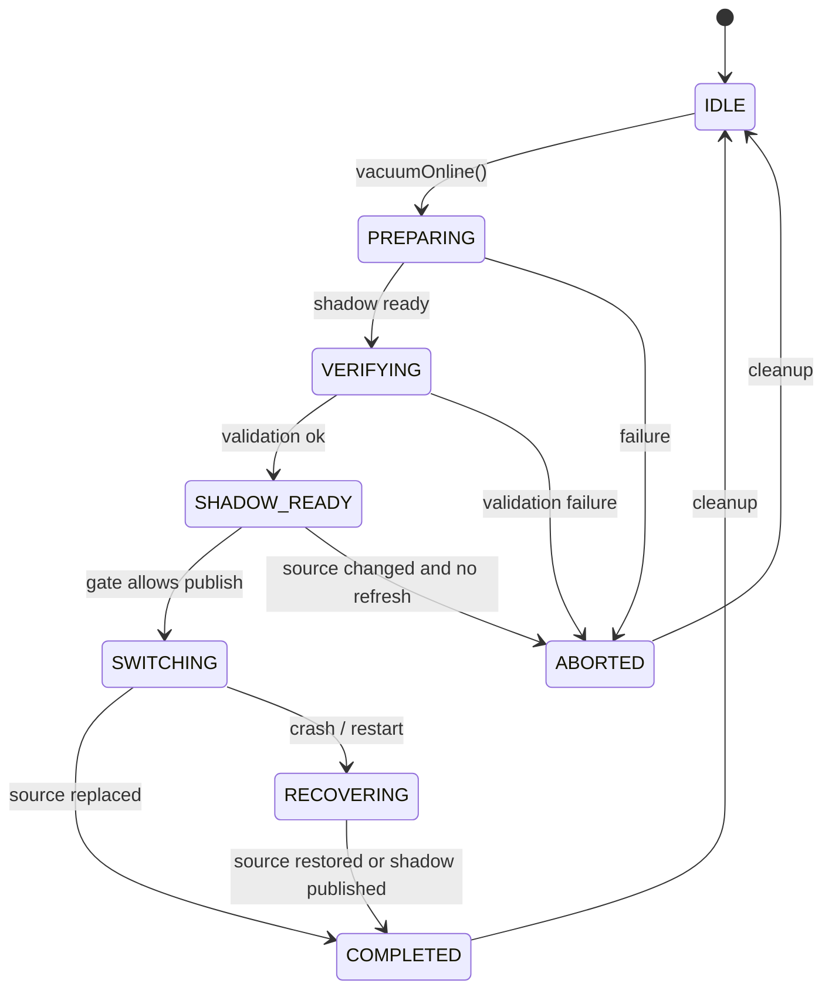

# MVStore Space Reclamation Readiness

This document records whether the codebase, tests, and working rules are ready before starting S2 online space reclamation optimization. Conclusion: the pluginization prerequisite is closed, the MVStore space reclamation scaffolding and dedicated test gate are available, and S2 detailed design and implementation can start.

## Background

The previous pluginization work fixed the provider and registry path for storage and table engines, diagnostic output, maintenance capability boundaries, and test gates. Space reclamation should now integrate through the `StorageMaintenance` capability boundary instead of spreading MVStore-specific maintenance logic across generic database flows.

The current code already contains MVStore space reclamation components: `MVStoreSpaceReclamation`, `MVStoreSpaceReclamationOptions`, `MVStoreSpaceReclamationResult`, `MVStoreSpaceReclamationMaintenance`, `MVStoreSpaceReclamationOperationGate`, `MVStoreSpaceReclamationPhase`, and diagnostic listeners. They cover the base semantics for closed-store compact, shadow preparation, manifests, switch, cleanup, fault injection, and operation gates.

## Goals

| Goal | Readiness decision |
| --- | --- |
| Pluginization does not block S2 | Done. The MVStore storage engine exposes maintenance capabilities through the built-in provider path. |
| A reusable maintenance interface exists | Done. `StorageMaintenance` exposes `compactClosed()`, `compactOnline()`, and `vacuumOnline()`. |
| A dedicated test gate exists | Done. `runMvStoreSpaceReclamationCheck` can run independently. |
| A failure and recovery base model exists | Done. Existing tests cover shadow files, manifests, backups, cleanup, and the fault harness. |
| A full-test baseline is recorded | Done. Full `TestAll ci` localhost network flakes are documented, and focused phase reruns passed. |

## Non-goals

This readiness step does not implement a new reclamation algorithm and does not change the MVStore disk format, SQL semantics, defaults, or plugin loading lifecycle. Hot plugin loading, plugin signing, permission sandboxing, and multi-version plugin resolution remain later pluginization work and must not be mixed into the first S2 reclamation round.

## Current Flows

| Existing entrypoint | Current behavior | S2 value |
| --- | --- | --- |
| `MVStoreSpaceReclamation.compactClosedStore()` | Creates a compacted shadow for a closed store, verifies it, then replaces the source file | Reliable offline compact baseline |
| `MVStoreSpaceReclamation.compactToShadow()` | Prepares `.reclaim.shadow` and `.reclaim.manifest` | Base for the online prepare phase |
| `MVStoreSpaceReclamation.switchToShadow()` | Verifies the manifest and source fingerprint, then switches the shadow in | Base for crash-safe publish |
| `MVStoreSpaceReclamation.cleanUp()` / `recover()` | Cleans or recovers intermediate files | Base for failure recovery and idempotent retry |
| `MVStoreMaintenance.vacuumOnline()` | Currently delegates to `Store.compactFile(50)` | S2 should upgrade this to the real online reclamation boundary |
| `MVStoreSpaceReclamationMaintenance` | Provides read, write, and switch decisions | Can be extended for long transactions and write gates |

## Core Constraints

| Constraint | Description |
| --- | --- |
| Java 8 | Mainline code must not use syntax or APIs newer than Java 8. |
| Compatibility | The first S2 round must not change the disk format or require old database migration. |
| Recoverability | Every shadow, backup, and manifest intermediate state must be cleanable or recoverable. |
| Observability | New maintenance paths must expose diagnosable states such as skipped, unsupported, busy, and failed. |
| Test-first work | Every implementation slice needs tests; production code should prefer JUnit, while MVStore compatibility scenarios may continue to use legacy `TestBase` gates. |
| Repeatable gates | S2 must at least pass `runMvStoreSpaceReclamationCheck`; higher-risk changes should also run the daily gate and related `TestAll ci` phases. |

## Interface Design

The first S2 round should advance through existing interfaces and should not add a public SQL command as the first step.

| Interface | Current state | S2 handling |
| --- | --- | --- |
| `StorageMaintenance.vacuumOnline()` | Existing | Use as the main online space reclamation entrypoint and return `StorageMaintenanceResult`. |
| `StorageMaintenance.compactOnline()` | Existing | Keep lightweight compact semantics separate from vacuum shadow/switch semantics. |
| `MVStoreSpaceReclamationOptions` | Existing | Review defaults and compatibility before adding online strategy options. |
| `MVStoreSpaceReclamationResult` | Existing | Add statistics only in a backward-compatible way; do not remove existing fields. |
| Diagnostic listener | Existing | Any new S2 phase must emit listener events. |

## Data Structures

Current reusable on-disk intermediate files:

| File | Purpose | S2 requirement |
| --- | --- | --- |
| `.reclaim.shadow` | Compacted candidate file | Created during prepare and verified before switch. |
| `.reclaim.backup` | Source file backup | Kept or deleted during publish according to the crash-safe strategy. |
| `.reclaim.manifest` | Phase, source fingerprint, and shadow information | Every phase transition must remain recoverable and verifiable. |

S2 should not introduce a new persistent metadata version in the first round. If a manifest version is needed later, add read/write compatibility tests first.

## State Machine

Recommended state model based on the existing phases:



## Sequence

The first online reclamation round should be sliced as follows:

1. Collect reclaimable size, file size, fill rate, active transaction state, and operation gate state.
2. Enter the MVStore-specific maintenance implementation through `StorageMaintenance.vacuumOnline()`.
3. Generate the shadow and manifest during prepare, while either blocking or detecting writes that would invalidate the source fingerprint.
4. Verify that the shadow opens, key maps are readable, and the manifest matches the source fingerprint.
5. Before publish, check long transactions and write gates. If switching is not allowed, return skipped or busy instead of retrying dangerously.
6. After a successful switch, clean shadow and manifest files and keep or delete the backup according to configuration.

## Error Handling

| Scenario | Expected handling |
| --- | --- |
| Source changed | Reject switch by default; explicitly allowed flows may reprepare or use full-copy fallback. |
| Long transaction blocks switch | Return skipped or busy and expose the reason in diagnostics. |
| Shadow validation fails | Delete the untrusted shadow and keep the source file unchanged. |
| Publish is interrupted | Recover through manifest and backup during startup or the next maintenance attempt. |
| Listener throws | Do not fail the main flow; at most record diagnostic listener failure. |
| Windows file replacement fails | Keep the source file, return failed or skipped, and never leave an unopened database. |

## Idempotency

`cleanUp()`, `recover()`, repeated prepare, and repeated switch must stay idempotent. S2 code must not assume an operation runs only once; tests need to cover repeated calls and partially completed file combinations.

## Rollback Strategy

The first S2 round should be explicitly triggered and low-risk by default. If a problem is found, rollback can restore the current `Store.compactFile(50)` behavior while keeping the closed-store compact utility. Any publish implementation must ensure that databases remain readable by the existing MVStore after rollback.

## Compatibility

| Dimension | Requirement |
| --- | --- |
| Disk format | No change in the first round. |
| JDBC/SQL | No new default SQL behavior; any future command needs a separate design. |
| Plugin API | Stay within the `StorageMaintenance` capability boundary and do not expand external plugin lifecycle promises. |
| Test system | Keep JUnit plugin tests; MVStore space reclamation may continue using legacy `TestBase`, but runnable tests must be managed by Gradle tasks. |

## Rollout

The first S2 round should use explicit triggering and a conservative default. Automatic background reclamation, threshold scheduling, periodic maintenance threads, and default-on behavior are later phases after the manual entrypoint, failure recovery, and dedicated tests are stable.

## Test Plan

| Level | Coverage | Gate |
| --- | --- | --- |
| JUnit | `StorageMaintenance` contracts, result semantics, capability declarations, provider exposure | `runPluginArchitectureCheck` |
| MVStore dedicated tests | Shadow, manifest, backup, switch, cleanup, fault harness, operation gates | `runMvStoreSpaceReclamationCheck` |
| Daily gate | Compile, regular checks, legacy smoke | `clean test check build runH2LegacySmoke` |
| Full acceptance | Full `TestAll ci` | Run for higher-risk phases; document localhost network flakes with focused phase reruns |

Current readiness verification:

```powershell
.\gradlew.bat runMvStoreSpaceReclamationCheck
```

Result: passed on 2026-05-30.

## Risks

| Risk | Impact | Mitigation |
| --- | --- | --- |
| Unclear crash-safe publish semantics | Recovery may become complex or data may become unavailable | Decide the publish strategy in the S2 design before coding. |
| Race between online writes and shadow copy | A stale shadow could be published | Reject fingerprint mismatches by default; design catch-up separately. |
| Long transactions block switch | Reclamation may not complete for a long time | Define busy/skipped results and diagnostics. |
| Windows file replacement differences | Publish failure or backup leftovers | Keep platform-sensitive fault and recovery tests. |
| Full `TestAll ci` network flakes | Phase acceptance may be noisy | Keep focused phase reruns and baseline records, and do not misclassify network flakes as S2 regressions. |

## Phased Implementation Plan

| Phase | Goal | Deliverable | Verification |
| --- | --- | --- | --- |
| S2.1 | Define online reclamation decision and statistics | Diagnostics for reclaimable size, fill rate, and active transactions without changing files | JUnit + `runMvStoreSpaceReclamationCheck` |
| S2.2 | Wire the real `vacuumOnline()` maintenance boundary | Move from `Store.compactFile(50)` to a diagnosable MVStore reclamation flow | JUnit + MVStore dedicated tests |
| S2.3 | Implement shadow prepare and gate policy | Source fingerprint, write gate, and long transaction decisions | MVStore dedicated and concurrency tests |
| S2.4 | Implement crash-safe publish | Complete manifest, backup, recover, and cleanup semantics | Fault harness and recovery tests |
| S2.5 | Complete docs and operational boundaries | Chinese and English usage notes, limits, and diagnostics | Docs review + daily gate |
| S2.6 | Evaluate automatic scheduling | Thresholds, background thread, throttling, default-off policy | Separate design before implementation |

## Decisions To Make

| Question | Suggested default |
| --- | --- |
| Should the first round support crash-safe publish? | Yes, but only for explicit triggers and with conservative backup retention. |
| Should catch-up be allowed while writes continue? | No in the first round; reject or reprepare when the source changes. |
| Should a SQL command be added? | No in the first round; stabilize the Java maintenance API first. |
| Should automatic background reclamation be part of S2? | Not in the first round; design it separately as S2.6. |
| Should legacy tests remain? | Yes, but all runnable legacy tests must be managed by Gradle tasks. |

## Readiness Conclusion

Space reclamation optimization can start. The next step is the detailed S2 design, with explicit decisions on crash-safe publish, source changes during online writes, long transaction gates, Windows file switch semantics, and test gates. Implementation should then proceed from S2.1 to S2.5, with a local commit after each completed phase.
