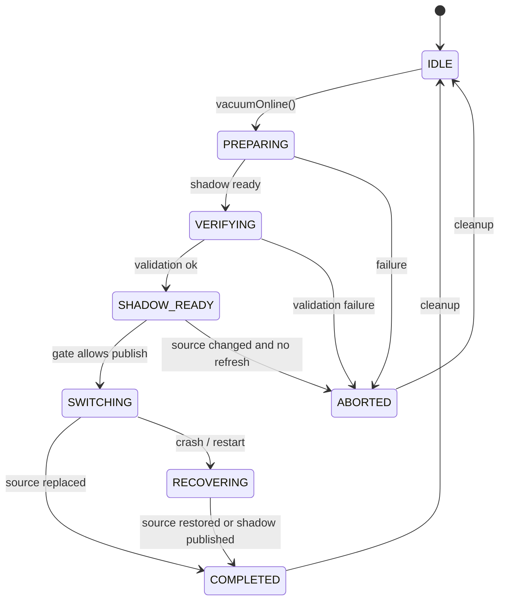

# MVStore 空间回收优化启动准备

本文档记录在开始 S2 空间在线回收优化之前，当前代码、测试和推进规则是否已经具备开工条件。结论是：插件化前置已经收口，MVStore 空间回收脚手架和专项测试可用，可以进入空间回收优化的详细设计与实现阶段。S2 在线优化主线是部分回收，不是整库 shadow copy 后整体替换。

## 背景

前一轮插件化改造已经把存储引擎和表引擎的 provider/registry 路径、诊断输出、维护能力边界和测试门禁固定下来。空间回收优化后续需要沿着 `StorageMaintenance` 能力边界接入，避免把 MVStore 专用维护逻辑散落到通用数据库流程里。

现有代码已经包含一组 MVStore 空间回收基础组件：`MVStoreSpaceReclamation`、`MVStoreSpaceReclamationOptions`、`MVStoreSpaceReclamationResult`、`MVStoreSpaceReclamationMaintenance`、`MVStoreSpaceReclamationOperationGate`、`MVStoreSpaceReclamationPhase` 和诊断 listener。它们覆盖了 closed-store compact、shadow 文件准备、manifest、switch、cleanup、故障注入和操作 gate 的基础语义。

## 目标

| 目标 | 启动判断 |
| --- | --- |
| 插件化前置不阻塞 S2 | 已完成。MVStore storage engine 通过内置 provider 暴露维护能力。 |
| 有可复用的维护接口 | 已具备。`StorageMaintenance` 暴露 `compactClosed()`、`compactOnline()`、`vacuumOnline()`。 |
| 有专项测试门禁 | 已具备。`runMvStoreSpaceReclamationCheck` 可独立运行。 |
| 有失败与恢复基础模型 | 已具备。现有测试覆盖 shadow、manifest、backup、cleanup 和 fault harness。 |
| 有完整测试基线记录 | 已具备。完整 `TestAll ci` 的 localhost 网络偶发失败已记录，focused phase 复跑通过。 |

## 非目标

本准备阶段不实现新的空间回收算法，也不改变 MVStore 磁盘格式、SQL 语义、默认配置或插件加载生命周期。热加载插件、插件签名、权限沙箱、多版本插件解析等能力继续留在后续插件化阶段，不能混入 S2 第一轮空间回收优化。

## 现状/已有流程

| 现有入口 | 当前行为 | S2 价值 |
| --- | --- | --- |
| `MVStoreSpaceReclamation.compactClosedStore()` | 对关闭的 store 生成 compact 后 shadow，验证后替换源文件 | 可作为离线 compact 的可靠基线 |
| `MVStoreSpaceReclamation.compactToShadow()` | 准备 `.reclaim.shadow` 和 `.reclaim.manifest` | 可作为在线回收 prepare 阶段的基础 |
| `MVStoreSpaceReclamation.switchToShadow()` | 验证 manifest/source fingerprint 后切换 shadow | 可作为离线 compact 或后续兜底 publish 方案参考 |
| `MVStoreSpaceReclamation.cleanUp()` / `recover()` | 清理或恢复中间文件 | 可作为异常恢复和幂等重试基础 |
| `MVStoreMaintenance.vacuumOnline()` | 当前委托 `Store.compactFile(50)` | S2 需要把它升级为真正的在线回收边界 |
| `MVStoreSpaceReclamationMaintenance` | 提供 read/write/switch decision | 可扩展为长事务和写入 gate 策略 |

## 核心约束

| 约束 | 说明 |
| --- | --- |
| Java 8 | 主线代码不能使用 Java 8 之后的语法或 API。 |
| 兼容性 | 第一轮 S2 不改变磁盘格式，不要求旧数据库迁移。 |
| 可恢复 | 任何 shadow、backup、manifest 中间态都必须能清理或恢复。 |
| 可观测 | 新增维护路径必须输出可诊断状态，便于定位是 skipped、unsupported、busy 还是 failed。 |
| 测试先行 | 每个实现切片都需要同步补测试；生产代码优先补 JUnit，MVStore 兼容场景可继续纳入 legacy `TestBase` 门禁。 |
| 门禁可重复 | S2 专项必须至少通过 `runMvStoreSpaceReclamationCheck`；高风险改动再跑 daily gate 和相关 `TestAll ci` phase。 |

## 接口设计

S2 第一轮应优先沿现有接口推进，不新增公开 SQL 命令作为第一步。

| 接口 | 当前状态 | S2 处理 |
| --- | --- | --- |
| `StorageMaintenance.vacuumOnline()` | 已存在 | 作为在线空间回收主入口，返回 `StorageMaintenanceResult`。 |
| `StorageMaintenance.compactOnline()` | 已存在 | 保留轻量 compact 语义，不和 vacuum 的 shadow/switch 语义混淆。 |
| `MVStoreSpaceReclamationOptions` | 已存在 | 补充 online 策略参数前先评审默认值和兼容性。 |
| `MVStoreSpaceReclamationResult` | 已存在 | 增加必要统计时保持向后兼容，不删除已有字段。 |
| 诊断 listener | 已存在 | S2 新 phase 必须通过 listener 输出。 |

## 数据结构

当前可复用的磁盘侧中间文件如下：

| 文件 | 用途 | S2 要求 |
| --- | --- | --- |
| `.reclaim.shadow` | compact 后候选文件 | prepare 阶段生成，switch 前必须验证。 |
| `.reclaim.backup` | 源文件备份 | publish 阶段按 crash-safe 策略决定是否保留。 |
| `.reclaim.manifest` | phase、源文件 fingerprint、shadow 信息 | 所有阶段转换必须保持可恢复和可校验。 |

S2 不应在第一轮引入新的持久化元数据版本。若后续需要 manifest version，应先补读写兼容测试。

## 状态机

建议沿用并收紧现有 phase：



## 时序流程

第一轮在线回收建议按以下顺序拆分：

1. 收集 reclaimable size、file size、fill rate、活动事务和操作 gate 状态。
2. 通过 `StorageMaintenance.vacuumOnline()` 进入 MVStore 专用维护实现。
3. 在 prepare 阶段生成 shadow 和 manifest，期间必须限制或检测会破坏 source fingerprint 的写入。
4. 验证 shadow 可打开、关键 map 可读、manifest 与 source fingerprint 一致。
5. publish 前检查长事务和写入 gate；无法切换时返回 skipped/busy，不做危险重试。
6. switch 成功后清理 shadow/manifest，按配置保留或删除 backup。

## 异常处理

| 场景 | 预期处理 |
| --- | --- |
| source 已变化 | 默认拒绝切换；显式允许时重新 prepare 或 fallback full copy。 |
| 长事务阻塞 | 返回 skipped/busy，并通过 diagnostic message 暴露原因。 |
| shadow 验证失败 | 删除不可信 shadow，保留源文件不变。 |
| publish 中断 | 启动时或下次维护时通过 manifest/backup 恢复。 |
| listener 抛异常 | 不影响主流程，最多记录诊断失败。 |
| Windows 文件替换失败 | 必须保留源文件，返回 failed/skipped，不能留下不可打开数据库。 |

## 幂等性

`cleanUp()`、`recover()`、重复 prepare 和重复 switch 都必须保持幂等。S2 实现中不能依赖“只会执行一次”的假设；测试需要覆盖重复调用和半完成文件组合。

## 回滚策略

第一轮 S2 默认通过配置或维护入口选择启用，不改变数据库启动路径。若发现问题，可以回滚到当前 `Store.compactFile(50)` 行为，并保留 closed-store compact 工具能力。涉及 publish 的实现必须保证 rollback 后旧数据库仍可由现有 MVStore 打开。

## 兼容性

| 维度 | 要求 |
| --- | --- |
| 磁盘格式 | 第一轮不变更。 |
| JDBC/SQL | 不新增默认 SQL 行为；后续若引入命令需单独设计。 |
| 插件 API | 沿 `StorageMaintenance` 能力边界，不扩大外部插件生命周期承诺。 |
| 测试体系 | JUnit 插件测试继续保留；MVStore 空间回收可继续使用 legacy `TestBase`，但必须纳入 Gradle task 管理。 |

## 灰度/迁移

S2 第一轮采用显式触发和低默认风险策略，主线是 bounded partial compact。自动后台回收、阈值调度、周期性维护线程都放到后续阶段，等手动入口、诊断和专项测试稳定后再设计。

## 测试方案

| 层级 | 测试内容 | 门禁 |
| --- | --- | --- |
| JUnit | `StorageMaintenance` 契约、结果语义、能力声明、provider 暴露 | `runPluginArchitectureCheck` |
| MVStore 专项 | shadow、manifest、backup、switch、cleanup、fault harness、operation gate | `runMvStoreSpaceReclamationCheck` |
| Daily gate | 编译、常规检查、legacy smoke | `clean test check build runH2LegacySmoke` |
| Full acceptance | 完整 `TestAll ci` | 高风险阶段运行；localhost 网络偶发失败按 phase 复跑规则记录 |

当前准备验证：

```powershell
.\gradlew.bat runMvStoreSpaceReclamationCheck
```

结果：2026-05-30 通过。

## 风险点

| 风险 | 影响 | 缓解 |
| --- | --- | --- |
| partial compact 与活跃事务交互不清 | 可能导致回收无进展或长时间阻塞 | 第一轮不等待长事务，先返回 busy/skipped。 |
| 整库 shadow publish 被误当成在线主线 | 可能放大 IO 和恢复复杂度 | S2.1-S2.3 明确只做 partial；shadow 仅保留为离线/兜底评审。 |
| 长事务阻塞 switch | 回收长期无法完成 | 明确 busy/skipped 返回和诊断。 |
| Windows 文件替换语义差异 | publish 失败或 backup 残留 | 保留平台相关故障测试和恢复测试。 |
| 完整 `TestAll ci` 网络偶发 | 干扰阶段验收判断 | 保留 focused phase 复跑和基线记录，不把网络偶发误判为 S2 回归。 |

## 分阶段实施计划

| 阶段 | 目标 | 交付物 | 验证 |
| --- | --- | --- | --- |
| S2.1 | 明确部分回收决策与统计 | reclaimable size/fill rate/活动事务诊断，不引入整库 shadow | JUnit + `runMvStoreSpaceReclamationCheck` |
| S2.2 | 打通 `vacuumOnline()` partial 维护边界 | 从直接 `Store.compactFile(50)` 过渡到可诊断的 partial 回收流程 | JUnit + MVStore 专项 |
| S2.3 | 实现 partial gate 与预算策略 | targetFillRate、write gate、long transaction/no-progress decision | MVStore 专项 + 并发场景 |
| S2.4 | 评审 shadow publish 兜底 | 明确整库 shadow publish 是否只作为离线/兜底能力保留 | fault harness + recovery tests |
| S2.5 | 补齐文档和运维边界 | 中英文使用说明、限制、诊断说明 | docs review + daily gate |
| S2.6 | 评估自动化调度 | 阈值、后台线程、限速、默认关闭策略 | 单独设计后实施 |

## 待拍板问题

| 问题 | 建议默认 |
| --- | --- |
| 是否第一轮支持整库 crash-safe publish | 不作为在线主线；保留为离线/兜底能力，S2.4 再评审。 |
| 在线写入期间是否允许 catch-up | partial 主线不做 shadow catch-up；后续整库 shadow 方案再单独评审。 |
| 是否新增 SQL 命令 | 第一轮不新增，先稳定 Java maintenance API。 |
| 自动后台回收是否纳入 S2 | 不纳入第一轮，放到 S2.6 单独设计。 |
| legacy 测试是否继续保留 | 保留，但所有可自动运行的 legacy 测试必须纳入 Gradle task 管理。 |

## 启动结论

可以开始空间回收优化。下一步应先写 S2 详细设计，重点拍板 partial compact 的决策阈值、targetFillRate、长事务 gate、no-progress 语义和测试门禁；整库 shadow publish 只作为离线/兜底方案评审。随后按 S2.1 到 S2.5 分阶段实现，每阶段完成后本地提交。
