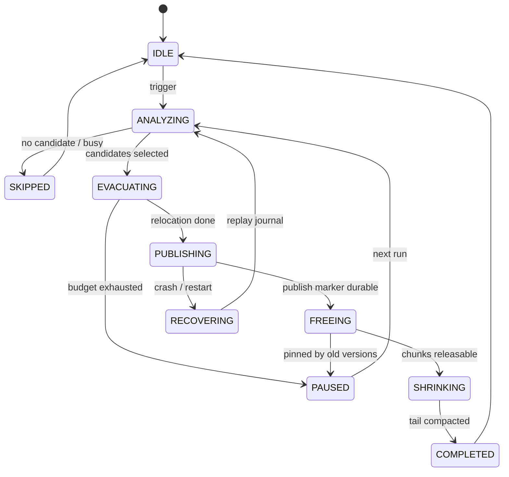

# MVStore Space Reclamation S2 Long-Term Architecture

This is the new design document for the S2 long-term solution. S1, the medium-term solution, is complete and archived. This document does not extend the archived material and does not reduce S2 to a wrapper around `compactFile()`. S2 builds a chunk/page-level online reclamation system inside MVStore, with observability, recovery, budgets, and scheduling.

## Background

MVStore uses append-style writes and chunk management. After deletes or updates, old pages become dead space and chunk live bytes drop. Space is usually not returned promptly for four reasons:

| Reason | Impact |
| --- | --- |
| A chunk still has live pages | The whole chunk cannot be freed. |
| Long transaction / old version pinning | Old pages may still be readable by older versions. |
| Map ownership is unclear or maps are not open | The current rewrite path mainly handles open maps. |
| Live chunks remain at the file tail | Interior holes do not allow file truncation. |

Reusable code anchors:

| Code anchor | Current capability | S2 role |
| --- | --- | --- |
| `MVStore.compact(int targetFillRate, int write)` | Triggers page rewrite for low-fill chunks | Governance entry in S2.2 and page relocation base in S2.3. |
| `FileStore.rewriteChunks()` | Selects rewritable chunks and calls map rewrite | Candidate and relocation starting point for S2.1/S2.3. |
| `MVMap.rewritePage(long pagePos)` | Rewrites a live page through map operations | Minimum page relocation primitive for S2.3. |
| `RandomAccessStore.compactMoveChunks()` | Moves physical chunks and shrinks the tail | Tail mover base for S2.6. |
| `FileStore.dropUnusedChunks()` | Frees dead chunks when retention allows | Release boundary for S2.4/S2.5/S2.6. |
| `MVStore.oldestVersionToKeep` | Controls the oldest retained version | Correctness boundary for S2.5 relocation map. |

## Goals

| Goal | Acceptance |
| --- | --- |
| Chunk/page-level online reclamation | No full-store copy and no whole-file replacement; each run processes bounded chunks/pages. |
| Observability | Output candidate chunks, skip reasons, pinning reasons, rewrite bytes, freed/moved chunks. |
| Recoverability | After evacuation journal exists, crashes can continue, roll back, or clean up. |
| Budgeting | Support max chunks, max live bytes, max run millis, and IO budget. |
| Long-transaction safety | Do not free data still readable by old versions; release pinned chunks only after relocation map is mature. |
| Tail shrink loop | After page relocation, move tail chunks and truncate the file. |
| Operational control | Background scheduling is default-off, with dry-run and clear diagnostics. |

## Non-goals

| Non-goal | Notes |
| --- | --- |
| Full-store shadow publish as the main path | Keep it only as offline compact or fallback tooling. |
| SQL command as the S2 starting point | Stabilize Java maintenance API and internal diagnostics first. |
| Bypassing MVCC / retention | Data referenced by old versions must remain readable. |
| Reclaiming everything in one run | S2 is multi-run, interruptible, and recoverable. |

## Core Components


| Component | Responsibility |
| --- | --- |
| `MVStoreReclamationCoordinator` | Maintenance entrypoint, mutual exclusion, budgets, recovery, phase orchestration, result aggregation. |
| `ChunkLivenessAnalyzer` | Produces chunk liveness snapshots with live/dead bytes, map ownership, and pinning reason. |
| `ReclamationCandidateSelector` | Selects candidate chunks by benefit, risk, position, and budget. |
| `PageRelocator` | Copy-on-writes live pages from candidate chunks into new chunks and updates map roots or relocation metadata. |
| `EvacuationJournal` | Persists job, phase, candidate, page relocation progress, and publish marker. |
| `ChunkReleaser` | Frees dead chunks when retention permits, through existing drop/free mechanisms. |
| `TailCompactor` | Moves tail chunks, creates a contiguous free tail, and truncates the file. |

## Interface Design

External entrypoint remains:

```java
StorageMaintenanceResult vacuumOnline();
```

Suggested internal API:

```java
final class MVStoreOnlineReclamation {
    MVStoreReclamationAnalysis analyze(MVStore store, MVStoreReclamationRequest request);
    MVStoreReclamationResult run(MVStore store, MVStoreReclamationRequest request);
    MVStoreReclamationRecovery recover(MVStore store);
}
```

`MVStoreReclamationRequest`:

| Field | Default | Description |
| --- | --- | --- |
| `dryRun` | `false` | Analyze candidates and expected benefit without writing. |
| `targetFillRate` | `50` | Target fill rate for candidate chunks. |
| `maxCandidateChunks` | `1` | Maximum candidate chunks per run. |
| `maxLiveBytesToRewrite` | `16MB` | Maximum live-page bytes to rewrite per run. |
| `maxRunMillis` | `0` | `0` means no strict limit for manual entry; background scheduling must set one. |
| `allowRelocationMap` | `false` | Whether relocation map writes are allowed. |
| `allowTailCompaction` | `true` | Whether tail chunk movement and shrink are allowed. |

`MVStoreReclamationResult`:

| Field | Description |
| --- | --- |
| `status` | `SUCCESS`, `SKIPPED`, `BUSY`, `NO_PROGRESS`, `FAILED`. |
| `message` | Stable prefix plus diagnostic summary. |
| `beforeFileSize` / `afterFileSize` | File size change. |
| `beforeFillRate` / `afterFillRate` | Store fill rate. |
| `beforeChunksFillRate` / `afterChunksFillRate` | Chunk fill rate. |
| `candidateChunks` | Selected chunk ids. |
| `relocatedPages` / `relocatedBytes` | Page relocation result. |
| `freedChunks` / `movedChunks` | Freed and moved chunks. |
| `pinnedChunks` | Chunks skipped because of old versions, unknown maps, or recent chunks. |

## Data Structures

### ChunkLivenessSnapshot

| Field | Description |
| --- | --- |
| `chunkId` | Chunk id. |
| `block` / `len` | File location and length. |
| `fillRate` | Chunk live ratio. |
| `liveBytes` / `deadBytes` | Estimated live/dead bytes. |
| `mapIds` | Maps owning pages in the chunk. |
| `oldestVersion` / `unusedAtVersion` | Retention and long-transaction data. |
| `pinnedReason` | `NONE`, `ACTIVE_VERSION`, `UNKNOWN_MAP`, `RECENT_CHUNK`. |

### EvacuationJournal

S2.4 introduces a persistent journal, preferably in the layout/meta map:

| Key | Value |
| --- | --- |
| `reclaim.job` | Current job id, phase, creation version, creation time. |
| `reclaim.job.<id>.chunk.<chunkId>` | Candidate information, original location, expected benefit, phase. |
| `reclaim.job.<id>.page.<oldPos>` | Optional old page position to new page position. |
| `reclaim.job.<id>.publish` | Publish marker showing that new roots or relocation metadata are durable. |

S2.1-S2.3 can use an in-memory journal. Persistent journal is required before freeing pinned old pages or supporting crash continuation.

### RelocationMap

S2.5 introduces relocation map to support old-version reads of moved pages.

| Item | Design |
| --- | --- |
| Key | Old page position or `(chunkId, pageNo)`. |
| Value | New page position, map id, source version, expire version. |
| Lifecycle | Delete after `oldestVersionToKeep` passes expire version. |
| Compatibility | Requires a feature flag; old versions must reject write-open. |
| Default | Off by default; enabled only when reclaiming pinned chunks. |

## State Machine



## Sequence

1. `vacuumOnline()` enters the coordinator.
2. Coordinator checks mutual exclusion: close, backup, store, and existing reclaim job.
3. Read and recover unfinished journal.
4. Analyzer builds chunk liveness snapshot.
5. Selector chooses candidate chunks.
6. Relocator moves live pages within budget.
7. Journal writes publish marker.
8. Releaser frees releasable dead chunks.
9. Tail compactor moves tail chunks and shrinks the file.
10. Emit result and diagnostics.

## Error Handling

| Scenario | Handling |
| --- | --- |
| Crash during relocation | No publish marker: discard or replay unpublished migration. |
| Crash after publish | Publish marker exists: continue free/shrink or preserve for next run. |
| Map ownership is unclear | Mark candidate `UNKNOWN_MAP` and do not relocate it. |
| Long transaction pins data | Mark candidate `ACTIVE_VERSION` and skip by default. |
| Relocation map is incomplete | Do not free old chunk; conservatively keep old pages. |
| Tail move fails | Page relocation correctness is unaffected; record no-shrink. |

## Compatibility

| Phase | Format impact | Compatibility strategy |
| --- | --- | --- |
| S2.1-S2.3 | No disk format change | Only improve observability, decisions, and open-map relocation. |
| S2.4 | Adds journal keys | Feature flag; old versions should reject write-open with unfinished jobs. |
| S2.5 | Adds relocation map | Feature flag; old versions must reject write-open, read-only downgrade needs separate validation. |
| S2.6-S2.8 | No new format by default | Scheduling and tail mover use existing chunk metadata. |

## Test Plan

| Level | Coverage |
| --- | --- |
| JUnit | Request/result, candidate scoring, budget, message, feature flag. |
| MVStore dedicated | Chunk bloat, page relocation, unknown map, long transaction, tail shrink, no-progress. |
| Fault injection | Crash before/after publish, during free, during shrink, missing relocation map. |
| Concurrency | Writes during reclamation, long read transaction, close/backup/compact mutual exclusion. |
| Compatibility | Old database open, new feature flag, unfinished journal recovery, read-only downgrade. |

## Design Conclusion

S2 is an online chunk/page-level reclamation system inside MVStore. Implementation can start from existing `compact()`, `compactFile()`, `rewriteChunks()`, and `compactMoveChunks()`, but the final deliverable is not a wrapper around them. The final deliverable is a closed loop of coordinator, liveness analyzer, candidate selector, page relocator, evacuation journal, relocation map, and tail compactor.
