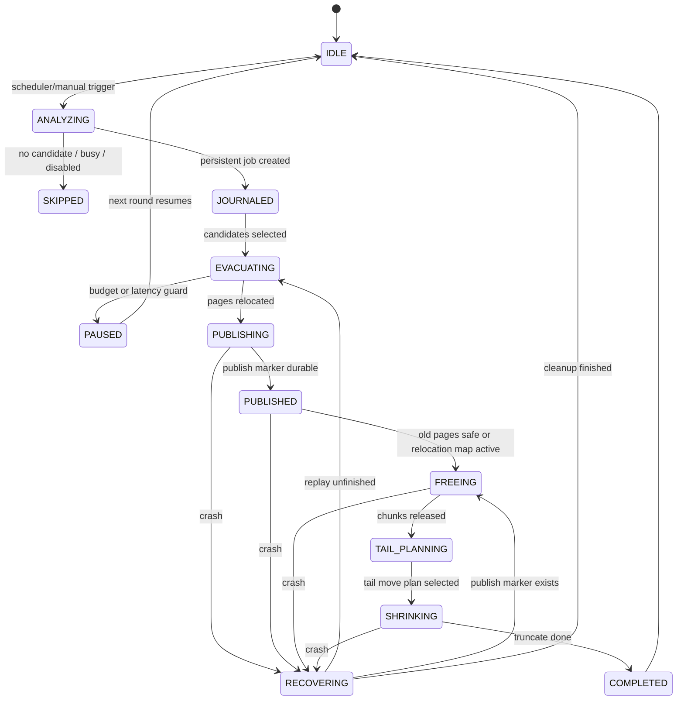

# MVStore Space Reclamation S2 Complete Automatic Space Organization Plan

This document tracks the continuation from the current S2 low-intensity online partial reclamation baseline to complete automatic space organization. The current decision is to not ship the formal release yet. The target is default automatic, recoverable, observable, and continuous MVStore file-space organization.

## Target Definition

Complete automatic space organization must provide all of the following behavior:

| Goal | Acceptance criteria |
| --- | --- |
| Automatically discover fragmentation | The background scheduler continuously detects low-fill chunks, tail holes, old-version pins, and unknown-map blockers. |
| Automatically relocate live pages | Candidate chunks can be safely evacuated without requiring users to pre-open all maps. |
| Keep old-version reads safe | When old versions may still read moved pages, the relocation map resolves old positions safely. |
| Provide crash-safe publish | Crashes during analyze, evacuate, publish, free, or tail move can be continued, rolled back, or cleaned up after restart. |
| Automatically shrink the tail | After page relocation, tail live chunks can be moved within budget and the file can eventually be truncated. |
| Minimize foreground impact | Background work has idle detection, throttling, failure backoff, write-latency guards, and a disable switch. |
| Explain operations | Every skip, pause, failure, recovery, and shrink outcome has stable diagnostic codes and traceable metrics. |
| Prove release readiness | JUnit, MVStore dedicated, fault-injection, compatibility, concurrency, performance, and full TestAll gates pass. |

## Non-Goals

| Non-goal | Notes |
| --- | --- |
| Replacing automatic organization with whole-store shadow copy | Shadow copy remains an offline fallback, not the main path. |
| Bypassing MVCC / retention | Data still readable by old versions must remain readable. |
| Unbounded background organization | Automatic execution must still be throttleable, pausable, and disableable. |
| Reclaiming all space in one run | The complete solution remains multi-round, interruptible, and recoverable. |

## Current Baseline

S2.0-S2.8 already provide the following foundation:

| Capability | Current state |
| --- | --- |
| `MVStoreReclamationAnalyzer` | Generates chunk liveness and candidate analysis. |
| `MVStoreReclamationCoordinator` | Runs one bounded online reclamation round and returns structured results. |
| `MVStoreReclamationRequest` / `MVStoreOnlineReclamationResult` | Provide budget, journal, relocation-map, tail-compaction, and diagnostic fields. |
| `MVStoreReclamationScheduler` | Integrated with MVStore housekeeping; enabled by default in low-intensity mode; supports disable and backoff. |
| Journal scaffold | Provides opt-in phase recording, completion cleanup, and recovery entrypoint. |
| Relocation-map gate | Provides feature gate and result diagnostics; real read-path redirection is not enabled by default. |
| Tail compaction | Provides explicit-budget trigger path and diagnostic fields. |
| Test base | Provides JUnit gate, MVStore dedicated gate, plugin gate, recovery gate, and full TestAll gate records. |

## New Phases

| Phase | Status | Goal | Deliverables | Minimum gate |
| --- | --- | --- | --- | --- |
| S2.9 | Done | Hold release and reset target | Mark release as held; switch target to complete automatic organization; remove release-ready framing | docs + `runMvStoreReclamationJUnitCheck` |
| S2.10 | Done | Persistent journal v1 | Job id, phase, candidate chunks, page progress, publish marker, idempotent recovery | JUnit + MVStore fault injection |
| S2.11 | Done | Real relocation-map read path | Old page position to new page position resolution, expire version, cleanup, compatibility rejection | JUnit + compatibility + recovery |
| S2.12 | Planned | Crash-safe publish/free | Full crash recovery and rollback across analyze / evacuate / publish / free / shrink | fault injection + corruption/recovery |
| S2.13 | Planned | Automatic map ownership | Lazy-open / map ownership resolution, dedicated unknown-map diagnostics, no user pre-open requirement | MVStore dedicated + concurrency |
| S2.14 | Planned | Automatic tail shrink planner | Tail-hole detection, tail live-chunk move planning, truncate verification, IO budgets | MVStore dedicated + slow baseline |
| S2.15 | Planned | Adaptive background scheduling | Idle detection, write-latency guard, global mutual exclusion, dynamic backoff, space-pressure trigger | scheduler + stress + performance |
| S2.16 | Planned | Complete automatic mode acceptance | Default automatic strategy, release-note rewrite, long-running stability tests, full CI and regression matrix | full release gates |

## Interface Plan

### MVStoreReclamationRequest Extensions

| Field | Default | Phase | Notes |
| --- | --- | --- | --- |
| `autoMode` | `false` | S2.15 | Scheduler automatic organization mode; manual entrypoints keep it disabled by default. |
| `journalMode` | `NONE` | S2.10 | `NONE`, `MEMORY`, or `PERSISTENT`. Complete automatic mode requires `PERSISTENT`. |
| `relocationMapMode` | `DISABLED` | S2.11 | `DISABLED`, `READ_ONLY_RESOLVE`, or `WRITE_AND_RESOLVE`. |
| `maxPagesToRelocate` | `0` | S2.10 | Per-round page relocation cap; `0` means byte budget controls it. |
| `maxTailChunksToMove` | `0` | S2.14 | Per-round tail mover cap to avoid aggressive IO on large files. |
| `foregroundLatencyBudgetMillis` | `0` | S2.15 | Background work pauses when foreground latency exceeds this budget. |
| `spacePressureThreshold` | `0` | S2.15 | Raises scheduling priority when file bloat or low fill rate crosses the threshold. |

### MVStoreOnlineReclamationResult Extensions

| Field | Phase | Notes |
| --- | --- | --- |
| `jobId` | S2.10 | Persistent job id for the current or recovered round. |
| `phase` | S2.10 | Final phase: `ANALYZED`, `EVACUATED`, `PUBLISHED`, `FREED`, or `SHRUNK`. |
| `relocatedPages` | S2.10 | Actual number of relocated pages. |
| `relocationMapEntries` | S2.11 | Number of relocation-map entries written or cleaned by the round. |
| `freedChunks` | S2.12 | Number of chunks freed by the round. |
| `movedTailChunks` | S2.14 | Number of tail chunks moved by the round. |
| `shrinkBytes` | S2.14 | Number of bytes truncated from the file. |
| `pauseReason` | S2.15 | `TIME_BUDGET`, `IO_BUDGET`, `FOREGROUND_LATENCY`, `BACKOFF`, `CLOSED`, and related reasons. |

## State Machine

## Data Structures

### Persistent Journal

| Key | Value | Phase |
| --- | --- | --- |
| `reclaim.s2.job` | Active job id, phase, createdVersion, createdTime, request hash | S2.10 |
| `reclaim.s2.job.<id>.candidate.<chunkId>` | Chunk snapshot, score, selected reason, pin state | S2.10 |
| `reclaim.s2.job.<id>.page.<oldPos>` | Map id, new position, source version, publish state | S2.10 / S2.11 |
| `reclaim.s2.job.<id>.publish` | Durable publish marker, published version, checksum | S2.12 |
| `reclaim.s2.job.<id>.tail` | Tail move plan, moved chunks, truncate target | S2.14 |

### Relocation Map

| Field | Notes |
| --- | --- |
| `oldPagePos` | Old page position; must uniquely identify the original page. |
| `newPagePos` | New page position. |
| `mapId` | Owning map id to prevent cross-map reads. |
| `sourceVersion` | Version at which relocation happened. |
| `expireVersion` | Entry is removable once `oldestVersionToKeep` passes this version. |
| `checksum` | Optional recovery and debugging validation. |

## Compatibility And Rollback

| Scenario | Strategy |
| --- | --- |
| Old version write-opens a store with active journal metadata | Reject write-open to avoid ignoring unfinished jobs. |
| Old version write-opens a store with relocation-map metadata | Reject write-open because the old read path cannot resolve moved pages. |
| Read-only open | Allow only when there is no active job and relocation map can be resolved; otherwise reject with diagnostics. |
| Automatic organization is disabled | `onlineReclamationEnabled(false)` must take effect immediately; existing jobs may only run recovery cleanup, not new relocation. |
| Roll back to conservative strategy | Use `autoMode=false`, `journalMode=NONE`, `relocationMapMode=DISABLED`, and explicit-budget-only tail mover. |

## Test Matrix

| Level | Coverage |
| --- | --- |
| JUnit contract | Request/result defaults, invalid values, diagnostic codes, illegal state transitions, feature gates. |
| MVStore dedicated | Page relocation, lazy map ownership, relocation-map resolve, tail shrink, no candidate, budget pause. |
| Fault injection | Crash before journal, during evacuation, after publish, during free, during tail move, during cleanup. |
| Compatibility | Old-store open, new metadata write rejection, read-only downgrade, disabled-gate open failure, upgrade recovery. |
| Concurrency | Foreground writes, long read transactions, close/backup/compact mutual exclusion, scheduler multi-round reentry. |
| Performance | Small store, bloated store, no-candidate store, many maps, large LOB values, network mode, foreground write-latency baseline. |
| Full gates | `runMvStoreReclamationJUnitCheck`, `runMvStoreSpaceReclamationCheck`, `runPluginArchitectureCheck`, `runMvStoreRecoveryCheck`, `runH2LegacySmoke`, `runH2TestAllCi`. |

## Phase Completion Rules

Every phase must satisfy:

1. Production code and tests are committed in the same phase.
2. Contract coverage that fits JUnit goes into `runMvStoreReclamationJUnitCheck`.
3. File, crash, concurrency, and compatibility scenarios go into `runMvStoreSpaceReclamationCheck` or an existing legacy gate.
4. User-visible behavior changes update Chinese and English documentation.
5. Persistent-format phases must document old-version read/write behavior, disabled gate behavior, rollback, and recovery semantics.
6. Commit locally after each completed phase.

## Current Decisions

| Question | Decision |
| --- | --- |
| Ship the current S2.0-S2.8 formal release? | No, hold release. |
| Final release target | Complete automatic space organization, not conservative online partial reclamation. |
| Keep the current low-intensity background baseline? | Yes, keep it as foundation, but it is not sufficient for final release. |
| Keep journal / relocation map / tail compaction explicitly gated? | Yes until complete automatic mode acceptance; revisit defaults after S2.16. |
| Next priority | S2.10 persistent journal v1, then S2.11 real relocation-map read path. |
