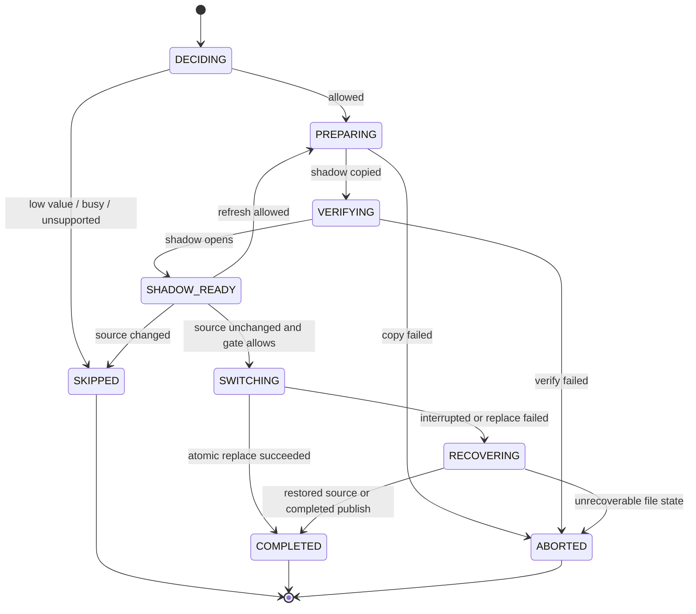
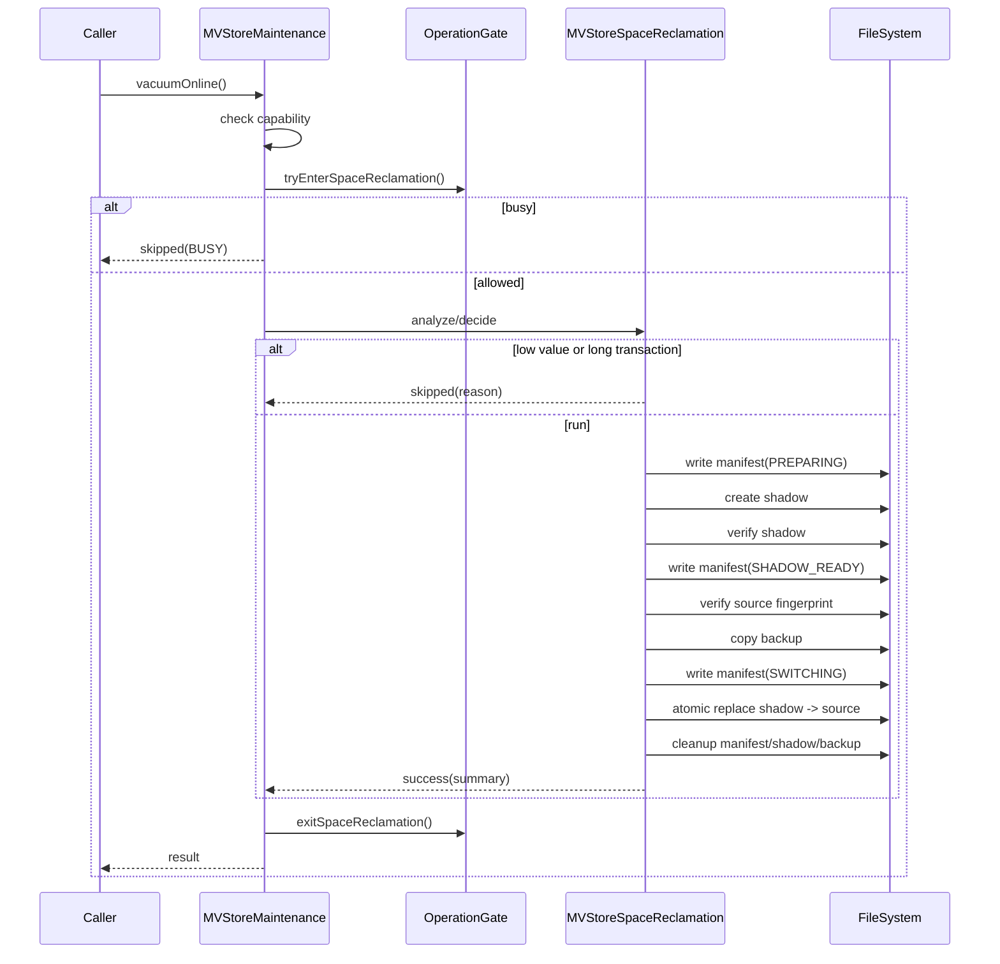

# MVStore Online Space Reclamation S2 Design

This document is the implementable design for S2 online space reclamation optimization. It follows the readiness conclusion in `mvstore-space-reclamation-readiness.md`: without changing the MVStore disk format or adding default SQL behavior, upgrade the current lightweight `vacuumOnline()` compact entrypoint into a diagnosable, recoverable, and testable online reclamation flow.

## Background

MVStore files can contain unused space after heavy insert, delete, and update workloads. Today `MVStoreMaintenance.vacuumOnline()` only delegates to `Store.compactFile(50)`. It can trigger some online compaction, but it lacks the following capabilities:

| Gap | Impact |
| --- | --- |
| Insufficient pre-reclamation decision | Callers cannot tell whether reclamation is worthwhile or why it was skipped. |
| Shadow/publish flow is not wired into the online entrypoint | Existing `MVStoreSpaceReclamation` utilities are not used by `StorageMaintenance.vacuumOnline()`. |
| Crash-safe publish is not formally decided | Recovery semantics for shadow, backup, and manifest files are still scaffolding-level. |
| Write and long-transaction gates are not connected to real database flows | The current gate is a minimum model and is not bound to MVStore or session lifecycles. |
| Test layering needs strengthening | JUnit and legacy MVStore dedicated coverage need clear ownership. |

## Goals

| Goal | Acceptance result |
| --- | --- |
| Converged online entrypoint | `StorageMaintenance.vacuumOnline()` is the only S2 online reclamation entrypoint in the first round. |
| Diagnosable decisions | no-op, busy, stale shadow, unsupported, and success return stable messages. |
| Reusable shadow prepare | Reuse and extend `MVStoreSpaceReclamation.compactToShadow()` semantics. |
| Crash-safe publish | Any interruption during publish preserves an openable source database or can be recovered through `recover()`. |
| Conservative handling of online writes | No version-scan catch-up in the first round; source changes reject publish or reprepare. |
| Traceable tests | Each S2 subphase has JUnit or legacy dedicated tests and is wired into a Gradle task. |

## Non-goals

| Non-goal | Reason |
| --- | --- |
| Automatic background reclamation | Scheduling, throttling, and default thresholds need a separate design in S2.6. |
| New SQL `VACUUM` / `COMPACT` command | Stabilize the Java maintenance API before expanding compatibility surface. |
| Online incremental catch-up | Version scanning and map-change replay are high-risk for the first round. |
| MVStore disk format changes | The first round must keep old database compatibility. |
| Plugin hot loading or maintenance plugin lifecycle | This remains later pluginization work and is out of S2. |

## Current Flows

| Module | Current state | S2 change |
| --- | --- | --- |
| `StorageMaintenance` | Has `compactClosed()`, `compactOnline()`, and `vacuumOnline()` | Do not add entrypoints; enhance `vacuumOnline()` semantics. |
| `StorageMaintenanceResult` | Has success, skipped, unsupported, and message | Reuse in the first round; add contract tests before introducing failed/busy enums. |
| `MVStoreSpaceReclamation` | Has closed compact, prepare shadow, switch, cleanup, and recover | Split out online-ready prepare/publish decisions and recovery constraints. |
| `MVStoreSpaceReclamationOptions` | Supports compress, verify, keepBackup, refreshShadowIfSourceChanged, ioDelay, listener | Design tests before adding online thresholds, publish strategy, and gate timeout. |
| `MVStoreSpaceReclamationMaintenance` | Minimum read/write/switch decision gate | Keep changes small before binding it to the real MVStore maintenance flow. |
| `TestMVStoreSpaceReclamation` | Covers shadow, manifest, source changes, gates, and fault matrix | Keep it as the S2 dedicated gate; new scenarios must be wired into this task. |

## Core Constraints

| Constraint | Design requirement |
| --- | --- |
| Java 8 | New code must not use APIs newer than Java 8. |
| File safety | Publish failure must not leave an unopened database. |
| Existing behavior compatibility | Default SQL and startup behavior remain unchanged; only explicit maintenance calls trigger S2. |
| Idempotent recovery | `recover()`, `cleanUp()`, repeated prepare, and repeated publish must be safe. |
| Low-risk defaults | Do not catch up by default; skip or reprepare when the source changes. |
| Testability | All new production code needs tests; interface contracts prefer JUnit, file fault scenarios prefer legacy MVStore dedicated tests. |

## Interface Design

### Public Maintenance Boundary

The first round does not add public interfaces. It keeps:

```java
StorageMaintenanceResult vacuumOnline();
```

S2 return contract for `vacuumOnline()`:

| Result | Suggested message | Condition |
| --- | --- | --- |
| `UNSUPPORTED` | `UNSUPPORTED` | Storage engine does not declare `STORAGE_VACUUM_ONLINE`. |
| `skipped` | `VACUUM_ONLINE_SKIPPED_LOW_RECLAIMABLE_SPACE` | File is too small or reclaimable ratio is too low. |
| `skipped` | `VACUUM_ONLINE_SKIPPED_BUSY` | Backup, another reclamation, or long transaction blocks the run. |
| `skipped` | `VACUUM_ONLINE_SKIPPED_SOURCE_CHANGED` | Source fingerprint changed after prepare and refresh is not allowed. |
| `success` | `VACUUM_ONLINE_FINISHED savedBytes=... savedPercent=...` | Shadow publish succeeded. |

`compactOnline()` continues to mean lightweight MVStore native compact. It should not be upgraded into shadow publish, otherwise the two entrypoints become ambiguous.

### Internal Online Request

Add a package-private request object to describe one online attempt:

| Type | Fields | Purpose |
| --- | --- | --- |
| `MVStoreSpaceReclamationRequest` | `fileName`, `options`, `minimumSavedPercent`, `minimumSavedBytes`, `publishMode`, `gateTimeoutMillis` | Describes one online reclamation attempt. |
| `MVStoreSpaceReclamationDecision` | `allowed`, `skipMessage`, `sourceSize`, `estimatedReclaimableBytes`, `fillRate`, `activeTransactions` | Records whether the run should execute and why. |
| `MVStoreSpaceReclamationPublishMode` | `VERIFY_SOURCE_UNCHANGED`, `REFRESH_SHADOW_IF_SOURCE_CHANGED` | Only these two modes are supported in the first round. |

If implementation shows that a separate request type is unnecessary, the fields may be added to `MVStoreSpaceReclamationOptions.Builder` first, but the tests and message contract must remain.

### Options Increment

Recommended S2.1/S2.2 additions:

| Option | Default | Description |
| --- | --- | --- |
| `minimumSavedBytes` | `0` | Skip when estimated saving is lower. |
| `minimumSavedPercent` | `0` | Skip when estimated ratio is lower. |
| `gateTimeoutMillis` | `0` | Do not wait for long transactions in the first round; skip immediately. |
| `publishMode` | `VERIFY_SOURCE_UNCHANGED` | Conservative default when the source changes. |
| `keepBackup` | Existing default `false` | Crash-safe publish must create a backup during publish; successful cleanup follows this option. |

## Data Structures

### Manifest

The existing manifest records phase, shadow, backup, and source fingerprint. S2 should add fields while remaining backward compatible:

| Field | Required | Description |
| --- | --- | --- |
| `phase` | Yes | `PREPARING`, `VERIFYING`, `SHADOW_READY`, `SWITCHING`, `COMPLETED`, `ABORTED`. |
| `shadow` | Yes | Shadow file name. |
| `backup` | Yes | Backup file name. |
| `sourceSize` | Yes | Source size at prepare time. |
| `sourceDigest` | Yes | Source digest at prepare time. |
| `publishMode` | No | Written by new versions; missing values mean `VERIFY_SOURCE_UNCHANGED`. |
| `createdAtMillis` | No | Diagnostic only; not part of correctness. |

Manifest reading must be lenient: ignore unknown fields and use defaults for missing new fields.

### Result

`MVStoreSpaceReclamationResult` already has `sourceSize`, `compactedSize`, `savedBytes`, `savedPercent`, and `replaced`. The first S2 round should not break this object. Express skipped decisions through `StorageMaintenanceResult.message` first; evaluate a separate analysis/result object later if needed.

## State Machine



Implementation note: `RECOVERING` can initially be an internal recovery path instead of a public `MVStoreSpaceReclamationPhase`. If it becomes visible through listeners, tests must be added.

## Sequence

### Manual vacuumOnline



### Startup / Next-Maintenance Recovery

The first round does not require changing database startup. Prefer calling `recover(fileName)` when `vacuumOnline()` starts, so leftovers from the previous maintenance attempt do not affect the next run. Whether to run automatic recover before MVStore open is an S2.4 decision point; if implemented, tests must prove it cannot delete user files accidentally.

## Error Handling

| Error | Handling |
| --- | --- |
| File missing | Convert to existing MVStore/DbException behavior and do not create a shadow. |
| Prepare copy fails | Delete incomplete shadow and leave the manifest cleanable. |
| Verify fails | Delete shadow, keep source unchanged, return an exception or skipped depending on entrypoint policy. |
| Source fingerprint changed | Skip by default and do not publish. |
| Backup copy fails | Do not publish; keep the source unchanged. |
| Atomic replace fails | Try restoring backup; if restore fails, keep manifest for `recover()`. |
| Cleanup fails | Do not invalidate successful publish, but expose leftovers through message/listener. |
| Listener throws | Keep existing policy: ignore listener failure and continue the main flow. |

## Idempotency

| Operation | Requirement |
| --- | --- |
| `recover(fileName)` | Repeated calls have the same result; when source exists, only trusted leftovers are cleaned. |
| `cleanUp(fileName)` | Repeated calls are safe and never delete the normal source. |
| `compactToShadow()` | May overwrite old shadow, but must handle old manifest state first. |
| `switchToShadow()` | Source changes or missing shadow must never damage the source file. |
| `vacuumOnline()` | Can be retried after busy/skipped; after success, a new call may no-op or decide again. |

## Rollback Strategy

Each S2 phase must be independently revertible:

| Phase | Rollback |
| --- | --- |
| S2.1 decision/statistics | Keep interfaces and disable thresholds, or return to always running the old compact. |
| S2.2 vacuum boundary | Temporarily restore `vacuumOnline()` to `Store.compactFile(50)`. |
| S2.3 prepare/gate | Keep closed-store tools and disable online shadow publish. |
| S2.4 publish/recover | Disable publish and allow only prepare/analyze/cleanup. |
| S2.5 docs | Documentation rollback has no runtime impact. |

## Compatibility

| Dimension | Decision |
| --- | --- |
| Disk format | Unchanged. |
| File suffixes | Keep `.reclaim.shadow`, `.reclaim.backup`, `.reclaim.manifest`. |
| SQL | No new command and no default behavior change. |
| Plugin API | Do not add public provider types; continue exposing capability through `StorageMaintenance`. |
| Old manifest | Interpret missing new fields with conservative defaults. |
| JDK | Java 8. |

## Rollout

The first round supports only explicit `StorageMaintenance.vacuumOnline()` calls. Automatic scheduling, background threads, default thresholds, and configuration entrypoints need a separate S2.6 design. If a configuration is needed later, it should default off and first support diagnostic dry-run.

## Test Plan

| Phase | Test type | Cases |
| --- | --- | --- |
| S2.1 | JUnit | Options defaults, decision messages, low-value skipped, capability boundary. |
| S2.1 | Legacy MVStore | Bloat file statistics aligned with existing `BloatStats`. |
| S2.2 | JUnit | `MVStoreMaintenance.vacuumOnline()` returns success/skipped/unsupported messages. |
| S2.2 | Legacy MVStore | Vacuum entrypoint creates and cleans shadow leftovers. |
| S2.3 | Legacy MVStore | Source changed skips by default; refresh mode reprepares. |
| S2.3 | Legacy MVStore | Long transaction and backup interaction gate. |
| S2.4 | Legacy MVStore | Crash before switch, during switch, cleanup failure, recover idempotency. |
| S2.5 | Docs/build | Chinese and English docs stay synced and dedicated gates pass. |

Minimum command for every phase:

```powershell
.\gradlew.bat runMvStoreSpaceReclamationCheck
```

When plugin maintenance capability or `StorageMaintenance` contracts change, also run:

```powershell
.\gradlew.bat runPluginArchitectureCheck
```

For larger production-code changes, also run the daily gate:

```powershell
.\gradlew.bat clean test check build runH2LegacySmoke
```

## Risks

| Risk | Level | Mitigation |
| --- | --- | --- |
| Power loss or process exit during publish | High | Manifest + backup + recover test matrix first. |
| Online writes make the shadow stale | High | Source changes skip by default in the first round. |
| Windows file replacement differs from POSIX rename | High | Keep move/restore failure tests and do not assume POSIX semantics. |
| Long transactions block reclamation | Medium | Do not wait in the first round; return skipped/busy. |
| Cleanup deletes the wrong file | Medium | `cleanUp()` only deletes fixed suffix files and never deletes source. |
| Messages become compatibility surface | Medium | Use stable prefixes and append statistics after them. |

## Phased Implementation Plan

| Phase | Task | Code deliverable | Test deliverable | Commit |
| --- | --- | --- | --- | --- |
| S2.1 | Decision and statistics | Add decision/options and dry-run style skipped/success decisions | JUnit + legacy stats case | Separate commit |
| S2.2 | Wire vacuumOnline | `MVStoreMaintenance.vacuumOnline()` calls the S2 decision flow | Maintenance entry JUnit + MVStore dedicated tests | Separate commit |
| S2.3 | Shadow prepare/gate | Wire operation gate, source fingerprint, and stale shadow policy | Source changed, busy, long transaction | Separate commit |
| S2.4 | Crash-safe publish | Complete backup/manifest/recover/publish flow | Fault matrix and recover idempotency | Separate commit |
| S2.5 | Docs and acceptance | Chinese/English usage notes, limits, diagnostic messages | Dedicated gate + plugin gate + daily gate | Separate commit |
| S2.6 | Automatic scheduling design | Design only by default | Separate test plan | Separate review |

## Decisions Needed

| Question | Suggested decision |
| --- | --- |
| Should the first round support crash-safe publish? | Yes. It must pass the fault matrix before wiring into `vacuumOnline()`. |
| Should source changes use catch-up? | No catch-up. Skip by default; optional refresh may reprepare. |
| Should long transactions wait? | No in the first round; return skipped/busy. Design timeout wait later. |
| Should backup be kept after successful publish? | Default no, but backup must exist during the publish window; `keepBackup` can retain it for debugging. |
| Should startup automatic recover be wired? | Decide in S2.4. Default first step is recover when entering maintenance. |
| Should a SQL command be added? | No. Revisit after the Java maintenance API is stable. |

## Design Conclusion

The first S2 round uses conservative online reclamation: explicit trigger, decide first, prepare shadow, verify source unchanged, create backup, crash-safe publish, and clean leftovers. It does not add automatic scheduling, online catch-up, or disk format changes. Implementation can start with S2.1, with tests and a local commit after each phase.
