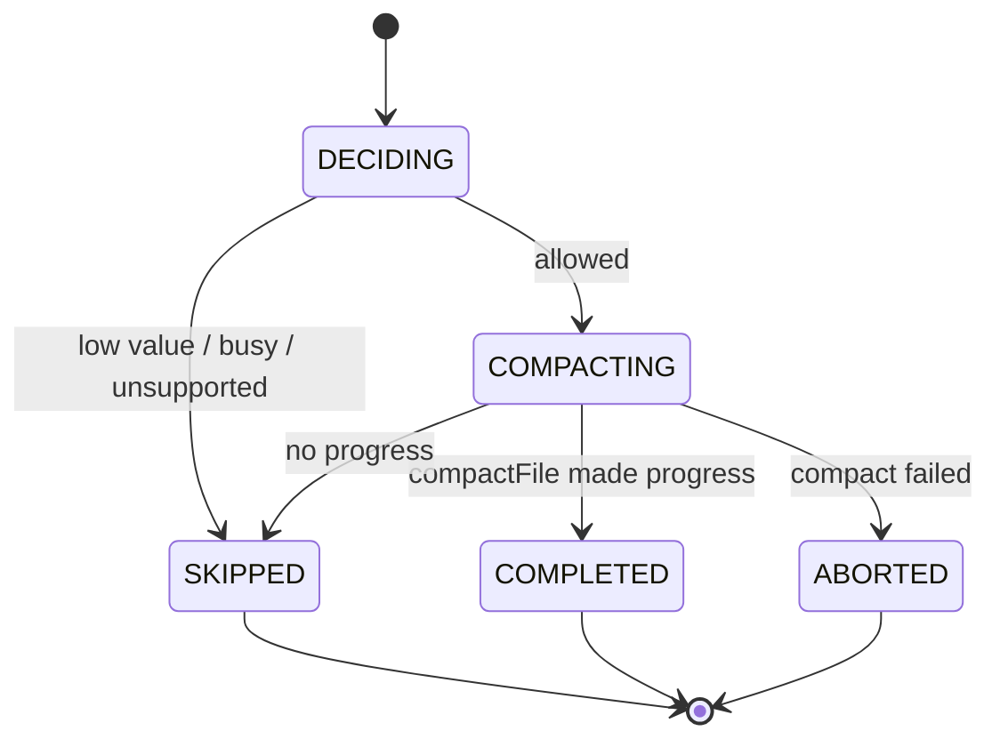
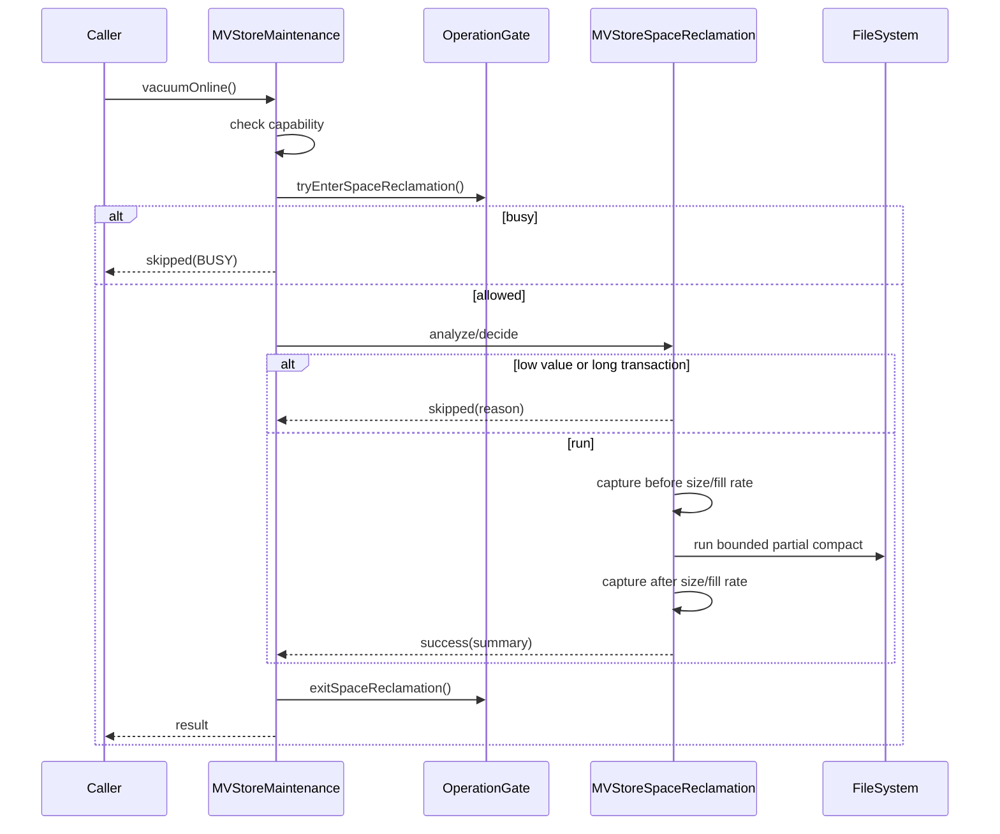

# MVStore Online Space Reclamation S2 Design

This document is the implementable design for S2 online space reclamation optimization. It follows the readiness conclusion in `mvstore-space-reclamation-readiness.md`: without changing the MVStore disk format or adding default SQL behavior, upgrade the current lightweight `vacuumOnline()` compact entrypoint into a diagnosable, recoverable, and testable partial space reclamation flow.

Important correction: the S2 online reclamation main path is partial / chunk-level reclamation, not a full-store shadow copy followed by whole-file replacement. The existing `MVStoreSpaceReclamation` shadow, backup, and manifest capabilities remain useful for offline compact, failure modeling, and a later fallback publish design, but they are not the S2.1-S2.3 online main path.

## Background

MVStore files can contain unused space after heavy insert, delete, and update workloads. Today `MVStoreMaintenance.vacuumOnline()` only delegates to `Store.compactFile(50)`. It can trigger some online compaction, but it lacks the following capabilities:

| Gap | Impact |
| --- | --- |
| Insufficient partial reclamation decision | There is no clear threshold, budget, or skip reason for reclaimable chunks and fill rate. |
| Online partial compact lacks a maintenance boundary | `Store.compactFile(50)` exists, but it is not wrapped as a diagnosable, testable, and governable S2 flow. |
| Shadow/publish can be mistaken for the online main path | Whole-file shadow replacement is closer to offline compact or fallback publish and should not be the first S2 online path. |
| Write and long-transaction gates are not connected to real database flows | The current gate is a minimum model and is not bound to MVStore or session lifecycles. |
| Test layering needs strengthening | JUnit and legacy MVStore dedicated coverage need clear ownership. |

## Goals

| Goal | Acceptance result |
| --- | --- |
| Converged online partial entrypoint | `StorageMaintenance.vacuumOnline()` is the only S2 online partial reclamation entrypoint in the first round. |
| Diagnosable decisions | no-op, busy, stale shadow, unsupported, and success return stable messages. |
| Governed partial compact | Decide whether to run local compact from file size, fill rate, estimated savings, and budgets. |
| No whole-file rewrite | S2.1-S2.3 do not use full-store shadow publish or require a full-store copy. |
| Conservative concurrency | Do not wait for long transactions in the first round, do not add background threads, and skip when safe reclamation is not possible. |
| Traceable tests | Each S2 subphase has JUnit or legacy dedicated tests and is wired into a Gradle task. |

## Non-goals

| Non-goal | Reason |
| --- | --- |
| Automatic background reclamation | Scheduling, throttling, and default thresholds need a separate design in S2.6. |
| New SQL `VACUUM` / `COMPACT` command | Stabilize the Java maintenance API before expanding compatibility surface. |
| Online incremental catch-up | Version scanning and map-change replay are high-risk for the first round. |
| Online full-store shadow copy + publish | The first round only does partial reclamation; whole-file shadow replacement remains offline compact or later fallback work. |
| MVStore disk format changes | The first round must keep old database compatibility. |
| Plugin hot loading or maintenance plugin lifecycle | This remains later pluginization work and is out of S2. |

## Current Flows

| Module | Current state | S2 change |
| --- | --- | --- |
| `StorageMaintenance` | Has `compactClosed()`, `compactOnline()`, and `vacuumOnline()` | Do not add entrypoints; enhance `vacuumOnline()` semantics. |
| `StorageMaintenanceResult` | Has success, skipped, unsupported, and message | Reuse in the first round; add contract tests before introducing failed/busy enums. |
| `Store.compactFile(int)` | Existing local compact capability | S2 first wraps it with decisions, diagnostics, budgets, and tests. |
| `MVStoreSpaceReclamation` | Has closed compact, prepare shadow, switch, cleanup, and recover | Keep as offline/fallback reference, not the online main path. |
| `MVStoreSpaceReclamationOptions` | Supports compress, verify, keepBackup, refreshShadowIfSourceChanged, ioDelay, listener | Do not expand publish strategy into the online main flow in the first round. |
| `MVStoreSpaceReclamationMaintenance` | Minimum read/write/switch decision gate | Keep changes small before binding it to the real MVStore maintenance flow. |
| `TestMVStoreSpaceReclamation` | Covers shadow, manifest, source changes, gates, and fault matrix | Keep it as the S2 dedicated gate; new scenarios must be wired into this task. |

## Core Constraints

| Constraint | Design requirement |
| --- | --- |
| Java 8 | New code must not use APIs newer than Java 8. |
| File safety | Publish failure must not leave an unopened database. |
| Existing behavior compatibility | Default SQL and startup behavior remain unchanged; only explicit maintenance calls trigger S2. |
| Idempotent recovery | `recover()`, `cleanUp()`, repeated prepare, and repeated publish must be safe. |
| Low-risk defaults | Only run bounded partial compact by default; skip when busy or low value. |
| Testability | All new production code needs tests; interface contracts prefer JUnit, file fault scenarios prefer legacy MVStore dedicated tests. |

## Interface Design

### Public Maintenance Boundary

The first round does not add public interfaces. It keeps:

```java
StorageMaintenanceResult vacuumOnline();
```

S2 return contract for `vacuumOnline()`:

| Result | Suggested message | Condition |
| --- | --- | --- |
| `UNSUPPORTED` | `UNSUPPORTED` | Storage engine does not declare `STORAGE_VACUUM_ONLINE`. |
| `skipped` | `VACUUM_ONLINE_SKIPPED_LOW_RECLAIMABLE_SPACE` | File is too small or reclaimable ratio is too low. |
| `skipped` | `VACUUM_ONLINE_SKIPPED_BUSY` | Backup, another reclamation, or long transaction blocks the run. |
| `skipped` | `VACUUM_ONLINE_SKIPPED_NO_PROGRESS` | Partial compact produced no observable benefit. |
| `success` | `VACUUM_ONLINE_FINISHED savedBytes=... savedPercent=...` | Partial compact completed and released space. |

`compactOnline()` continues to mean lightweight MVStore native compact. `vacuumOnline()` in S2 also starts from partial compact, but adds clearer decisions, diagnostics, and gate semantics. Whole-file shadow publish is not wired into either online entrypoint.

### Internal Online Request

Add a package-private request object to describe one online attempt:

| Type | Fields | Purpose |
| --- | --- | --- |
| `MVStoreSpaceReclamationRequest` | `store`, `fileName`, `minimumSavedPercent`, `minimumSavedBytes`, `targetFillRate`, `maxRunMillis`, `gateTimeoutMillis` | Describes one partial reclamation attempt. |
| `MVStoreSpaceReclamationDecision` | `allowed`, `skipMessage`, `sourceSize`, `estimatedReclaimableBytes`, `fillRate`, `chunksFillRate`, `activeTransactions` | Records whether the run should execute and why. |
| `MVStorePartialReclamationResult` | `beforeSize`, `afterSize`, `savedBytes`, `savedPercent`, `madeProgress`, `message` | Records the partial compact result. |

If implementation shows that a separate request type is unnecessary, the fields may be added to `MVStoreSpaceReclamationOptions.Builder` first, but the tests and message contract must remain.

### Options Increment

Recommended S2.1/S2.2 additions:

| Option | Default | Description |
| --- | --- | --- |
| `minimumSavedBytes` | `0` | Skip when estimated saving is lower. |
| `minimumSavedPercent` | `0` | Skip when estimated ratio is lower. |
| `targetFillRate` | `50` | Target fill rate passed to `compactFile(targetFillRate)`. |
| `maxRunMillis` | `0` | The first round may not enforce interruption; reserve the design slot. |
| `gateTimeoutMillis` | `0` | Do not wait for long transactions in the first round; skip immediately. |

## Data Structures

### Partial Reclamation Runtime State

S2.1-S2.3 do not add a persistent manifest. Partial reclamation acts on the existing MVStore file and relies on MVStore's own write, chunk, and recovery semantics. Runtime state only records before/after statistics and the skip reason for the current maintenance attempt.

### Manifest

The manifest belongs to full-store shadow compact / publish fallback, not to the S2 first-round online partial main path. If shadow publish is reintroduced after S2.4, the manifest can be extended in this backward-compatible way:

| Field | Required | Description |
| --- | --- | --- |
| `phase` | Yes | `PREPARING`, `VERIFYING`, `SHADOW_READY`, `SWITCHING`, `COMPLETED`, `ABORTED`. |
| `shadow` | Yes | Shadow file name. |
| `backup` | Yes | Backup file name. |
| `sourceSize` | Yes | Source size at prepare time. |
| `sourceDigest` | Yes | Source digest at prepare time. |
| `publishMode` | No | Written by new versions; missing values mean `VERIFY_SOURCE_UNCHANGED`. |
| `createdAtMillis` | No | Diagnostic only; not part of correctness. |

Manifest reading must be lenient: ignore unknown fields and use defaults for missing new fields.

### Result

`MVStoreSpaceReclamationResult` already has `sourceSize`, `compactedSize`, `savedBytes`, `savedPercent`, and `replaced`; keep it for whole-file shadow or closed compact. The S2 partial path should use `StorageMaintenanceResult.message` and an internal result instead of forcing the `replaced` semantics onto partial compact.

## State Machine



Implementation note: this state machine is the partial online path. `PREPARING`, `SHADOW_READY`, `SWITCHING`, and `RECOVERING` belong to the shadow publish path and should not be mixed into the first online main flow.

## Sequence

### Manual vacuumOnline



### Startup / Next-Maintenance Recovery

The first round does not change database startup. Partial compact does not introduce new shadow, backup, or manifest files, so S2.1-S2.3 do not need a startup recovery path. Existing `recover(fileName)` continues to serve whole-file shadow compact leftovers; automatic recover before MVStore open should only be revisited if shadow publish is reintroduced later.

## Error Handling

| Error | Handling |
| --- | --- |
| File missing | Convert to existing MVStore/DbException behavior and do not create a shadow. |
| Partial compact fails | Rely on existing MVStore exception and recovery semantics, and do not create shadow leftovers. |
| Partial compact makes no progress | Return skipped/no-progress and expose before/after size in the message. |
| Long transaction or maintenance gate busy | Return skipped/busy and do not wait. |
| File size statistics fail | Do not compact; convert to existing MVStore/DbException behavior. |
| Listener throws | Keep existing policy: ignore listener failure and continue the main flow. |

## Idempotency

| Operation | Requirement |
| --- | --- |
| `recover(fileName)` | Repeated calls have the same result; when source exists, only trusted leftovers are cleaned. |
| `cleanUp(fileName)` | Repeated calls are safe and never delete the normal source. |
| Partial compact | Failure must not leave S2-specific intermediate files. |
| `compactToShadow()` | Still belongs to whole-file shadow path; may overwrite old shadow, but must handle old manifest state first. |
| `switchToShadow()` | Still belongs to whole-file shadow path; source changes or missing shadow must never damage the source file. |
| `vacuumOnline()` | Can be retried after busy/skipped; after success, a new call may no-op or decide again. |

## Rollback Strategy

Each S2 phase must be independently revertible:

| Phase | Rollback |
| --- | --- |
| S2.1 decision/statistics | Keep interfaces and disable thresholds, or return to always running the old compact. |
| S2.2 vacuum boundary | Temporarily restore `vacuumOnline()` to the current direct `Store.compactFile(50)` call. |
| S2.3 gate/budget | Disable the new gate/budget decisions and keep basic partial compact. |
| S2.4 shadow fallback review | Do not wire it into the online entrypoint; keep closed-store tooling. |
| S2.5 docs | Documentation rollback has no runtime impact. |

## Compatibility

| Dimension | Decision |
| --- | --- |
| Disk format | Unchanged. |
| File suffixes | Keep `.reclaim.shadow`, `.reclaim.backup`, `.reclaim.manifest`. |
| SQL | No new command and no default behavior change. |
| Plugin API | Do not add public provider types; continue exposing capability through `StorageMaintenance`. |
| Old manifest | Interpret missing new fields with conservative defaults. |
| JDK | Java 8. |

## Rollout

The first round supports only explicit `StorageMaintenance.vacuumOnline()` calls and only runs bounded partial compact. Automatic scheduling, background threads, default thresholds, and configuration entrypoints need a separate S2.6 design. If a configuration is needed later, it should default off and first support diagnostic dry-run.

## Test Plan

| Phase | Test type | Cases |
| --- | --- | --- |
| S2.1 | JUnit | Options defaults, decision messages, low-value skipped, capability boundary. |
| S2.1 | Legacy MVStore | Bloat file statistics aligned with existing `BloatStats`. |
| S2.2 | JUnit | `MVStoreMaintenance.vacuumOnline()` returns success/skipped/unsupported messages. |
| S2.2 | Legacy MVStore | Vacuum entrypoint runs partial compact and records before/after file size. |
| S2.3 | Legacy MVStore | Low reclaimable, busy, and long transaction gate. |
| S2.4 | Legacy MVStore | Review whether shadow fallback is needed; run crash/recover matrix only if it is wired. |
| S2.5 | Docs/build | Chinese and English docs stay synced and dedicated gates pass. |

Minimum command for every phase:

```powershell
.\gradlew.bat runMvStoreSpaceReclamationCheck
```

When plugin maintenance capability or `StorageMaintenance` contracts change, also run:

```powershell
.\gradlew.bat runPluginArchitectureCheck
```

For larger production-code changes, also run the daily gate:

```powershell
.\gradlew.bat clean test check build runH2LegacySmoke
```

## Risks

| Risk | Level | Mitigation |
| --- | --- | --- |
| Partial compact interaction with active transactions is unclear | High | Do not wait in the first round; add busy/skipped tests first. |
| `compactFile` makes no visible progress | Medium | Record before/after statistics and no-progress messages. |
| Whole-file shadow publish accidentally becomes the online main path | High | Docs and tests state S2.1-S2.3 are partial only. |
| Windows file replacement differs from POSIX rename | Medium | Only affects later shadow fallback, not the partial main path. |
| Long transactions block reclamation | Medium | Do not wait in the first round; return skipped/busy. |
| Cleanup deletes the wrong file | Medium | `cleanUp()` only deletes fixed suffix files and never deletes source. |
| Messages become compatibility surface | Medium | Use stable prefixes and append statistics after them. |

## Phased Implementation Plan

| Phase | Task | Code deliverable | Test deliverable | Commit |
| --- | --- | --- | --- | --- |
| S2.1 | Decision and statistics | Add partial decision/options and dry-run style skipped/success decisions | JUnit + legacy stats case | Separate commit |
| S2.2 | Wire vacuumOnline | `MVStoreMaintenance.vacuumOnline()` calls the partial reclamation decision flow | Maintenance entry JUnit + MVStore dedicated tests | Separate commit |
| S2.3 | Partial gate/budget | Wire operation gate, targetFillRate, and no-progress diagnostics | Busy, long transaction, low value | Separate commit |
| S2.4 | Shadow publish fallback review | Review whether whole-file shadow publish should be enhanced as offline/fallback capability, not the default online main path | Fault matrix and recover idempotency | Separate commit |
| S2.5 | Docs and acceptance | Chinese/English usage notes, limits, diagnostic messages | Dedicated gate + plugin gate + daily gate | Separate commit |
| S2.6 | Automatic scheduling design | Design only by default | Separate test plan | Separate review |

## Decisions Needed

| Question | Suggested decision |
| --- | --- |
| Should the first round do whole-file crash-safe publish? | No as the online main path. Keep it as offline/fallback capability and review in S2.4. |
| Should source changes use catch-up? | The partial main path does not use shadow catch-up; review separately if whole-file shadow returns later. |
| Should long transactions wait? | No in the first round; return skipped/busy. Design timeout wait later. |
| Should backup be kept? | The partial main path does not create backup; discuss `keepBackup` only if shadow fallback is enabled. |
| Should startup automatic recover be wired? | Not needed for the partial main path; decide only if shadow fallback is wired. |
| Should a SQL command be added? | No. Revisit after the Java maintenance API is stable. |

## Design Conclusion

The first S2 round uses conservative partial online reclamation: explicit trigger, decide first, run bounded partial compact, record before/after statistics, and skip when low-value or busy. It does not do whole-file shadow publish, automatic scheduling, online catch-up, or disk format changes. Implementation can start with S2.1, with tests and a local commit after each phase.
