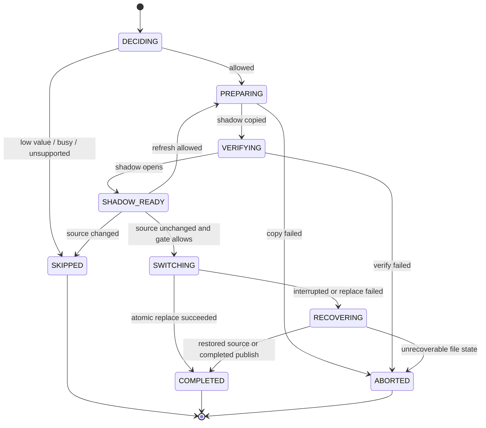
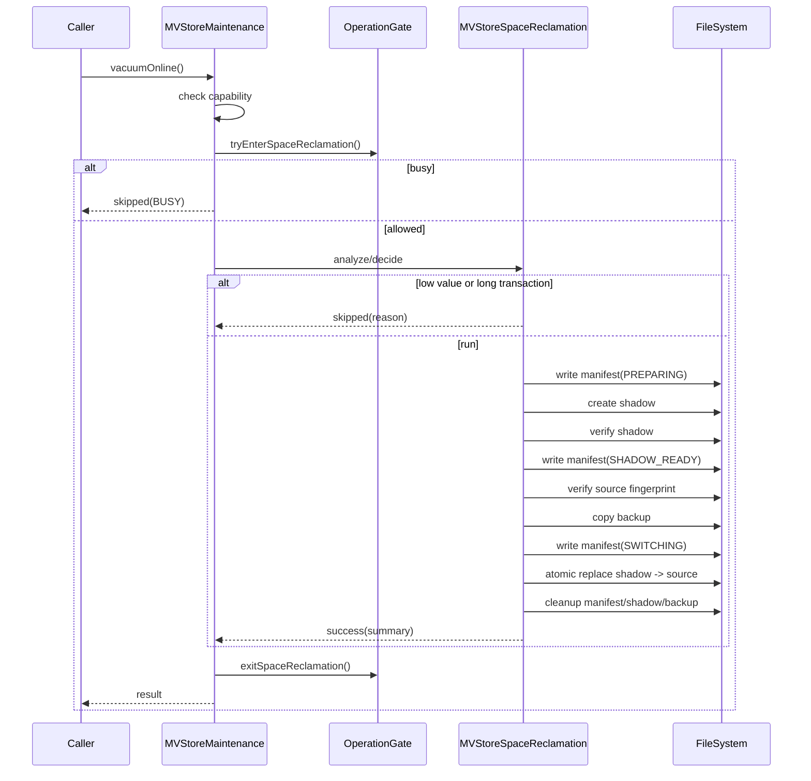

# MVStore 空间在线回收 S2 设计

本文档是 S2 空间在线回收优化的可落地设计。它承接 `mvstore-space-reclamation-readiness.md` 的启动结论，目标是在不改变 MVStore 磁盘格式、不新增默认 SQL 行为的前提下，把当前 `vacuumOnline()` 的轻量 compact 入口升级为可诊断、可恢复、可测试的在线空间回收流程。

## 背景

MVStore 文件在大量插入、删除、更新后会出现空间空洞。当前 `MVStoreMaintenance.vacuumOnline()` 仅委托 `Store.compactFile(50)`，它能触发一定程度的在线 compact，但缺少以下能力：

| 缺口 | 影响 |
| --- | --- |
| 回收前决策不足 | 无法明确本次是否值得回收、跳过原因是什么。 |
| shadow/publish 流程未接入在线入口 | 已有 `MVStoreSpaceReclamation` 工具不能被 `StorageMaintenance.vacuumOnline()` 使用。 |
| crash-safe publish 策略未正式拍板 | shadow、backup、manifest 的恢复语义还停留在脚手架层。 |
| 写入与长事务 gate 未接到真实数据库流程 | 当前 gate 是最小模型，还没有和 MVStore / session 生命周期绑定。 |
| 测试分层需要加强 | 需要明确哪些用 JUnit，哪些继续放在 legacy MVStore 专项门禁。 |

## 目标

| 目标 | 可验收结果 |
| --- | --- |
| 在线回收入口收敛 | `StorageMaintenance.vacuumOnline()` 成为 S2 第一轮唯一在线回收入口。 |
| 可诊断决策 | 对 no-op、busy、stale shadow、unsupported、success 都返回稳定 message。 |
| shadow prepare 可复用 | 复用并扩展 `MVStoreSpaceReclamation.compactToShadow()` 语义。 |
| crash-safe publish | publish 期间任何中断都能保留可打开源库，或通过 `recover()` 恢复。 |
| 保守处理在线写入 | 第一轮不做 version-scan catch-up；source 变化时拒绝 publish 或重新 prepare。 |
| 测试可追踪 | 每个 S2 子阶段都有 JUnit 或 legacy 专项测试，并纳入 Gradle task。 |

## 非目标

| 非目标 | 原因 |
| --- | --- |
| 自动后台空间回收 | 需要调度、限速和默认阈值设计，放到 S2.6 后续评审。 |
| SQL `VACUUM` / `COMPACT` 新命令 | 先稳定 Java maintenance API，避免扩大兼容面。 |
| 在线增量 catch-up | 需要版本扫描和 map 变更重放设计，第一轮风险高。 |
| 改变 MVStore 磁盘格式 | 第一轮必须保持旧库兼容。 |
| 插件热加载或维护插件生命周期 | 已规划到插件化后续阶段，不进入 S2。 |

## 现状/已有流程

| 模块 | 现状 | S2 改造点 |
| --- | --- | --- |
| `StorageMaintenance` | 已有 `compactClosed()`、`compactOnline()`、`vacuumOnline()` | 不新增入口，增强 `vacuumOnline()` 语义。 |
| `StorageMaintenanceResult` | 只有 success、skipped、unsupported 和 message | 第一轮可继续复用；如需 failed/busy 枚举，先补契约测试。 |
| `MVStoreSpaceReclamation` | 已有 closed compact、prepare shadow、switch、cleanup、recover | 拆出在线可用的 prepare/publish 决策和恢复约束。 |
| `MVStoreSpaceReclamationOptions` | 支持 compress、verify、keepBackup、refreshShadowIfSourceChanged、ioDelay、listener | S2 增加在线阈值、publish 策略和 gate 超时前先设计测试。 |
| `MVStoreSpaceReclamationMaintenance` | 有 read/write/switch decision 的最小 gate | 绑定真实 MVStore 维护流程前保持小步推进。 |
| `TestMVStoreSpaceReclamation` | 覆盖 shadow、manifest、source change、gate、fault matrix | 继续作为 S2 专项门禁，新增场景必须挂到此任务。 |

## 核心约束

| 约束 | 设计要求 |
| --- | --- |
| Java 8 | 新代码不能使用 Java 8 之后 API。 |
| 文件安全 | publish 失败不能留下不可打开数据库。 |
| 旧行为兼容 | 默认 SQL 和启动行为不变，手动 maintenance 调用才触发 S2。 |
| 幂等恢复 | `recover()`、`cleanUp()`、重复 prepare、重复 publish 都要安全。 |
| 低风险默认 | 默认不做 catch-up；source 变化即跳过或重新 prepare。 |
| 可测试 | 所有新增生产代码都必须有测试；接口契约优先 JUnit，文件故障优先 legacy MVStore 专项。 |

## 接口设计

### Public Maintenance Boundary

第一轮不新增公开接口，保留：

```java
StorageMaintenanceResult vacuumOnline();
```

S2 后 `vacuumOnline()` 的返回约定：

| 结果 | message 建议 | 触发条件 |
| --- | --- | --- |
| `UNSUPPORTED` | `UNSUPPORTED` | storage engine 不声明 `STORAGE_VACUUM_ONLINE`。 |
| `skipped` | `VACUUM_ONLINE_SKIPPED_LOW_RECLAIMABLE_SPACE` | 文件太小或可回收比例低。 |
| `skipped` | `VACUUM_ONLINE_SKIPPED_BUSY` | backup、已有回收或长事务阻塞。 |
| `skipped` | `VACUUM_ONLINE_SKIPPED_SOURCE_CHANGED` | prepare 后 source fingerprint 变化且不允许 refresh。 |
| `success` | `VACUUM_ONLINE_FINISHED savedBytes=... savedPercent=...` | shadow publish 成功。 |

`compactOnline()` 继续表示 MVStore 原生轻量 compact，不升级为 shadow publish，避免两个入口语义重叠。

### Internal Online Request

建议新增包内对象承载一次在线回收请求，不作为公开 API：

| 类型 | 字段 | 用途 |
| --- | --- | --- |
| `MVStoreSpaceReclamationRequest` | `fileName`、`options`、`minimumSavedPercent`、`minimumSavedBytes`、`publishMode`、`gateTimeoutMillis` | 描述一次在线回收尝试。 |
| `MVStoreSpaceReclamationDecision` | `allowed`、`skipMessage`、`sourceSize`、`estimatedReclaimableBytes`、`fillRate`、`activeTransactions` | 记录是否执行和原因。 |
| `MVStoreSpaceReclamationPublishMode` | `VERIFY_SOURCE_UNCHANGED`、`REFRESH_SHADOW_IF_SOURCE_CHANGED` | 第一轮只支持这两个模式。 |

如果实现时发现不需要独立 request 类，可以先把字段放入 `MVStoreSpaceReclamationOptions.Builder`，但要保留测试覆盖和 message 约定。

### Options 增量

建议 S2.1/S2.2 分两步增加：

| 选项 | 默认值 | 说明 |
| --- | --- | --- |
| `minimumSavedBytes` | `0` | 小于该值时跳过。 |
| `minimumSavedPercent` | `0` | 小于该比例时跳过。 |
| `gateTimeoutMillis` | `0` | 第一轮不等待长事务，发现阻塞即 skipped。 |
| `publishMode` | `VERIFY_SOURCE_UNCHANGED` | source 变化时保守跳过。 |
| `keepBackup` | 沿用现有默认 `false` | crash-safe publish 第一轮建议在内部 publish 窗口保留 backup，成功后按配置删除。 |

## 数据结构

### Manifest

现有 manifest 已记录 phase、shadow、backup 和 source fingerprint。S2 建议补充但保持向后兼容：

| 字段 | 必填 | 说明 |
| --- | --- | --- |
| `phase` | 是 | `PREPARING`、`VERIFYING`、`SHADOW_READY`、`SWITCHING`、`COMPLETED`、`ABORTED`。 |
| `shadow` | 是 | shadow 文件名。 |
| `backup` | 是 | backup 文件名。 |
| `sourceSize` | 是 | prepare 时源文件大小。 |
| `sourceDigest` | 是 | prepare 时源文件 digest。 |
| `publishMode` | 否 | 新版本写入，旧 manifest 缺失时按 `VERIFY_SOURCE_UNCHANGED` 解释。 |
| `createdAtMillis` | 否 | 仅诊断，不参与正确性判断。 |

Manifest 读取必须宽松：未知字段忽略，缺少新字段时用默认值解释。

### Result

`MVStoreSpaceReclamationResult` 当前已有 `sourceSize`、`compactedSize`、`savedBytes`、`savedPercent`、`replaced`。S2 第一轮尽量不破坏该对象。若要记录 skipped decision，优先在 `StorageMaintenanceResult.message` 中表达；后续再评估是否引入独立 analysis/result。

## 状态机



实现注意：`RECOVERING` 可先作为内部恢复路径，不一定第一轮加入 `MVStoreSpaceReclamationPhase`。如果要公开到 listener，必须补测试。

## 时序流程

### 手动 vacuumOnline



### 启动/下次维护恢复

第一轮不强制修改数据库启动流程。优先在 `vacuumOnline()` 进入时调用 `recover(fileName)`，确保上次维护残留不会影响新一轮维护。是否接入 MVStore open 前自动 recover，放到 S2.4 评审点；如果接入，必须证明不会误删用户文件。

## 异常处理

| 异常 | 处理 |
| --- | --- |
| 文件不存在 | 转换为现有 MVStore/DbException，不创建 shadow。 |
| prepare copy 失败 | 删除不完整 shadow，manifest 进入或保持可清理状态。 |
| verify 失败 | 删除 shadow，源文件不变，返回异常或 skipped 由入口决定。 |
| source fingerprint 变化 | 默认 skipped，不 publish。 |
| backup copy 失败 | 不 publish，源文件不变。 |
| atomic replace 失败 | 尝试 restore backup；restore 失败时保留 manifest 供 recover。 |
| cleanup 失败 | 不影响已成功 publish，但 message/listener 要能看见残留。 |
| listener 抛异常 | 已有策略为忽略 listener 异常，继续保留。 |

## 幂等性

| 操作 | 幂等要求 |
| --- | --- |
| `recover(fileName)` | 多次调用结果一致；有 source 时只清理可信残留。 |
| `cleanUp(fileName)` | 多次调用安全；不能删除正常 source。 |
| `compactToShadow()` | 允许覆盖旧 shadow，但必须先处理旧 manifest 状态。 |
| `switchToShadow()` | source 变化或 shadow 缺失时不能破坏源文件。 |
| `vacuumOnline()` | busy 或 skipped 后可再次调用；成功后再次调用可 no-op 或再次决策。 |

## 回滚策略

S2 每个阶段都必须能单独回滚：

| 阶段 | 回滚方式 |
| --- | --- |
| S2.1 决策统计 | 保留接口，禁用阈值判断或回到总是运行旧 compact。 |
| S2.2 vacuum 边界 | 将 `vacuumOnline()` 临时恢复为 `Store.compactFile(50)`。 |
| S2.3 prepare/gate | 保留 closed-store 工具，禁用在线 shadow publish。 |
| S2.4 publish/recover | 禁用 publish，仅允许 prepare/analyze/cleanup。 |
| S2.5 docs | 文档回滚不影响运行时。 |

## 兼容性

| 维度 | 决策 |
| --- | --- |
| 磁盘格式 | 不变。 |
| 文件后缀 | 继续使用 `.reclaim.shadow`、`.reclaim.backup`、`.reclaim.manifest`。 |
| SQL | 不新增命令，不改变默认行为。 |
| 插件 API | 不新增公开 provider 类型，继续通过 `StorageMaintenance` 暴露能力。 |
| 旧 manifest | 缺少新字段时按保守默认解释。 |
| JDK | Java 8。 |

## 灰度/迁移

第一轮只支持显式调用 `StorageMaintenance.vacuumOnline()`。自动调度、后台线程、阈值默认值和配置入口要在 S2.6 单独设计。若后续需要配置项，建议默认关闭，并先支持仅诊断 dry-run。

## 测试方案

| 阶段 | 测试类型 | 用例 |
| --- | --- | --- |
| S2.1 | JUnit | options 默认值、decision message、low-value skipped、capability 边界。 |
| S2.1 | Legacy MVStore | bloat file 统计与现有 `BloatStats` 对齐。 |
| S2.2 | JUnit | `MVStoreMaintenance.vacuumOnline()` 返回 success/skipped/unsupported message。 |
| S2.2 | Legacy MVStore | vacuum 入口能生成/清理 shadow 残留。 |
| S2.3 | Legacy MVStore | source changed 默认 skipped；refresh 模式重新 prepare。 |
| S2.3 | Legacy MVStore | long transaction 和 backup interaction gate。 |
| S2.4 | Legacy MVStore | crash before switch、during switch、cleanup failure、recover idempotency。 |
| S2.5 | Docs/build | 中英文文档同步，专项门禁通过。 |

每阶段最少运行：

```powershell
.\gradlew.bat runMvStoreSpaceReclamationCheck
```

涉及插件维护能力或 `StorageMaintenance` 契约时加跑：

```powershell
.\gradlew.bat runPluginArchitectureCheck
```

生产代码改动较大时加跑 daily gate：

```powershell
.\gradlew.bat clean test check build runH2LegacySmoke
```

## 风险点

| 风险 | 等级 | 缓解 |
| --- | --- | --- |
| publish 期间断电或进程退出 | 高 | manifest + backup + recover 测试矩阵先行。 |
| 在线写入造成 shadow 过期 | 高 | 第一轮 source 变化默认 skipped。 |
| Windows 文件替换行为不一致 | 高 | 保留 move/restore 失败测试，不能假设 POSIX rename 语义。 |
| 长事务长期阻塞 | 中 | 第一轮不等待，返回 skipped/busy。 |
| cleanup 残留误删 | 中 | cleanUp 只能删除固定后缀文件，且不能删除 source。 |
| message 变成兼容面 | 中 | 采用稳定前缀，详细统计追加在后面。 |

## 分阶段实施计划

| 阶段 | 任务 | 代码交付 | 测试交付 | 提交要求 |
| --- | --- | --- | --- | --- |
| S2.1 | 决策与统计 | 增加 decision/options，支持 dry-run 式 skipped/success 判定 | JUnit + legacy 统计用例 | 单独提交 |
| S2.2 | vacuumOnline 接入 | `MVStoreMaintenance.vacuumOnline()` 调用 S2 决策流程 | 维护入口 JUnit + MVStore 专项 | 单独提交 |
| S2.3 | shadow prepare/gate | 接入 operation gate、source fingerprint 和 stale shadow 策略 | source changed、busy、long transaction | 单独提交 |
| S2.4 | crash-safe publish | 完整 backup/manifest/recover/publish 流程 | fault matrix、recover idempotency | 单独提交 |
| S2.5 | 文档与验收 | 中英文使用说明、限制、诊断 message 表 | 专项门禁 + plugin gate + daily gate | 单独提交 |
| S2.6 | 自动调度设计 | 仅设计，不默认实现 | 另行测试计划 | 单独评审 |

## 需要拍板的问题

| 问题 | 建议拍板 |
| --- | --- |
| 第一轮是否支持 crash-safe publish | 支持。实现必须先通过 fault matrix，再接入 `vacuumOnline()`。 |
| source 变化时是否 catch-up | 不 catch-up。默认 skipped；可选 refresh 重新 prepare。 |
| 长事务是否等待 | 第一轮不等待，返回 skipped/busy。后续再设计 timeout wait。 |
| publish 成功后是否保留 backup | 默认不保留，但 publish 窗口内必须先创建 backup；调试可通过 `keepBackup` 保留。 |
| 是否接入启动自动 recover | S2.4 再拍板。默认先在维护入口进入时 recover。 |
| 是否新增 SQL 命令 | 不新增。等 Java maintenance API 稳定后再评审。 |

## 当前设计结论

S2 第一轮采用保守在线回收：显式调用、先决策、prepare shadow、验证 source 未变化、创建 backup、crash-safe publish、清理残留。它不做自动调度、不做在线 catch-up、不改变磁盘格式。下一步可以从 S2.1 开始实现，每阶段同步测试并本地提交。
