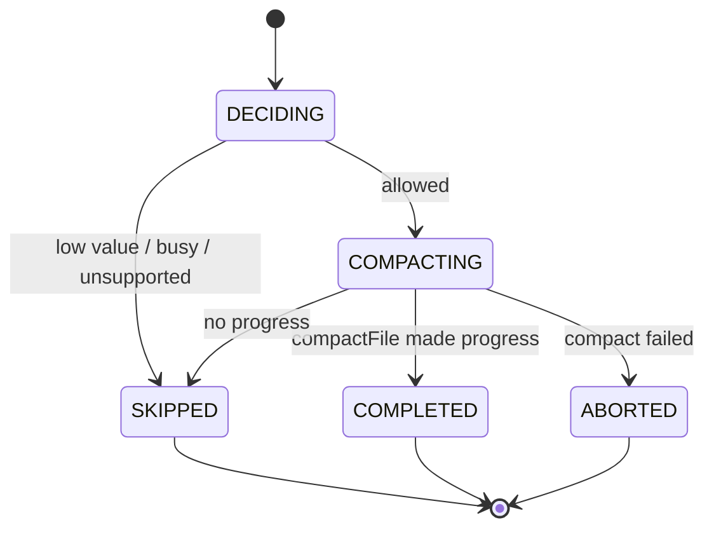
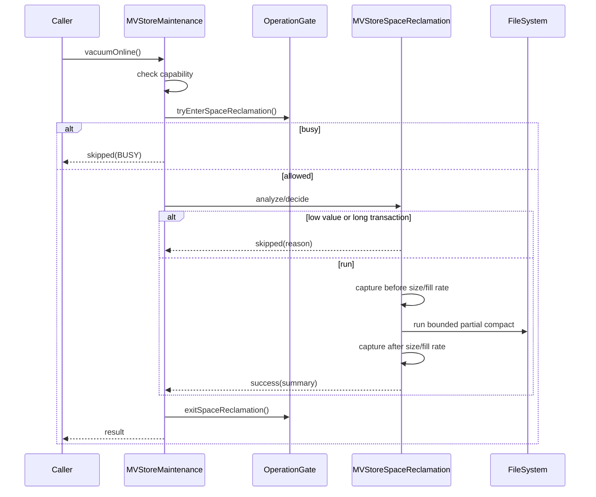

# MVStore 空间在线回收 S2 设计

本文档是 S2 空间在线回收优化的可落地设计。它承接 `mvstore-space-reclamation-readiness.md` 的启动结论，目标是在不改变 MVStore 磁盘格式、不新增默认 SQL 行为的前提下，把当前 `vacuumOnline()` 的轻量 compact 入口升级为可诊断、可恢复、可测试的部分空间回收流程。

重要修正：S2 在线回收主线是 partial / chunk-level reclamation，不是整库 shadow copy 后整体替换。已有 `MVStoreSpaceReclamation` 的 shadow、backup、manifest 能力继续作为离线 compact、故障模型和后续兜底 publish 方案的参考，不作为 S2.1-S2.3 的在线主路径。

如果推进目标是长期终极方案，应以 `mvstore-space-reclamation-long-term-design.md` 为主设计；本文档中的 S2.1-S2.3 只是终局方案的前置切片，不能替代 chunk/page relocation、evacuation journal 和 relocation map 的长期架构。

## 背景

MVStore 文件在大量插入、删除、更新后会出现空间空洞。当前 `MVStoreMaintenance.vacuumOnline()` 仅委托 `Store.compactFile(50)`，它能触发一定程度的在线 compact，但缺少以下能力：

| 缺口 | 影响 |
| --- | --- |
| 回收前决策不足 | 无法明确本次是否值得回收、跳过原因是什么。 |
| 部分回收决策不足 | 当前没有明确的可回收 chunk/填充率阈值、预算和跳过原因。 |
| 在线 partial compact 缺少维护边界 | `Store.compactFile(50)` 已存在，但没有被包装成可诊断、可测试、可治理的 S2 流程。 |
| shadow/publish 流程容易被误用为在线主路径 | 整体 shadow 替换更接近离线 compact 或兜底 publish，不适合作为 S2 在线优化第一主线。 |
| 写入与长事务 gate 未接到真实数据库流程 | 当前 gate 是最小模型，还没有和 MVStore / session 生命周期绑定。 |
| 测试分层需要加强 | 需要明确哪些用 JUnit，哪些继续放在 legacy MVStore 专项门禁。 |

## 目标

| 目标 | 可验收结果 |
| --- | --- |
| 在线部分回收入口收敛 | `StorageMaintenance.vacuumOnline()` 成为 S2 第一轮唯一在线部分回收入口。 |
| 可诊断决策 | 对 no-op、busy、stale shadow、unsupported、success 都返回稳定 message。 |
| partial compact 可治理 | 基于 file size、fill rate、预计可回收空间和预算决定是否执行局部 compact。 |
| 不整体改写文件 | S2.1-S2.3 不走整库 shadow publish，不要求整库 copy。 |
| 保守处理并发 | 第一轮不主动等待长事务，不引入后台线程，无法安全回收时跳过。 |
| 测试可追踪 | 每个 S2 子阶段都有 JUnit 或 legacy 专项测试，并纳入 Gradle task。 |

## 非目标

| 非目标 | 原因 |
| --- | --- |
| 自动后台空间回收 | 需要调度、限速和默认阈值设计，放到 S2.6 后续评审。 |
| SQL `VACUUM` / `COMPACT` 新命令 | 先稳定 Java maintenance API，避免扩大兼容面。 |
| 在线增量 catch-up | 需要版本扫描和 map 变更重放设计，第一轮风险高。 |
| 在线整库 shadow copy + publish | 第一轮只做部分回收；整体 shadow 替换保留为离线 compact 或后续兜底方案。 |
| 改变 MVStore 磁盘格式 | 第一轮必须保持旧库兼容。 |
| 插件热加载或维护插件生命周期 | 已规划到插件化后续阶段，不进入 S2。 |

## 现状/已有流程

| 模块 | 现状 | S2 改造点 |
| --- | --- | --- |
| `StorageMaintenance` | 已有 `compactClosed()`、`compactOnline()`、`vacuumOnline()` | 不新增入口，增强 `vacuumOnline()` 语义。 |
| `StorageMaintenanceResult` | 只有 success、skipped、unsupported 和 message | 第一轮可继续复用；如需 failed/busy 枚举，先补契约测试。 |
| `Store.compactFile(int)` | 已有局部 compact 能力 | S2 第一轮围绕它补决策、诊断、预算和测试。 |
| `MVStoreSpaceReclamation` | 已有 closed compact、prepare shadow、switch、cleanup、recover | 作为离线/兜底能力参考，不作为在线主路径。 |
| `MVStoreSpaceReclamationOptions` | 支持 compress、verify、keepBackup、refreshShadowIfSourceChanged、ioDelay、listener | S2 第一轮不要把 publish 策略扩到在线主流程。 |
| `MVStoreSpaceReclamationMaintenance` | 有 read/write/switch decision 的最小 gate | 绑定真实 MVStore 维护流程前保持小步推进。 |
| `TestMVStoreSpaceReclamation` | 覆盖 shadow、manifest、source change、gate、fault matrix | 继续作为 S2 专项门禁，新增场景必须挂到此任务。 |

## 核心约束

| 约束 | 设计要求 |
| --- | --- |
| Java 8 | 新代码不能使用 Java 8 之后 API。 |
| 文件安全 | publish 失败不能留下不可打开数据库。 |
| 旧行为兼容 | 默认 SQL 和启动行为不变，手动 maintenance 调用才触发 S2。 |
| 幂等恢复 | `recover()`、`cleanUp()`、重复 prepare、重复 publish 都要安全。 |
| 低风险默认 | 默认只做 bounded partial compact；遇到 busy 或收益不足即跳过。 |
| 可测试 | 所有新增生产代码都必须有测试；接口契约优先 JUnit，文件故障优先 legacy MVStore 专项。 |

## 接口设计

### Public Maintenance Boundary

第一轮不新增公开接口，保留：

```java
StorageMaintenanceResult vacuumOnline();
```

S2 后 `vacuumOnline()` 的返回约定：

| 结果 | message 建议 | 触发条件 |
| --- | --- | --- |
| `UNSUPPORTED` | `UNSUPPORTED` | storage engine 不声明 `STORAGE_VACUUM_ONLINE`。 |
| `skipped` | `VACUUM_ONLINE_SKIPPED_LOW_RECLAIMABLE_SPACE` | 文件太小或可回收比例低。 |
| `skipped` | `VACUUM_ONLINE_SKIPPED_BUSY` | backup、已有回收或长事务阻塞。 |
| `skipped` | `VACUUM_ONLINE_SKIPPED_NO_PROGRESS` | partial compact 未产生可观测收益。 |
| `success` | `VACUUM_ONLINE_FINISHED savedBytes=... savedPercent=...` | partial compact 完成并释放空间。 |

`compactOnline()` 继续表示 MVStore 原生轻量 compact。`vacuumOnline()` 在 S2 中也先走 partial compact，但它会增加更明确的决策、诊断和门禁语义；整库 shadow publish 不并入这两个在线入口。

### Internal Online Request

建议新增包内对象承载一次在线回收请求，不作为公开 API：

| 类型 | 字段 | 用途 |
| --- | --- | --- |
| `MVStoreSpaceReclamationRequest` | `store`、`fileName`、`minimumSavedPercent`、`minimumSavedBytes`、`targetFillRate`、`maxRunMillis`、`gateTimeoutMillis` | 描述一次部分回收尝试。 |
| `MVStoreSpaceReclamationDecision` | `allowed`、`skipMessage`、`sourceSize`、`estimatedReclaimableBytes`、`fillRate`、`chunksFillRate`、`activeTransactions` | 记录是否执行和原因。 |
| `MVStorePartialReclamationResult` | `beforeSize`、`afterSize`、`savedBytes`、`savedPercent`、`madeProgress`、`message` | 记录 partial compact 的结果。 |

如果实现时发现不需要独立 request 类，可以先把字段放入 `MVStoreSpaceReclamationOptions.Builder`，但要保留测试覆盖和 message 约定。

### Options 增量

建议 S2.1/S2.2 分两步增加：

| 选项 | 默认值 | 说明 |
| --- | --- | --- |
| `minimumSavedBytes` | `0` | 小于该值时跳过或记录 no-progress。 |
| `minimumSavedPercent` | `0` | 小于该比例时跳过或记录 no-progress。 |
| `targetFillRate` | `50` | 传递给 `compactFile(targetFillRate)` 的目标填充率。 |
| `maxRunMillis` | `0` | 第一轮可不实现强制中断；先保留设计位。 |
| `gateTimeoutMillis` | `0` | 第一轮不等待长事务，发现阻塞即 skipped。 |

## 数据结构

### Partial Reclamation Runtime State

S2.1-S2.3 不新增持久化 manifest。部分回收直接作用于现有 MVStore 文件，依赖 MVStore 自身的写入、chunk 和恢复机制。运行时只记录本次维护的 before/after 统计和 skip reason。

### Manifest

Manifest 只属于整库 shadow compact / publish 兜底能力，不属于 S2 第一轮在线部分回收主路径。若 S2.4 之后重新引入 shadow publish，manifest 可按以下兼容方式扩展：

| 字段 | 必填 | 说明 |
| --- | --- | --- |
| `phase` | 是 | `PREPARING`、`VERIFYING`、`SHADOW_READY`、`SWITCHING`、`COMPLETED`、`ABORTED`。 |
| `shadow` | 是 | shadow 文件名。 |
| `backup` | 是 | backup 文件名。 |
| `sourceSize` | 是 | prepare 时源文件大小。 |
| `sourceDigest` | 是 | prepare 时源文件 digest。 |
| `publishMode` | 否 | 新版本写入，旧 manifest 缺失时按 `VERIFY_SOURCE_UNCHANGED` 解释。 |
| `createdAtMillis` | 否 | 仅诊断，不参与正确性判断。 |

Manifest 读取必须宽松：未知字段忽略，缺少新字段时用默认值解释。

### Result

`MVStoreSpaceReclamationResult` 当前已有 `sourceSize`、`compactedSize`、`savedBytes`、`savedPercent`、`replaced`，继续用于整库 shadow/closed compact。S2 partial path 优先通过 `StorageMaintenanceResult.message` 和内部 result 表达，不强行复用 `replaced` 语义。

## 状态机



实现注意：这个状态机是 partial online path。`PREPARING`、`SHADOW_READY`、`SWITCHING`、`RECOVERING` 属于 shadow publish path，第一轮不要混入在线主流程。

## 时序流程

### 手动 vacuumOnline



### 启动/下次维护恢复

第一轮不修改数据库启动流程。partial compact 不引入新的 shadow/backup/manifest，因此不需要为 S2.1-S2.3 增加启动恢复路径。已有 `recover(fileName)` 继续服务于整库 shadow compact 残留；是否接入 MVStore open 前自动 recover，只有在后续重新引入 shadow publish 时才需要评审。

## 异常处理

| 异常 | 处理 |
| --- | --- |
| 文件不存在 | 转换为现有 MVStore/DbException，不创建 shadow。 |
| partial compact 失败 | 依赖 MVStore 原有异常和恢复语义，入口返回异常或 failed message，不引入 shadow 残留。 |
| partial compact 无进展 | 返回 skipped/no-progress，message 暴露 before/after size。 |
| 长事务或维护 gate busy | 返回 skipped/busy，不等待。 |
| 文件大小统计失败 | 不执行 compact，转换为现有 MVStore/DbException。 |
| listener 抛异常 | 已有策略为忽略 listener 异常，继续保留。 |

## 幂等性

| 操作 | 幂等要求 |
| --- | --- |
| `recover(fileName)` | 多次调用结果一致；有 source 时只清理可信残留。 |
| `cleanUp(fileName)` | 多次调用安全；不能删除正常 source。 |
| partial compact | 失败不能留下 S2 自定义中间文件。 |
| `compactToShadow()` | 继续用于整库 shadow path；允许覆盖旧 shadow，但必须先处理旧 manifest 状态。 |
| `switchToShadow()` | 继续用于整库 shadow path；source 变化或 shadow 缺失时不能破坏源文件。 |
| `vacuumOnline()` | busy 或 skipped 后可再次调用；成功后再次调用可 no-op 或再次决策。 |

## 回滚策略

S2 每个阶段都必须能单独回滚：

| 阶段 | 回滚方式 |
| --- | --- |
| S2.1 决策统计 | 保留接口，禁用阈值判断或回到总是运行旧 compact。 |
| S2.2 vacuum 边界 | 将 `vacuumOnline()` 临时恢复为当前直接调用 `Store.compactFile(50)`。 |
| S2.3 gate/预算 | 禁用新增 gate/预算判断，保留基础 partial compact。 |
| S2.4 shadow 兜底评审 | 不接入在线入口，保留 closed-store 工具。 |
| S2.5 docs | 文档回滚不影响运行时。 |

## 兼容性

| 维度 | 决策 |
| --- | --- |
| 磁盘格式 | 不变。 |
| 文件后缀 | 继续使用 `.reclaim.shadow`、`.reclaim.backup`、`.reclaim.manifest`。 |
| SQL | 不新增命令，不改变默认行为。 |
| 插件 API | 不新增公开 provider 类型，继续通过 `StorageMaintenance` 暴露能力。 |
| 旧 manifest | 缺少新字段时按保守默认解释。 |
| JDK | Java 8。 |

## 灰度/迁移

第一轮只支持显式调用 `StorageMaintenance.vacuumOnline()`，且只执行 bounded partial compact。自动调度、后台线程、阈值默认值和配置入口要在 S2.6 单独设计。若后续需要配置项，建议默认关闭，并先支持仅诊断 dry-run。

## 测试方案

| 阶段 | 测试类型 | 用例 |
| --- | --- | --- |
| S2.1 | JUnit | options 默认值、decision message、low-value skipped、capability 边界。 |
| S2.1 | Legacy MVStore | bloat file 统计与现有 `BloatStats` 对齐。 |
| S2.2 | JUnit | `MVStoreMaintenance.vacuumOnline()` 返回 success/skipped/unsupported message。 |
| S2.2 | Legacy MVStore | vacuum 入口执行 partial compact，并记录 before/after 文件大小。 |
| S2.3 | Legacy MVStore | low reclaimable、busy、long transaction gate。 |
| S2.4 | Legacy MVStore | 评审是否需要 shadow 兜底；若接入再跑 crash/recover matrix。 |
| S2.5 | Docs/build | 中英文文档同步，专项门禁通过。 |

每阶段最少运行：

```powershell
.\gradlew.bat runMvStoreSpaceReclamationCheck
```

涉及插件维护能力或 `StorageMaintenance` 契约时加跑：

```powershell
.\gradlew.bat runPluginArchitectureCheck
```

生产代码改动较大时加跑 daily gate：

```powershell
.\gradlew.bat clean test check build runH2LegacySmoke
```

## 风险点

| 风险 | 等级 | 缓解 |
| --- | --- | --- |
| partial compact 与活跃事务交互不清 | 高 | 第一轮不等待长事务；先补 busy/skipped 测试。 |
| compactFile 无明显收益 | 中 | before/after 统计和 no-progress message。 |
| 将整库 shadow publish 误接入在线主路径 | 高 | 文档和测试明确 S2.1-S2.3 只做 partial。 |
| Windows 文件替换行为不一致 | 中 | 仅影响后续 shadow 兜底，不影响 partial 主线。 |
| 长事务长期阻塞 | 中 | 第一轮不等待，返回 skipped/busy。 |
| cleanup 残留误删 | 中 | cleanUp 只能删除固定后缀文件，且不能删除 source。 |
| message 变成兼容面 | 中 | 采用稳定前缀，详细统计追加在后面。 |

## 分阶段实施计划

| 阶段 | 任务 | 代码交付 | 测试交付 | 提交要求 |
| --- | --- | --- | --- | --- |
| S2.1 | 决策与统计 | 增加 partial decision/options，支持 dry-run 式 skipped/success 判定 | JUnit + legacy 统计用例 | 单独提交 |
| S2.2 | vacuumOnline 接入 | `MVStoreMaintenance.vacuumOnline()` 调用 partial reclamation 决策流程 | 维护入口 JUnit + MVStore 专项 | 单独提交 |
| S2.3 | partial gate/预算 | 接入 operation gate、targetFillRate、no-progress 诊断 | busy、long transaction、low value | 单独提交 |
| S2.4 | shadow publish 兜底评审 | 评审是否需要把整库 shadow publish 作为离线/兜底能力增强，不接入默认在线主线 | fault matrix、recover idempotency | 单独提交 |
| S2.5 | 文档与验收 | 中英文使用说明、限制、诊断 message 表 | 专项门禁 + plugin gate + daily gate | 单独提交 |
| S2.6 | 自动调度设计 | 仅设计，不默认实现 | 另行测试计划 | 单独评审 |

## 需要拍板的问题

| 问题 | 建议拍板 |
| --- | --- |
| 第一轮是否做整库 crash-safe publish | 不作为在线主线。保留为离线/兜底能力，S2.4 再评审。 |
| source 变化时是否 catch-up | partial 主线不做 shadow catch-up；后续如果做整库 shadow 再单独评审。 |
| 长事务是否等待 | 第一轮不等待，返回 skipped/busy。后续再设计 timeout wait。 |
| 是否保留 backup | partial 主线不创建 backup；shadow 兜底方案如启用再沿 `keepBackup` 讨论。 |
| 是否接入启动自动 recover | partial 主线不需要；shadow 兜底接入时再拍板。 |
| 是否新增 SQL 命令 | 不新增。等 Java maintenance API 稳定后再评审。 |

## 当前设计结论

S2 第一轮采用保守的部分在线回收：显式调用、先决策、bounded partial compact、记录 before/after 统计、收益不足或 busy 时跳过。它不做整库 shadow publish、不做自动调度、不做在线 catch-up、不改变磁盘格式。下一步可以从 S2.1 开始实现，每阶段同步测试并本地提交。
